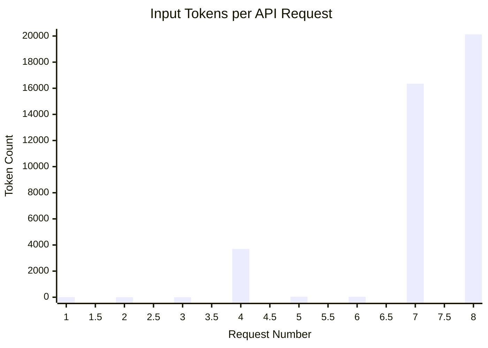

# Analysis of Claude API Token Usage

This document provides a detailed, quantitative analysis of the token usage for a series of captured API requests to `api.anthropic.com`.

## Summary

The captured traffic contains multiple, independent conversations with the Claude API. By analyzing the `usage` data in each API response, we can see the precise input token count for every request.

The data clearly shows that the token count varies dramatically based on the amount of context (like the `CLAUDE.md` file and conversation history) sent with each request. Requests with large context payloads consume a significant portion of the organization's 40,000 tokens/minute rate limit.

## Token Usage Per Request

The following table details the input token count for each captured `POST /v1/messages` request.

| Request # | Input Tokens               |
| :-------- | :------------------------- |
| 1         | 8                          |
| 2         | *Streamed, no token count* |
| 3         | *Streamed, no token count* |
| 4         | 3,695                      |
| 5         | 42                         |
| 6         | 38                         |
| 7         | 16,349                     |
| 8         | 20,124                     |

*Note: Some responses were streamed and did not contain a final `usage` object in the logged data. The token counts are extracted from the `input_tokens` field in the JSON response body.*

## Visualization of Token Consumption

This chart visualizes the token count for each of the requests where data was available, illustrating the significant variance in payload size.

## Conclusion

This detailed analysis confirms our previous findings with precise data. The `claude` CLI's inclusion of large context files and conversation history is the direct cause of the high token consumption that leads to rate-limiting errors.

To manage this, it is essential to start new conversations or temporarily rename context files like `CLAUDE.md` when beginning a new, unrelated task.
