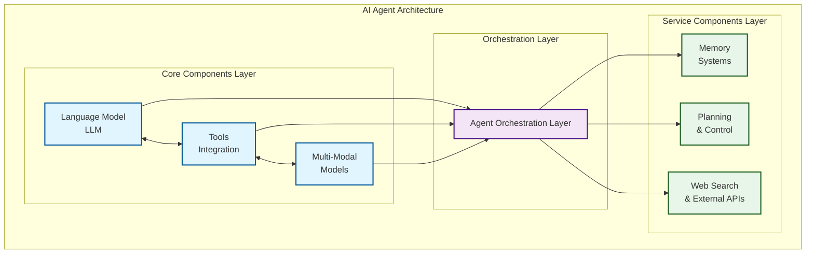
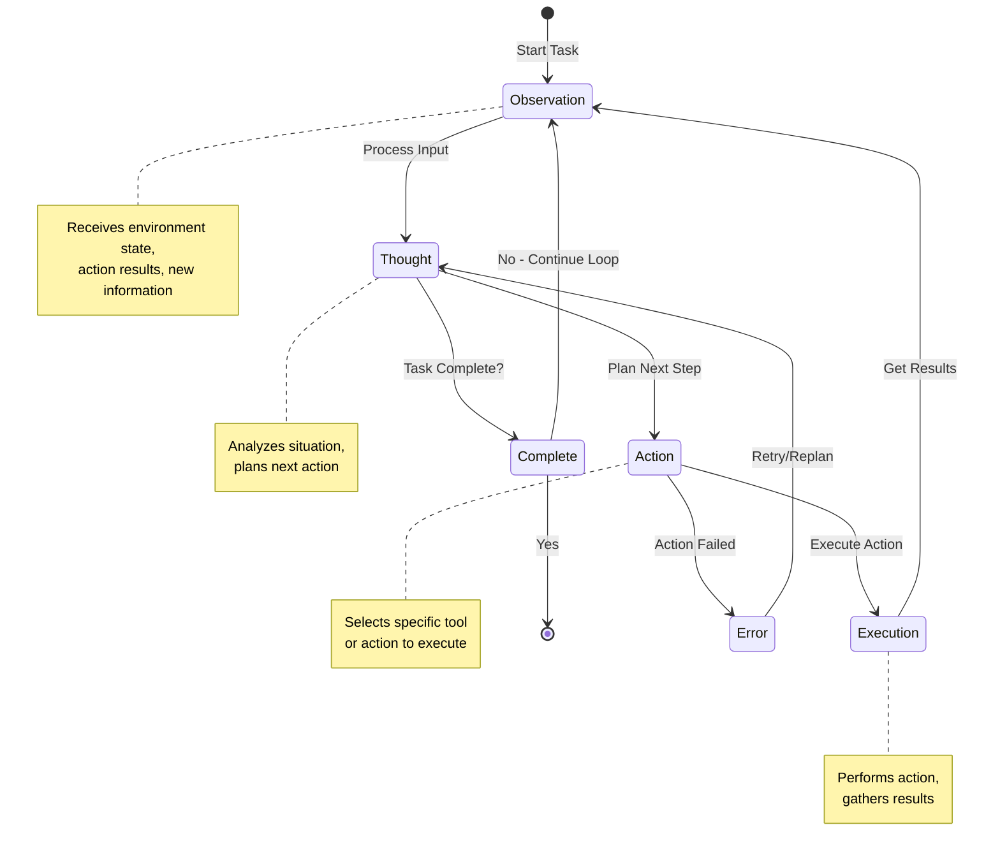
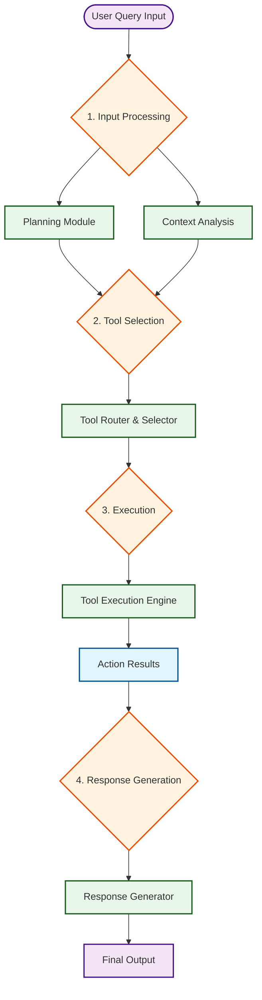
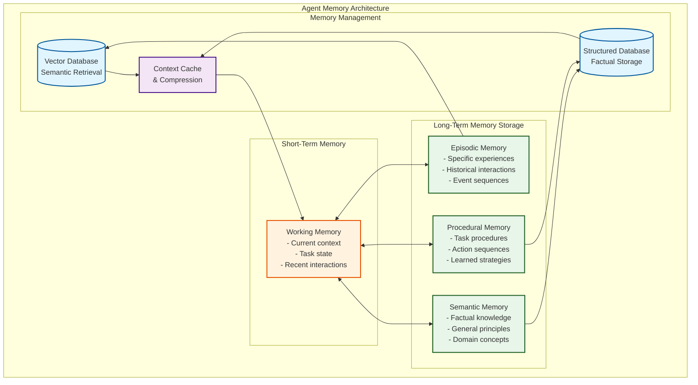
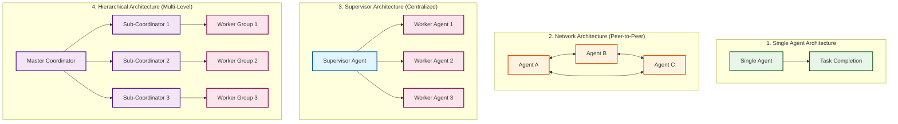

# Building Intelligent Spreadsheet Analyzers: A Complete Guide to AI Agents, RAG Systems, and Multi-Agent Orchestration

**Author:** Cheick Berthe
**Publication Year:** 2025
**Project Context:** Excel/Spreadsheet AI Analysis System

______________________________________________________________________

## Abstract

This comprehensive guide provides both theoretical foundations and practical implementation strategies for building sophisticated AI-powered spreadsheet analysis systems. From fundamental concepts of Large Language Model (LLM) architectures to advanced multi-agent orchestration frameworks, this resource serves as the definitive guide for developers, researchers, and organizations implementing intelligent document analysis solutions.

The work examines the technical, architectural, and strategic considerations necessary for successful deployment of AI agents in document processing domains, with specific focus on spreadsheet and tabular data analysis. Coverage includes RAG system implementation, memory management, tool integration, and multi-agent coordination patterns essential for building production-ready analytical systems.

______________________________________________________________________

## Table of Contents

**[Preface](#preface)**

**[Chapter 1: LLM and Agentic Fundamentals](#chapter-1-llm-and-agentic-fundamentals)**

- [1.1 Introduction to AI Agents and Agentic Systems](#11-introduction-to-ai-agents-and-agentic-systems)
- [1.2 Agent Architectures and Design Patterns](#12-agent-architectures-and-design-patterns)
- [1.3 Planning and Reasoning in AI Agents](#13-planning-and-reasoning-in-ai-agents)
- [1.4 Memory Systems and State Management](#14-memory-systems-and-state-management)
- [1.5 Tool Integration and Environmental Interaction](#15-tool-integration-and-environmental-interaction)
- [1.6 Small Language Models for Agentic Systems](#16-small-language-models-for-agentic-systems)
- [1.7 Comprehensive Guide to RAG Methods and Techniques](#17-comprehensive-guide-to-rag-methods-and-techniques)

**[Chapter 2: Engineering Techniques for AI Agents](#chapter-2-engineering-techniques-for-ai-agents)**

- [2.1 Introduction to Engineering Techniques](#21-introduction-to-engineering-techniques)
- [2.2 Prompt Engineering for Agentic Systems](#22-prompt-engineering-for-agentic-systems)
- [2.3 Context Engineering and Dynamic Systems](#23-context-engineering-and-dynamic-systems)
- [2.4 Guardrails and Safety Mechanisms](#24-guardrails-and-safety-mechanisms)
- [2.5 Observability and Monitoring](#25-observability-and-monitoring)

**[Chapter 3: Workflow and Orchestration](#chapter-3-workflow-and-orchestration)**

- [3.1 Introduction to Workflow and Orchestration](#31-introduction-to-workflow-and-orchestration)
- [3.2 Single-Agent vs. Multi-Agent System Design](#32-single-agent-vs-multi-agent-system-design)
- [3.3 Agent Coordination and Communication](#33-agent-coordination-and-communication)
- [3.4 Agent Orchestration Frameworks: A Comprehensive Analysis](#34-agent-orchestration-frameworks-a-comprehensive-analysis)
- [3.5 Human-in-the-Loop Integration](#35-human-in-the-loop-integration)

**[Chapter 4: Implementation and Optimization](#chapter-4-implementation-and-optimization)**

- [4.1 Introduction to Implementation and Optimization](#41-introduction-to-implementation-and-optimization)
- [4.2 Tool Integration and External System Connectivity](#42-tool-integration-and-external-system-connectivity)
- [4.3 Memory and State Management](#43-memory-and-state-management)
- [4.4 Performance Optimization and Scalability](#44-performance-optimization-and-scalability)

**[Chapter 5: Broader Considerations and Future Directions](#chapter-5-broader-considerations-and-future-directions)**

- [5.1 Introduction to Broader Considerations](#51-introduction-to-broader-considerations)
- [5.2 Use Cases and Domain-Specific Applications](#52-use-cases-and-domain-specific-applications)
- [5.3 Ethical Considerations and AI Safety](#53-ethical-considerations-and-ai-safety)
- [5.4 Future Trends and Emerging Technologies](#54-future-trends-and-emerging-technologies)

**[Conclusion](#conclusion)**

**[Comprehensive Bibliography](#comprehensive-bibliography)**

**[Index](#index)**

______________________________________________________________________

# Preface

The field of artificial intelligence has witnessed remarkable transformations in recent years, with the emergence of Large Language Models (LLMs) and their evolution into sophisticated autonomous agents representing one of the most significant developments in computational intelligence. This book, "AI Agents and Agentic Systems: A Comprehensive Guide to Design, Implementation, and Deployment," aims to provide readers with a thorough understanding of this rapidly evolving landscape.

## Purpose and Scope

This comprehensive guide serves multiple audiences: researchers seeking to understand the theoretical foundations of agentic systems, practitioners looking to implement these technologies in real-world applications, and decision-makers evaluating the strategic implications of AI agent deployment. The book bridges the gap between academic research and practical implementation, offering both conceptual frameworks and actionable guidance.

The scope encompasses the full spectrum of agentic system development, from fundamental concepts and architectural patterns to advanced implementation strategies and future considerations. Each chapter builds upon previous knowledge while remaining accessible to readers with varying levels of technical expertise.

## Approach and Methodology

The content presented in this book is grounded in extensive research of current literature, industry best practices, and emerging trends in the field. The approach emphasizes practical applicability while maintaining academic rigor, ensuring that theoretical concepts are always connected to real-world implementation challenges and opportunities.

The methodology employed throughout the book involves systematic analysis of existing frameworks, critical evaluation of different approaches, and synthesis of best practices from leading organizations and researchers in the field. Case studies and examples are drawn from diverse domains to illustrate the broad applicability of agentic systems.

## Acknowledgments

This work builds upon the contributions of numerous researchers, practitioners, and organizations who have advanced the field of AI agents and agentic systems. Special recognition goes to the teams at Anthropic, OpenAI, LangChain, and other organizations whose research and development efforts have shaped our understanding of these technologies.

The author acknowledges the valuable insights gained from the broader AI research community, whose collaborative efforts continue to push the boundaries of what is possible with autonomous intelligent systems.

## How to Use This Book

This book is designed to be both a comprehensive reference and a practical guide. Readers may choose to read it sequentially for a complete understanding of the field, or focus on specific chapters based on their immediate needs and interests.

Each chapter includes detailed explanations of concepts, practical implementation guidance, and extensive references for further exploration. The comprehensive bibliography and index facilitate easy navigation and reference lookup.

For practitioners, the implementation-focused chapters (3 and 4) provide detailed technical guidance, while the broader considerations chapter (5) offers strategic insights for organizational adoption. Researchers will find the foundational chapters (1 and 2) particularly valuable for understanding current state-of-the-art approaches and identifying areas for future investigation.

______________________________________________________________________

# Chapter 1: LLM and Agentic Fundamentals

## 1.1 Introduction to AI Agents and Agentic Systems

The emergence of Large Language Models (LLMs) has fundamentally transformed the landscape of artificial intelligence, enabling the development of sophisticated agentic systems that can reason, plan, and act autonomously in complex environments. This chapter establishes the theoretical and practical foundations necessary for understanding AI agents and agentic systems, providing the conceptual framework that underpins all subsequent discussions in this book.

The term "agentic" refers to systems that exhibit agency—the capacity to act independently and make choices that affect their environment (Russell & Norvig, 2020). In the context of modern AI systems, agentic behavior emerges from the sophisticated reasoning capabilities of LLMs combined with structured architectures that enable planning, memory, and tool use. This represents a significant evolution from traditional rule-based systems or even early machine learning applications, as these systems can adapt their behavior dynamically based on context and objectives.

The significance of agentic systems extends beyond mere technological advancement. As noted by researchers at Anthropic (2024), the distinction between workflows and agents represents a fundamental paradigm shift in how we conceptualize intelligent systems. While workflows rely on predetermined sequences of operations, agents possess the autonomy to determine their own paths toward goal achievement, making them particularly suited for complex, open-ended problems where the solution space is not well-defined.

### Defining AI Agents in the Modern Context

An AI agent, in its contemporary formulation, is fundamentally defined as a system that uses a Large Language Model to decide the control flow of an application (LangChain AI, 2024). This definition captures the essential characteristic that distinguishes modern agentic systems from their predecessors: the dynamic, LLM-driven decision-making process that determines how the system operates.

This represents a paradigm shift from traditional software architectures where control flow is predetermined by code to dynamic systems where LLMs make real-time decisions about how to accomplish tasks. The implications of this shift are profound, as it enables systems to adapt to novel situations, handle unexpected inputs, and develop creative solutions to complex problems.

The architectural foundation of modern AI agents rests on what researchers term the "augmented LLM"—a base language model enhanced with three critical capabilities: retrieval, tool integration, and memory systems (Anthropic, 2024). These augmentations transform a static language model into a dynamic agent capable of interacting with its environment, maintaining state across interactions, and leveraging external resources to accomplish complex tasks.

### The Evolution from Workflows to Agents

Understanding the distinction between workflows and agents is crucial for appreciating the unique capabilities and appropriate applications of agentic systems. This distinction, clearly articulated in recent research from Anthropic (2024), highlights fundamental differences in architecture, control mechanisms, and suitable use cases.

**Workflows** represent systems where LLMs and tools are orchestrated through predefined code paths. These systems excel in scenarios where the sequence of operations is well-understood and can be predetermined. Workflows offer several advantages: they provide predictability and consistency, enable easier debugging and optimization, and often deliver superior performance for well-defined tasks. In workflow systems, the LLM typically serves as a component within a larger, deterministic process rather than as the primary decision-making entity.

**Agents**, in contrast, are systems where LLMs dynamically direct their own processes and tool usage, maintaining control over how they accomplish tasks. This autonomy makes agents particularly valuable for open-ended problems where it's difficult to predict the required number of steps or hardcode a fixed path. Agents can adapt their strategies based on intermediate results, handle unexpected situations gracefully, and develop novel approaches to problem-solving.

The choice between workflows and agents depends largely on the nature of the problem domain. Workflows are optimal when the task is well-defined, the steps are predictable, and consistency is paramount. Agents become necessary when dealing with ambiguous requirements, novel situations, or problems that require creative problem-solving and adaptation.

### Theoretical Foundations of Agency

The concept of agency in artificial intelligence draws from multiple theoretical traditions, including cognitive science, philosophy of mind, and control theory. At its core, agency involves several key components that distinguish agentic systems from reactive or purely computational systems.

**Intentionality** represents the agent's capacity to have goals, beliefs, and desires that guide its behavior. In LLM-based agents, intentionality emerges from the combination of training objectives, prompt engineering, and the model's learned representations of goal-directed behavior (Bubeck et al., 2023).

**Autonomy** refers to the agent's ability to operate independently, making decisions without constant human intervention. This autonomy is constrained by the agent's design, training, and operational parameters, but within these constraints, the agent can exhibit significant independence in its decision-making processes.

**Adaptability** encompasses the agent's capacity to modify its behavior based on environmental feedback and changing circumstances. This is particularly important in dynamic environments where initial plans may need to be revised based on new information or unexpected obstacles.

**Rationality** involves the agent's ability to select actions that are likely to achieve its objectives given its current knowledge and beliefs. While perfect rationality is computationally intractable, modern LLM-based agents can exhibit bounded rationality that is often sufficient for practical applications.

## 1.2 Agent Architectures and Design Patterns

The architecture of an AI agent fundamentally determines its capabilities, limitations, and appropriate applications. This section examines the primary architectural patterns that have emerged in the development of LLM-based agentic systems, providing both theoretical understanding and practical guidance for system design.

### The Augmented LLM: Foundational Architecture

The basic building block of modern agentic systems is what researchers term the "augmented LLM"—a Large Language Model enhanced with three fundamental capabilities that transform it from a static text generator into a dynamic, interactive agent (Anthropic, 2024).

**Figure 1.1: AI Agent Architecture Overview**



*Figure 1.1: Core components of an AI agent architecture showing the integration of language models, tools, multi-modal capabilities, and orchestration systems. Source: Anthropic Research (2024)*

#### Retrieval Capabilities

The retrieval component enables agents to query external information sources and incorporate relevant information into their reasoning processes. This capability addresses one of the fundamental limitations of base LLMs: their knowledge cutoff and inability to access real-time or domain-specific information.

Retrieval systems in agentic architectures typically implement sophisticated information retrieval mechanisms that go beyond simple keyword matching. Modern retrieval systems employ semantic search techniques, often utilizing embedding models to identify relevant information based on conceptual similarity rather than lexical overlap (Lewis et al., 2020). This enables agents to find relevant information even when the query and source material use different terminology or express concepts in different ways.

The integration of retrieval capabilities also enables agents to access and reason about large knowledge bases that would be impossible to include in the model's training data. This is particularly important for domain-specific applications where specialized knowledge is required, or for applications that need access to frequently updated information.

#### Tool Integration

Tool integration represents perhaps the most transformative augmentation, enabling agents to interact with external systems, execute computations, and effect changes in their environment. This capability transforms LLMs from purely linguistic systems into agents capable of taking concrete actions in the world.

The tool integration paradigm typically follows a structured approach where tools are defined with clear interfaces, including descriptions of their functionality, required parameters, and expected outputs. The LLM learns to select appropriate tools based on the current context and objectives, formulate proper inputs for those tools, and interpret the results to inform subsequent actions.

Modern tool integration frameworks, such as those implemented in LangChain and similar platforms, provide standardized interfaces for tool definition and execution (LangChain AI, 2024). This standardization enables the development of rich ecosystems of tools that can be easily integrated into agentic systems, from simple computational tools to complex API integrations with external services.

#### Memory Systems

Memory systems provide agents with the ability to maintain state and context across interactions, enabling them to build upon previous experiences and maintain coherent behavior over extended periods. This capability is essential for complex tasks that require multiple steps or interactions to complete.

Memory systems in agentic architectures typically implement multiple types of memory, each serving different purposes. Short-term memory maintains context within a single interaction or task, enabling the agent to track its progress and maintain coherence. Long-term memory preserves information across multiple interactions, allowing agents to learn from experience and build up domain knowledge over time.

The implementation of memory systems often involves sophisticated data structures and retrieval mechanisms. Vector databases are commonly used to store and retrieve episodic memories based on semantic similarity, while structured databases may be used for factual information and procedural knowledge (Weaviate, 2024).

### Router Architecture

Router agents represent the simplest form of agentic control, providing a foundation for understanding more complex architectures. In router systems, the LLM's role is to select a single step from a specified set of options, making a decision about how to proceed based on the current context.

While router architectures exhibit relatively limited autonomy compared to more sophisticated agent designs, they serve important functions in many applications. Routers are particularly valuable for decision points where the agent needs to choose between different approaches or tools based on the current situation.

The implementation of router architectures typically employs structured outputs to ensure reliable interpretation of the LLM's decisions. This can be achieved through several mechanisms:

**Prompt Engineering** involves carefully crafting prompts that instruct the LLM to respond in specific formats, making it easier to parse and interpret the model's decisions. This approach relies on the model's ability to follow instructions and maintain consistency in its output format.

**Output Parsers** extract structured data from the LLM's natural language responses, using techniques such as regular expressions, parsing libraries, or additional LLM calls to convert free-form text into structured decisions.

**Tool Calling** leverages built-in capabilities of modern LLMs to generate structured outputs directly, bypassing the need for post-processing of natural language responses. This approach typically provides the most reliable results but requires LLMs that have been specifically trained for tool calling.

### ReAct Architecture: Reasoning and Acting

The ReAct (Reasoning and Acting) architecture represents a significant advancement in agent design, combining reasoning capabilities with the ability to take actions in the environment. This architecture, introduced by Yao et al. (2022), has become one of the most influential paradigms in modern agentic system design.

The ReAct architecture operates on the principle that effective agents must be able to both reason about their situation and take actions to gather information or effect changes. This is implemented through a continuous loop where the agent alternates between reasoning about its current state and taking actions to advance toward its goals.

#### Core Components of ReAct

**Tool Calling** enables the agent to select and use various tools as needed, providing the action component of the ReAct paradigm. The agent maintains awareness of available tools and their capabilities, selecting appropriate tools based on its current objectives and the information it needs to gather or actions it needs to take.

**Memory** allows the agent to retain information from previous steps, enabling it to build upon earlier discoveries and maintain coherent behavior across multiple reasoning and action cycles. This memory component is crucial for complex tasks that require multiple steps to complete.

**Planning** provides the agent with the ability to create and follow multi-step plans to achieve goals. While the planning may be implicit rather than explicit, the agent demonstrates the ability to work toward long-term objectives through sequences of reasoning and action steps.

#### The ReAct Loop

The ReAct architecture operates through a continuous loop where the LLM is called repeatedly, with each iteration involving several key steps:

1. **Observation**: The agent receives information about its current state, including the results of previous actions and any new information from the environment.

1. **Reasoning**: The agent analyzes the current situation, considering its objectives, available tools, and the information it has gathered so far.

1. **Action Selection**: Based on its reasoning, the agent selects an appropriate action to take, which may involve using a tool, gathering more information, or making a decision.

1. **Action Execution**: The selected action is executed, and the results are fed back into the system as observations for the next iteration.

This loop continues until the agent determines it has sufficient information to complete its task or achieve its objectives. The iterative nature of the ReAct loop enables agents to adapt their strategies based on intermediate results and handle unexpected situations gracefully.

**Figure 1.2A: ReAct Loop State Machine**



*Figure 1.2A: State diagram showing the ReAct loop lifecycle with decision points, error handling, and completion conditions. The loop continues until the agent determines the task is complete or encounters an unrecoverable error.*

**Figure 1.2B: LLM Agent Workflow Process**



*Figure 1.2: Understanding Agentic Concepts in LLM Workflows. This diagram illustrates the complex decision-making process within agentic systems, showing how agents dynamically call other agents and manage workflow orchestration. (Source: Medium - Pankaj)*

### Advanced Architectural Patterns

Beyond the foundational router and ReAct architectures, several advanced patterns have emerged to address specific challenges in agentic system design.

#### Hierarchical Agent Architectures

Hierarchical architectures organize agents into multiple levels, with higher-level agents responsible for strategic planning and lower-level agents handling tactical execution. This approach enables the development of systems that can operate at multiple scales of abstraction, from high-level goal setting to detailed task execution.

In hierarchical systems, higher-level agents typically focus on decomposing complex tasks into manageable subtasks, while lower-level agents specialize in executing specific types of operations. This division of labor enables more efficient resource utilization and clearer separation of concerns.

#### Multi-Agent Collaborative Systems

Multi-agent systems involve multiple autonomous agents working together to achieve common or complementary objectives. These systems can leverage the specialized capabilities of different agents, enabling more sophisticated problem-solving than would be possible with a single agent.

Collaboration in multi-agent systems requires sophisticated coordination mechanisms, including communication protocols, task allocation strategies, and conflict resolution procedures. Recent research has shown that well-designed multi-agent systems can achieve superior performance on complex tasks compared to single-agent approaches (Li et al., 2023).

#### Reflective and Self-Improving Architectures

Reflective architectures incorporate mechanisms for agents to analyze and improve their own performance over time. These systems can identify patterns in their successes and failures, adjust their strategies accordingly, and even modify their own architectures to better suit their operating environment.

Self-improvement in agentic systems typically involves several mechanisms: performance monitoring to track the effectiveness of different strategies, strategy adaptation to modify behavior based on observed outcomes, and meta-learning to improve the agent's ability to learn and adapt in new situations.

## 1.3 Planning and Reasoning in AI Agents

Planning and reasoning represent the cognitive core of agentic systems, enabling them to navigate complex problem spaces and develop sophisticated strategies for goal achievement. This section examines the mechanisms by which modern AI agents plan their actions and reason about their environment, drawing from both classical AI planning techniques and novel approaches enabled by Large Language Models.

### Foundations of AI Planning

Classical AI planning has its roots in symbolic reasoning and state-space search, with foundational work dating back to the STRIPS planning system (Fikes & Nilsson, 1971). However, the integration of LLMs into planning systems has fundamentally transformed the landscape, enabling more flexible and adaptive planning approaches that can handle ambiguous goals and uncertain environments.

Modern agentic planning systems leverage the natural language understanding capabilities of LLMs to interpret goals, reason about actions, and generate plans in a more intuitive and flexible manner than traditional symbolic planners. This approach enables agents to work with goals expressed in natural language, reason about abstract concepts, and adapt their plans based on contextual understanding rather than rigid logical rules.

#### Goal Formulation and Decomposition

Effective planning begins with clear goal formulation, a process that has been significantly enhanced by the natural language processing capabilities of modern LLMs. Unlike traditional planning systems that require goals to be expressed in formal logical languages, LLM-based agents can work with goals expressed in natural language, enabling more intuitive human-agent interaction.

Goal decomposition represents a critical capability in complex planning scenarios. Large, complex goals must be broken down into manageable subgoals that can be addressed through specific actions or sequences of actions. LLM-based agents excel at this decomposition process, leveraging their understanding of hierarchical relationships and causal dependencies to identify appropriate subgoals.

The decomposition process typically involves several key considerations: identifying dependencies between subgoals, determining the appropriate level of granularity for decomposition, and ensuring that the decomposed goals collectively achieve the original objective. Modern agents can perform this decomposition dynamically, adjusting their approach based on new information or changing circumstances.

#### State Representation and Reasoning

State representation in LLM-based planning systems differs significantly from classical approaches. Rather than relying on formal logical representations, these systems often maintain state information in natural language or hybrid representations that combine structured data with natural language descriptions.

This approach to state representation offers several advantages: it enables more intuitive reasoning about complex, real-world situations; it allows for the incorporation of uncertain or incomplete information; and it facilitates communication between agents and human users. However, it also introduces challenges related to consistency, precision, and computational efficiency.

Modern agentic systems often employ sophisticated state management techniques that combine the flexibility of natural language representation with the precision of structured data. This may involve maintaining multiple representations of state information, using structured data for precise computations while maintaining natural language descriptions for reasoning and communication.

### Planning Strategies in LLM-Based Agents

The planning capabilities of LLM-based agents emerge from their training on vast corpora of text that include examples of planning, problem-solving, and strategic thinking. This enables them to generate plans that are often remarkably sophisticated, even without explicit training on planning algorithms.

#### Forward Planning and Backward Chaining

Forward planning involves starting from the current state and reasoning forward toward the goal, generating sequences of actions that are likely to achieve the desired outcome. LLM-based agents excel at forward planning, leveraging their understanding of causal relationships and action consequences to generate plausible action sequences.

Backward chaining, conversely, starts from the goal state and reasons backward to identify the actions and conditions necessary to achieve that goal. This approach can be particularly effective for complex goals where the path forward is not immediately obvious.

Many modern agentic systems employ hybrid approaches that combine forward and backward reasoning, using backward chaining to identify key milestones and forward planning to determine how to reach those milestones from the current state.

#### Hierarchical Planning

Hierarchical planning addresses the complexity of large-scale planning problems by organizing plans at multiple levels of abstraction. High-level plans focus on strategic objectives and major milestones, while lower-level plans address the tactical details of implementation.

This hierarchical approach offers several benefits: it enables agents to maintain focus on high-level objectives while handling detailed execution; it facilitates plan adaptation when circumstances change; and it enables more efficient resource allocation and coordination in multi-agent systems.

LLM-based agents are particularly well-suited to hierarchical planning due to their ability to reason at multiple levels of abstraction and their understanding of hierarchical relationships in natural language.

#### Contingency Planning and Adaptation

Real-world environments are characterized by uncertainty and change, making contingency planning and adaptation essential capabilities for practical agentic systems. Modern agents must be able to anticipate potential obstacles, develop alternative strategies, and adapt their plans when circumstances change.

Contingency planning in LLM-based systems often involves generating multiple alternative plans or identifying key decision points where different strategies might be appropriate. This enables agents to respond quickly to changing circumstances without requiring complete replanning.

Plan adaptation involves modifying existing plans based on new information or changed circumstances. LLM-based agents can perform sophisticated plan adaptation, leveraging their understanding of plan structure and goal relationships to make appropriate modifications while maintaining overall coherence.

### Reasoning Mechanisms

The reasoning capabilities of LLM-based agents represent one of their most significant advantages over traditional AI systems. These agents can perform sophisticated reasoning about complex, real-world situations using natural language understanding and generation capabilities.

#### Causal Reasoning

Causal reasoning involves understanding the relationships between causes and effects, enabling agents to predict the consequences of actions and identify the actions necessary to achieve desired outcomes. LLM-based agents demonstrate remarkable capabilities in causal reasoning, often outperforming traditional symbolic systems in complex, real-world scenarios.

The causal reasoning capabilities of these agents emerge from their training on vast amounts of text that describe causal relationships in natural language. This enables them to understand and reason about causality in ways that are often more intuitive and flexible than formal causal models.

#### Analogical Reasoning

Analogical reasoning involves identifying similarities between different situations and applying knowledge from familiar situations to novel ones. This capability is particularly important for agents operating in dynamic environments where they may encounter situations that were not explicitly covered in their training.

LLM-based agents excel at analogical reasoning, leveraging their vast knowledge base to identify relevant analogies and apply insights from similar situations. This enables them to handle novel situations more effectively than systems that rely solely on explicit rules or training examples.

#### Counterfactual Reasoning

Counterfactual reasoning involves considering alternative scenarios and their potential outcomes, enabling agents to evaluate different strategies and anticipate potential problems. This capability is essential for robust planning and decision-making in uncertain environments.

Modern LLM-based agents can perform sophisticated counterfactual reasoning, considering multiple alternative scenarios and their implications for planning and decision-making. This enables them to develop more robust plans and make better decisions under uncertainty.

### Integration with Tool Use and Memory

The planning and reasoning capabilities of agentic systems are significantly enhanced by their integration with tool use and memory systems. This integration enables agents to gather information, perform computations, and maintain context across extended planning episodes.

#### Information Gathering and Analysis

Effective planning often requires gathering and analyzing information about the current situation, available resources, and potential obstacles. Modern agents can use their tool integration capabilities to gather relevant information from external sources, perform analyses, and incorporate the results into their planning processes.

This capability enables agents to develop plans based on current, accurate information rather than relying solely on their training data or initial assumptions. It also enables them to adapt their plans as new information becomes available.

#### Memory-Informed Planning

The memory systems of agentic architectures enable agents to learn from experience and improve their planning capabilities over time. Agents can maintain records of successful and unsuccessful strategies, enabling them to make better decisions in similar situations in the future.

Memory-informed planning also enables agents to maintain context across extended planning episodes, ensuring that their plans remain coherent and consistent even when dealing with complex, multi-step objectives.

## 1.4 Memory Systems and State Management

Memory systems represent a critical component of agentic architectures, enabling agents to maintain coherent behavior across extended interactions and learn from experience. This section examines the various types of memory systems employed in modern AI agents and their role in enabling sophisticated, context-aware behavior.

### Types of Memory in Agentic Systems

The memory architecture of AI agents typically incorporates multiple types of memory, each serving different functions and operating at different timescales. This multi-layered approach to memory enables agents to handle both immediate contextual needs and long-term learning and adaptation.

**Figure 1.3: Multi-Layered Memory Architecture in AI Agents**



*Figure 1.3: The multi-layered memory architecture showing the relationship between different memory types and their underlying storage mechanisms. Each memory type serves specific functions while contributing to the agent's overall cognitive capabilities.*

#### Working Memory

Working memory serves as the agent's immediate context, maintaining information about the current task, recent interactions, and intermediate results. This type of memory is typically implemented through the agent's context window and immediate state representations.

In LLM-based agents, working memory is often constrained by the model's context length, requiring sophisticated strategies for managing information within these constraints. Techniques such as summarization, selective attention, and hierarchical representation are commonly employed to maximize the utility of limited working memory capacity.

The management of working memory involves several key challenges: determining what information to retain and what to discard, maintaining coherence across context boundaries, and ensuring that critical information remains accessible throughout task execution.

#### Episodic Memory

Episodic memory stores specific experiences and interactions, enabling agents to recall and learn from past events. This type of memory is particularly important for agents that need to adapt their behavior based on experience or maintain relationships with users over time.

Implementation of episodic memory typically involves sophisticated storage and retrieval mechanisms. Vector databases are commonly used to store episodic memories as embeddings, enabling semantic retrieval based on similarity to current situations (Weaviate, 2024). This approach allows agents to recall relevant past experiences even when the current situation is not identical to previous ones.

The design of episodic memory systems involves several important considerations: determining what experiences to store, how to index and organize memories for efficient retrieval, and how to maintain memory systems over extended periods without degradation.

#### Semantic Memory

Semantic memory stores factual knowledge and general principles that the agent has learned or been provided. Unlike episodic memory, which stores specific experiences, semantic memory contains abstract knowledge that can be applied across multiple situations.

In LLM-based agents, semantic memory often builds upon the knowledge encoded in the model's parameters during training, supplemented by additional knowledge acquired through experience or explicit instruction. This hybrid approach enables agents to leverage both their pre-trained knowledge and domain-specific information acquired during operation.

The integration of semantic memory with other memory systems requires careful consideration of knowledge representation, consistency maintenance, and conflict resolution when different sources of knowledge provide contradictory information.

#### Procedural Memory

Procedural memory stores knowledge about how to perform tasks and execute procedures. This type of memory is particularly important for agents that need to learn and improve their performance on specific types of tasks over time.

In agentic systems, procedural memory often takes the form of learned strategies, successful action sequences, and refined approaches to common problems. This knowledge can be represented in various forms, from natural language descriptions of procedures to more structured representations of action sequences and decision trees.

The development and maintenance of procedural memory involves mechanisms for identifying successful strategies, generalizing from specific experiences to general procedures, and adapting procedures based on changing circumstances or improved understanding.

### Memory Architecture and Implementation

The implementation of memory systems in agentic architectures involves sophisticated data structures and algorithms for storage, retrieval, and maintenance of different types of memory.

#### Vector-Based Memory Systems

Vector-based memory systems represent one of the most significant innovations in modern agentic architectures. These systems store memories as high-dimensional vectors (embeddings) that capture semantic meaning, enabling retrieval based on conceptual similarity rather than exact matching.

The use of vector embeddings for memory storage offers several advantages: it enables semantic retrieval that can find relevant memories even when the current situation is described differently than past experiences; it allows for efficient similarity search using techniques such as approximate nearest neighbor search; and it facilitates the integration of different types of information within a unified memory framework.

Modern vector databases such as Pinecone, Weaviate, and Chroma provide sophisticated infrastructure for implementing vector-based memory systems, offering features such as metadata filtering, hybrid search capabilities, and scalable storage and retrieval (Pinecone, 2024).

#### Hierarchical Memory Organization

Hierarchical memory organization addresses the challenge of managing large amounts of memory information by organizing memories at multiple levels of abstraction. This approach enables agents to maintain both detailed memories of specific events and higher-level summaries that capture general patterns and trends.

The implementation of hierarchical memory typically involves multiple storage layers, with detailed memories stored at the lowest level and progressively more abstract summaries stored at higher levels. This organization enables efficient retrieval by allowing agents to first search at higher levels to identify relevant memory clusters, then drill down to specific memories as needed.

Hierarchical organization also facilitates memory maintenance by enabling the compression or archival of older memories while preserving their essential information in higher-level summaries.

#### Temporal Memory Management

Temporal aspects of memory management involve strategies for handling the evolution of memory over time, including the retention, updating, and eventual forgetting of memories. Effective temporal management is crucial for maintaining memory systems that remain useful and efficient over extended periods.

Strategies for temporal memory management include: implementing forgetting mechanisms that remove or archive old memories based on age, relevance, or frequency of access; developing update mechanisms that can modify existing memories based on new information; and creating consolidation processes that combine related memories to reduce storage requirements and improve retrieval efficiency.

### State Management in Agentic Systems

State management encompasses the broader challenge of maintaining coherent representations of the agent's current situation, objectives, and progress toward goals. Effective state management is essential for enabling agents to maintain consistent behavior across extended interactions and complex tasks.

#### State Representation Strategies

The representation of state in agentic systems involves balancing several competing requirements: expressiveness to capture complex, real-world situations; efficiency to enable rapid processing and decision-making; and consistency to ensure coherent behavior across different components of the system.

Modern agentic systems often employ hybrid state representations that combine structured data for precise, computational aspects with natural language descriptions for complex, contextual information. This approach enables agents to leverage the precision of structured representations while maintaining the flexibility and expressiveness of natural language.

The design of state representations also involves considerations of modularity, enabling different components of the agent to maintain their own state information while ensuring overall consistency and coordination.

#### State Persistence and Recovery

State persistence involves maintaining state information across system restarts, failures, or other interruptions. This capability is essential for agents that need to maintain long-term relationships with users or work on extended tasks that may span multiple sessions.

Implementation of state persistence typically involves sophisticated serialization and storage mechanisms that can capture the full state of the agent, including its memory contents, current objectives, and progress toward goals. Recovery mechanisms must be able to restore the agent to a consistent state from these stored representations.

The design of persistence and recovery systems must also consider issues such as state migration when system architectures change, conflict resolution when multiple versions of state exist, and graceful degradation when complete state recovery is not possible.

#### Distributed State Management

In multi-agent systems or distributed architectures, state management becomes significantly more complex, requiring coordination mechanisms to ensure consistency across multiple agents or system components.

Distributed state management involves several key challenges: maintaining consistency when multiple agents are modifying shared state, coordinating updates to ensure that all agents have access to current information, and handling conflicts when different agents have different views of the current state.

Modern approaches to distributed state management often employ techniques from distributed systems, such as consensus algorithms, eventual consistency models, and conflict-free replicated data types (CRDTs) to address these challenges.

## 1.5 Tool Integration and Environmental Interaction

Tool integration represents one of the most transformative capabilities of modern agentic systems, enabling them to extend beyond pure language processing to interact with external systems, perform computations, and effect changes in their environment. This section examines the principles, architectures, and best practices for implementing robust tool integration in agentic systems.

### Foundations of Tool Integration

The concept of tool use in AI systems has evolved significantly with the advent of Large Language Models capable of understanding and generating structured outputs. Unlike traditional API integrations that require rigid programming interfaces, LLM-based tool integration enables more flexible, context-aware interactions with external systems.

#### Tool Definition and Specification

Modern tool integration frameworks employ standardized approaches to tool definition that enable LLMs to understand and use tools effectively. These definitions typically include several key components that provide the LLM with the information necessary to select and use tools appropriately.

**Functional Descriptions** provide natural language explanations of what the tool does, when it should be used, and what outcomes it produces. These descriptions are crucial for enabling LLMs to select appropriate tools based on their current objectives and context.

**Parameter Specifications** define the inputs required by the tool, including data types, constraints, and optional parameters. Modern frameworks often use schema languages such as JSON Schema to provide precise, machine-readable parameter definitions while maintaining human readability.

**Output Specifications** describe the format and content of tool outputs, enabling the LLM to understand and interpret the results of tool execution. This includes both successful outputs and error conditions that the tool might encounter.

**Usage Examples** provide concrete illustrations of how the tool should be used, including sample inputs and expected outputs. These examples are particularly valuable for helping LLMs understand the practical application of tools in different contexts.

#### Tool Selection and Orchestration

The process by which agents select and orchestrate tools represents a critical aspect of agentic system design. Effective tool selection requires agents to understand their current objectives, evaluate available tools, and choose the most appropriate tool for the current situation.

Modern LLM-based agents employ sophisticated reasoning processes for tool selection, considering factors such as: the relevance of each tool to the current objective, the availability and reliability of required inputs, the expected utility of the tool's outputs, and the computational or resource costs associated with tool execution.

Tool orchestration involves coordinating the use of multiple tools to achieve complex objectives. This may involve sequential tool use, where the output of one tool serves as input to another, or parallel tool use, where multiple tools are executed simultaneously to gather different types of information or perform different aspects of a task.

#### Error Handling and Robustness

Robust tool integration requires sophisticated error handling mechanisms that can gracefully manage tool failures, unexpected outputs, and resource constraints. Modern agentic systems employ several strategies to ensure robust tool integration.

**Graceful Degradation** involves designing systems that can continue to operate effectively even when some tools are unavailable or produce errors. This may involve using alternative tools, adjusting objectives, or providing partial results when complete success is not possible.

**Retry Mechanisms** enable agents to attempt tool execution multiple times when transient failures occur. These mechanisms often employ exponential backoff strategies and circuit breaker patterns to avoid overwhelming failing systems.

**Validation and Verification** involve checking tool outputs for consistency, plausibility, and completeness before incorporating them into the agent's reasoning process. This is particularly important when dealing with external systems that may produce unreliable or malicious outputs.

### Categories of Tools and Integration Patterns

The landscape of tools available to agentic systems is vast and diverse, spanning from simple computational functions to complex integrations with enterprise systems. Understanding the different categories of tools and their integration patterns is essential for designing effective agentic systems.

#### Computational Tools

Computational tools provide agents with the ability to perform calculations, data processing, and algorithmic operations that extend beyond the native capabilities of LLMs. These tools are particularly important for tasks that require precision, large-scale data processing, or specialized algorithms.

**Mathematical and Statistical Tools** enable agents to perform complex calculations, statistical analyses, and mathematical modeling. These tools are essential for applications that require quantitative analysis or scientific computation.

**Data Processing Tools** provide capabilities for parsing, transforming, and analyzing structured and unstructured data. These tools enable agents to work with large datasets, extract insights from complex data structures, and prepare data for further analysis.

**Algorithmic Tools** implement specialized algorithms for tasks such as optimization, machine learning, and graph analysis. These tools enable agents to leverage sophisticated algorithmic approaches that would be difficult or impossible to implement directly in natural language.

#### Information Retrieval Tools

Information retrieval tools enable agents to access and search external knowledge sources, databases, and information systems. These tools are crucial for agents that need to work with current information or access specialized knowledge bases.

**Search Engines** provide access to web-based information and enable agents to find relevant information on virtually any topic. Modern search integrations often include semantic search capabilities that can understand natural language queries and return contextually relevant results.

**Database Interfaces** enable agents to query structured databases and retrieve specific information based on complex criteria. These interfaces often provide natural language query capabilities that translate agent requests into appropriate database queries.

**API Integrations** provide access to external services and systems through standardized interfaces. These integrations enable agents to interact with a wide range of external systems, from social media platforms to enterprise software systems.

#### Communication and Collaboration Tools

Communication tools enable agents to interact with humans and other agents, facilitating collaboration and coordination in complex environments.

**Messaging and Notification Systems** enable agents to send messages, alerts, and notifications to users and other systems. These tools are essential for keeping stakeholders informed about agent activities and requesting human input when needed.

**Collaboration Platforms** provide integration with tools such as project management systems, document sharing platforms, and communication channels. These integrations enable agents to participate in collaborative workflows and contribute to team-based activities.

**Human Interface Tools** facilitate direct interaction between agents and human users, including capabilities for presenting information, requesting input, and managing approval workflows.

#### Action and Control Tools

Action tools enable agents to effect changes in their environment, from simple file operations to complex system administration tasks.

**File System Operations** provide capabilities for reading, writing, and manipulating files and directories. These tools are essential for agents that need to process documents, generate reports, or manage data files.

**System Administration Tools** enable agents to perform administrative tasks such as process management, resource monitoring, and configuration management. These tools are particularly important for agents operating in DevOps or system management contexts.

**External System Control** provides interfaces for controlling external systems and devices, from simple API calls to complex automation workflows. These tools enable agents to serve as intelligent controllers for complex systems and processes.

### Security and Safety Considerations

The integration of tools into agentic systems introduces significant security and safety considerations that must be carefully addressed to ensure safe and reliable operation.

#### Sandboxing and Isolation

Sandboxing involves executing tools in isolated environments that limit their access to system resources and prevent them from causing unintended damage. Modern sandboxing approaches employ several techniques to ensure safe tool execution.

**Containerization** uses technologies such as Docker to isolate tool execution in lightweight, portable containers that have limited access to the host system. This approach provides strong isolation while maintaining reasonable performance and flexibility.

**Virtual Machines** provide even stronger isolation by executing tools in completely separate operating system instances. While this approach offers superior security, it typically involves higher resource overhead and complexity.

**Process Isolation** uses operating system features to limit the resources and capabilities available to tool processes. This approach can provide effective isolation with minimal overhead for many types of tools.

#### Access Control and Authorization

Access control mechanisms ensure that agents can only use tools and access resources that they are authorized to use. These mechanisms are essential for preventing unauthorized access and maintaining security in multi-user environments.

**Role-Based Access Control (RBAC)** assigns permissions to agents based on their roles and responsibilities. This approach enables fine-grained control over tool access while maintaining manageable administration overhead.

**Capability-Based Security** provides agents with explicit capabilities or tokens that grant access to specific tools or resources. This approach enables dynamic, context-sensitive access control that can adapt to changing circumstances.

**Audit and Monitoring** systems track tool usage and access patterns, enabling detection of unauthorized access attempts and providing accountability for agent actions.

#### Input Validation and Output Sanitization

Robust tool integration requires careful validation of inputs and sanitization of outputs to prevent security vulnerabilities and ensure reliable operation.

**Input Validation** involves checking tool inputs for correctness, completeness, and safety before execution. This includes validating data types, checking for malicious content, and ensuring that inputs conform to expected formats and constraints.

**Output Sanitization** involves processing tool outputs to remove potentially harmful content and ensure that outputs are safe to use in subsequent processing. This is particularly important when dealing with tools that process untrusted data or interact with external systems.

**Injection Prevention** involves protecting against various forms of injection attacks, including SQL injection, command injection, and script injection. This requires careful design of tool interfaces and robust input validation mechanisms.

## 1.6 Small Language Models for Agentic Systems

The emergence of Small Language Models (SLMs) represents a significant development in the field of agentic systems, offering compelling advantages in terms of efficiency, cost, and deployment flexibility while maintaining much of the reasoning capability of their larger counterparts. This section examines the role of SLMs in agentic architectures and their potential to democratize access to sophisticated AI capabilities.

### The Evolution Toward Smaller Models

The trend toward smaller, more efficient language models reflects both technological advancement and practical necessity. While large models such as GPT-4 and Claude demonstrate remarkable capabilities, their computational requirements and associated costs limit their accessibility and practical deployment in many scenarios.

Recent research from NVIDIA and other leading institutions has demonstrated that carefully designed smaller models can achieve performance comparable to much larger models on many tasks, particularly when optimized for specific domains or applications (NVIDIA Research, 2024). This finding has significant implications for the deployment of agentic systems in resource-constrained environments and cost-sensitive applications.

#### Advantages of Small Language Models

**Computational Efficiency** represents perhaps the most significant advantage of SLMs. These models require substantially less computational resources for both training and inference, enabling deployment on edge devices, mobile platforms, and resource-constrained environments where large models would be impractical.

**Cost Effectiveness** emerges naturally from the reduced computational requirements. SLMs can provide sophisticated language understanding and generation capabilities at a fraction of the cost of large models, making advanced AI capabilities accessible to organizations with limited budgets.

**Latency and Responsiveness** benefit significantly from the reduced model size. SLMs can provide near-instantaneous responses in many scenarios, enabling real-time applications and interactive experiences that would be challenging with larger models.

**Privacy and Security** advantages arise from the ability to deploy SLMs locally rather than relying on cloud-based services. This enables organizations to maintain control over sensitive data and comply with strict privacy requirements.

**Customization and Specialization** become more feasible with smaller models, as the reduced training costs enable organizations to develop domain-specific models tailored to their particular needs and requirements.

#### Challenges and Limitations

Despite their advantages, SLMs face several challenges that must be carefully considered when designing agentic systems.

**Reduced Capability** in complex reasoning tasks represents the primary limitation of SLMs. While these models can perform many tasks effectively, they may struggle with highly complex reasoning, extensive context requirements, or tasks requiring broad general knowledge.

**Limited Context Windows** in many SLMs restrict their ability to maintain context over extended interactions, potentially limiting their effectiveness in complex, multi-step tasks.

**Specialization Requirements** often mean that SLMs must be specifically trained or fine-tuned for particular domains or applications, reducing their general-purpose utility compared to larger models.

### SLM-to-LLM Conversion and Optimization

Recent research has developed sophisticated techniques for converting the capabilities of large language models into smaller, more efficient models while preserving much of their performance. These techniques represent a significant advancement in making advanced AI capabilities more accessible and practical.

#### Knowledge Distillation

Knowledge distillation involves training smaller models to mimic the behavior of larger, more capable models. This process enables the transfer of knowledge and capabilities from large models to smaller ones, often achieving surprising levels of performance preservation.

The distillation process typically involves several key steps: generating training data using the large model, training the smaller model to match the large model's outputs, and iteratively refining the smaller model's performance through additional training and optimization.

Modern distillation techniques have achieved remarkable success in preserving the reasoning capabilities of large models in much smaller architectures. Research has shown that properly distilled small models can achieve 80-90% of the performance of their larger counterparts on many tasks while requiring only a fraction of the computational resources.

#### Architectural Optimization

Architectural optimization involves designing model architectures that are specifically optimized for efficiency while maintaining performance. This includes techniques such as: attention mechanism optimization to reduce computational complexity, layer pruning to remove unnecessary model components, and quantization to reduce the precision requirements of model parameters.

These optimization techniques can significantly reduce model size and computational requirements while preserving most of the model's capabilities. When combined with knowledge distillation, architectural optimization can produce models that are both highly efficient and remarkably capable.

#### Task-Specific Fine-Tuning

Task-specific fine-tuning enables SLMs to achieve high performance on particular types of tasks by specializing their capabilities for specific domains or applications. This approach can often achieve performance that exceeds that of much larger general-purpose models on specialized tasks.

The fine-tuning process involves training the model on domain-specific data and tasks, enabling it to develop specialized knowledge and capabilities that are particularly relevant to its intended application. This specialization can compensate for the reduced general capabilities of smaller models.

### Integration of SLMs in Agentic Architectures

The integration of SLMs into agentic architectures requires careful consideration of their capabilities and limitations, as well as strategic design decisions about when and how to use smaller models effectively.

#### Hybrid Architectures

Hybrid architectures combine SLMs and LLMs in complementary ways, leveraging the efficiency of smaller models for routine tasks while reserving larger models for complex reasoning and decision-making. This approach can provide an optimal balance of performance and efficiency.

In hybrid systems, SLMs might handle tasks such as: initial request processing and routing, routine information retrieval and formatting, simple reasoning and decision-making, and user interface and interaction management. LLMs would be reserved for: complex reasoning and planning tasks, novel problem-solving situations, high-stakes decision-making, and tasks requiring extensive general knowledge.

The coordination between SLMs and LLMs in hybrid architectures requires sophisticated orchestration mechanisms that can determine when to escalate tasks from smaller to larger models and how to integrate the outputs of different models effectively.

#### Edge Deployment and Distributed Systems

SLMs enable new deployment patterns that were not practical with larger models, including edge deployment and distributed agentic systems. These deployment patterns offer significant advantages in terms of latency, privacy, and resilience.

**Edge Deployment** involves running SLMs directly on user devices or local infrastructure, eliminating the need for cloud connectivity and reducing latency to near-zero levels. This approach is particularly valuable for applications that require real-time responsiveness or operate in environments with limited connectivity.

**Distributed Systems** can leverage SLMs to create networks of intelligent agents that can operate independently while coordinating to achieve larger objectives. This approach enables the development of resilient, scalable systems that can continue to operate even when individual components fail or become unavailable.

#### Specialized Agent Roles

SLMs are particularly well-suited for specialized agent roles that require specific capabilities rather than broad general intelligence. These specialized agents can be highly effective within their domains while requiring minimal computational resources.

Examples of specialized SLM-based agents include: data processing agents that specialize in parsing and analyzing specific types of data, interface agents that handle user interactions and communication, monitoring agents that track system performance and detect anomalies, and coordination agents that manage workflows and resource allocation.

The development of specialized SLM-based agents enables the creation of sophisticated multi-agent systems where different agents handle different aspects of complex tasks, with each agent optimized for its specific role and responsibilities.

### Future Directions and Research

The field of SLMs for agentic systems continues to evolve rapidly, with several promising research directions that may further enhance their capabilities and applicability.

#### Emergent Capabilities in Small Models

Recent research has begun to identify emergent capabilities in small models that were previously thought to require much larger architectures. These discoveries suggest that the relationship between model size and capability may be more complex than initially understood.

Understanding and leveraging these emergent capabilities could enable the development of even more capable SLMs that can handle increasingly complex tasks while maintaining their efficiency advantages.

#### Multi-Modal SLMs

The development of multi-modal SLMs that can process and generate multiple types of content (text, images, audio) represents an exciting frontier that could significantly expand the capabilities of efficient agentic systems.

Multi-modal SLMs could enable the development of more sophisticated agents that can interact with rich, multi-modal environments while maintaining the efficiency advantages of smaller models.

#### Adaptive and Self-Improving SLMs

Research into adaptive SLMs that can improve their performance over time through experience and feedback represents another promising direction. These models could potentially overcome some of the limitations of smaller architectures through continuous learning and adaptation.

Self-improving SLMs could enable the development of agentic systems that become more capable over time while maintaining their efficiency advantages, potentially achieving the best of both worlds in terms of capability and efficiency.

## 1.7 Comprehensive Guide to RAG Methods and Techniques

## Introduction to RAG Method Diversity

Retrieval-Augmented Generation has evolved far beyond its initial simple implementation of embedding documents, storing them in vector databases, and retrieving relevant chunks for language model prompting. The field has witnessed an explosion of sophisticated techniques that address various limitations of naive RAG approaches, each designed to tackle specific challenges in information retrieval, context understanding, and response generation quality.

The landscape of RAG methods can be understood through multiple dimensions: the complexity of retrieval mechanisms, the sophistication of query processing, the depth of context understanding, and the level of self-awareness in the generation process. Modern RAG systems incorporate elements of multi-agent orchestration, hierarchical information organization, adaptive retrieval strategies, and self-reflective quality assessment mechanisms.

This comprehensive exploration examines the full spectrum of RAG methodologies, from foundational approaches to cutting-edge techniques that push the boundaries of what retrieval-augmented systems can achieve. Each method represents a unique solution to specific challenges in the RAG pipeline, whether addressing issues of retrieval precision, context relevance, computational efficiency, or response quality assurance.

## Foundational RAG Approaches

### Naive RAG: The Foundation

Naive RAG represents the foundational approach that established the core principles of retrieval-augmented generation. This method follows a straightforward pipeline: documents are chunked into manageable segments, embedded using transformer-based encoders, stored in vector databases, and retrieved based on semantic similarity to user queries. The retrieved chunks are then injected into language model prompts as context for response generation.

The simplicity of naive RAG makes it an excellent starting point for understanding retrieval-augmented systems. The process begins with document preprocessing, where large texts are divided into chunks of typically 512 to 1024 tokens, balancing the need for sufficient context with the constraints of embedding model input limits. These chunks are then processed through embedding models such as sentence transformers or OpenAI's text-embedding models to create dense vector representations that capture semantic meaning.

The retrieval phase employs cosine similarity or other distance metrics to identify the most semantically similar chunks to a given query. This approach assumes that semantic similarity in the embedding space correlates with relevance for answering the query, an assumption that holds reasonably well for many straightforward information retrieval tasks. The top-k retrieved chunks are then concatenated and provided as context to the language model, along with instructions to answer the query based on the provided information.

While naive RAG established the fundamental paradigm, its limitations became apparent as practitioners attempted to apply it to more complex scenarios. Issues such as poor retrieval precision for nuanced queries, inability to handle multi-hop reasoning requirements, and lack of quality assessment mechanisms highlighted the need for more sophisticated approaches.

### Advanced RAG: Enhanced Pipeline Processing

Advanced RAG emerged as a response to the limitations of naive approaches, introducing pre-retrieval and post-retrieval processing steps that significantly improve system performance. This methodology recognizes that both query processing and result handling can be optimized to achieve better retrieval quality and more accurate response generation.

Pre-retrieval enhancements focus on query optimization techniques that improve the likelihood of retrieving relevant information. Query rewriting transforms user queries into forms more likely to match relevant documents, often by expanding abbreviations, adding context, or reformulating questions in ways that align better with document content. Query expansion techniques add related terms or concepts to broaden the search scope, while query decomposition breaks complex queries into simpler sub-queries that can be processed more effectively.

The retrieval phase in advanced RAG often employs hybrid search strategies that combine dense vector retrieval with sparse retrieval methods like BM25. This fusion approach leverages the semantic understanding capabilities of dense embeddings while maintaining the precise keyword matching abilities of traditional search methods. The combination typically involves retrieving candidates from both approaches and merging the results using techniques like reciprocal rank fusion.

Post-retrieval processing introduces sophisticated reranking mechanisms that improve the relevance of retrieved chunks. Cross-encoder models, which process query-document pairs jointly, can provide more accurate relevance assessments than the bi-encoder models used for initial retrieval. These reranking models consider the interaction between query and document content more thoroughly, leading to better selection of the most relevant information for response generation.

Context compression techniques address the challenge of fitting relevant information within language model context windows. Methods such as extractive summarization, key sentence selection, and redundancy removal help distill the most important information from retrieved chunks while maintaining the essential details needed for accurate response generation.

## Query Enhancement Techniques

### HyDE: Hypothetical Document Embeddings

Hypothetical Document Embeddings represents a paradigm shift in query processing for retrieval systems, addressing the fundamental challenge of semantic gap between queries and relevant documents. Traditional RAG systems embed user queries directly and search for similar document embeddings, but this approach often fails when queries and answers exist in different semantic spaces or when queries lack the specific terminology present in relevant documents.

HyDE introduces an innovative solution by generating hypothetical documents that would contain answers to user queries, then using these generated documents for retrieval rather than the original queries. This approach leverages the generative capabilities of language models to bridge the semantic gap between questions and answers, creating more effective search vectors that align better with the embedding space of actual documents.

The HyDE process begins with prompt engineering that instructs a language model to generate a passage that would answer the given query. For example, when asked "What are the side effects of aspirin?", HyDE would generate a hypothetical medical document describing aspirin's side effects, complete with the terminology and structure typical of medical literature. This generated document is then embedded and used as the search vector for retrieving actual documents from the knowledge base.

The theoretical foundation of HyDE rests on the observation that answer-to-answer similarity often provides better retrieval performance than query-to-answer similarity. By generating hypothetical answers, the system transforms the retrieval task from finding documents that relate to a question to finding documents that are similar to a plausible answer. This transformation is particularly effective in domains where queries and documents use different vocabularies or where the query lacks sufficient detail to match document content effectively.

Implementation of HyDE requires careful consideration of the generation model and prompt design. The quality of hypothetical documents directly impacts retrieval performance, making it essential to use capable language models and well-crafted prompts that encourage generation of documents similar in style and content to the target knowledge base. The prompt should specify the desired format, level of detail, and domain-specific terminology to maximize the effectiveness of the generated hypothetical documents.

HyDE demonstrates particular strength in scenarios where traditional keyword-based or semantic similarity approaches struggle. Technical domains with specialized vocabulary, medical queries requiring precise terminology, and complex analytical questions benefit significantly from the hypothetical document approach. However, the method also introduces potential risks, particularly when the generation model produces inaccurate hypothetical documents that lead retrieval away from correct information.

The computational overhead of HyDE includes an additional language model inference step for each query, which must be balanced against the improved retrieval quality. In practice, this trade-off often favors HyDE for applications where retrieval accuracy is critical and the additional latency is acceptable. The method has shown consistent improvements over traditional retrieval approaches across various benchmarks, particularly in zero-shot scenarios where no task-specific training data is available.

### RAG-Fusion: Multi-Query Generation and Rank Fusion

RAG-Fusion addresses the limitation of single-query retrieval by generating multiple related queries from a user's original input and combining the results through sophisticated ranking mechanisms. This approach recognizes that complex information needs often cannot be fully captured by a single query formulation and that different query perspectives can retrieve complementary relevant information.

The multi-query generation component of RAG-Fusion employs language models to create diverse reformulations of the original query. These reformulations explore different aspects of the information need, use alternative terminology, and approach the topic from various angles. For instance, a query about "climate change impacts" might be expanded into queries about "global warming effects on agriculture," "sea level rise consequences," and "temperature increase environmental changes." This diversification ensures broader coverage of relevant information and reduces the risk of missing important documents due to query formulation limitations.

The parallel retrieval phase executes each generated query independently against the knowledge base, creating multiple sets of retrieved documents. This parallel processing approach captures information that might be missed by any single query formulation while maintaining the efficiency benefits of vector-based retrieval. Each query's results contribute unique perspectives and potentially different relevant documents to the overall result set.

Reciprocal Rank Fusion serves as the core mechanism for combining results from multiple queries in RAG-Fusion. This technique assigns scores to documents based on their ranks across different query results, with documents appearing highly ranked in multiple result sets receiving higher composite scores. The RRF algorithm calculates scores using the formula: score = Σ(1/(k + rank_i)), where k is a constant (typically 60) and rank_i is the rank of the document in the i-th query result. This approach effectively identifies documents that are consistently relevant across different query formulations.

The fusion process in RAG-Fusion goes beyond simple score aggregation to consider the diversity and complementarity of retrieved information. Documents that provide unique information not covered by other retrieved content receive additional consideration, ensuring that the final context includes comprehensive coverage of the topic. This diversity-aware fusion helps prevent redundancy while maximizing the informational value of the retrieved context.

RAG-Fusion demonstrates particular effectiveness in complex analytical tasks, research queries, and scenarios requiring comprehensive understanding of multifaceted topics. The method excels when dealing with ambiguous queries that could be interpreted in multiple ways, as the multi-query approach explores different interpretations and combines the results. Technical support scenarios, where user queries might not perfectly capture their underlying problems, benefit significantly from the broader perspective provided by query expansion and fusion.

The implementation of RAG-Fusion requires careful balance between query diversity and computational efficiency. Generating too many queries can lead to diminishing returns and increased processing time, while too few queries might not capture sufficient diversity. Practical implementations typically generate 3-5 related queries, providing a good balance between coverage and efficiency.

Quality control mechanisms in RAG-Fusion include query relevance filtering to ensure generated queries remain aligned with the original information need, and result diversity assessment to prevent over-representation of similar information. These mechanisms help maintain the quality and usefulness of the fused results while maximizing the benefits of the multi-query approach.

## Hierarchical and Structured Approaches

### RAPTOR: Recursive Abstractive Processing for Tree-Organized Retrieval

RAPTOR represents a fundamental reimagining of how information should be organized and retrieved in RAG systems, moving beyond flat document collections to hierarchical tree structures that capture information at multiple levels of abstraction. This approach addresses the challenge of retrieving appropriate information granularity for different types of queries, from specific factual questions requiring detailed information to broad conceptual queries needing high-level summaries.

The tree construction process in RAPTOR begins with document chunking and embedding, similar to traditional RAG approaches. However, instead of storing these chunks in a flat vector database, RAPTOR recursively clusters related chunks based on their semantic similarity and generates abstractive summaries of each cluster. These summaries become parent nodes in the tree structure, with the original chunks serving as leaf nodes. The process continues recursively, clustering and summarizing at each level until a complete hierarchical representation is achieved.

The clustering methodology in RAPTOR employs a sophisticated combination of global and local clustering techniques. Global clustering uses dimensionality reduction methods like UMAP to identify broad thematic groups within the document collection, while local clustering refines these groups to capture more nuanced relationships. Gaussian Mixture Models provide probabilistic cluster assignments, allowing for soft clustering where documents can belong to multiple clusters with different probabilities.

Abstractive summarization at each level of the hierarchy ensures that parent nodes contain meaningful representations of their child content. Unlike extractive approaches that simply select representative sentences, RAPTOR's abstractive summaries synthesize information from multiple sources to create coherent, comprehensive overviews. This summarization process preserves the essential information while reducing redundancy and providing appropriate abstraction levels for different query types.

The retrieval mechanism in RAPTOR employs a collapsed tree approach that flattens the hierarchical structure for efficient similarity search while maintaining the benefits of multi-level organization. During retrieval, the system can select information from appropriate levels of the hierarchy based on query characteristics. Specific factual queries might retrieve detailed information from leaf nodes, while broad conceptual queries might benefit from higher-level summaries that provide comprehensive overviews.

RAPTOR's tree-organized structure enables sophisticated query routing strategies that direct different types of questions to appropriate levels of the hierarchy. The system can analyze query complexity, scope, and specificity to determine whether detailed factual information, mid-level explanations, or high-level overviews would best serve the information need. This adaptive retrieval capability significantly improves the relevance and appropriateness of retrieved context.

The recursive nature of RAPTOR's processing allows it to handle documents of varying lengths and complexity effectively. Long documents are naturally decomposed into hierarchical structures that capture both detailed information and broader themes, while collections of shorter documents can be organized into thematic clusters with appropriate summarization. This flexibility makes RAPTOR particularly suitable for diverse document collections with varying content types and structures.

Implementation considerations for RAPTOR include the computational requirements for clustering and summarization, which can be significant for large document collections. However, the tree construction is typically performed offline during indexing, with the resulting structure enabling efficient retrieval during query processing. The quality of clustering and summarization directly impacts the effectiveness of the hierarchical organization, making careful parameter tuning and model selection critical for optimal performance.

RAPTOR demonstrates particular strength in scenarios requiring comprehensive understanding of complex topics, research applications where both detailed and high-level information are needed, and knowledge management systems dealing with large, diverse document collections. The hierarchical organization provides natural support for exploratory search and progressive disclosure of information, allowing users to navigate from general concepts to specific details as needed.

## Self-Reflective and Adaptive Methods

### Self-RAG: Self-Reflective Retrieval-Augmented Generation

Self-RAG introduces a revolutionary approach to retrieval-augmented generation by incorporating self-reflection and adaptive decision-making capabilities directly into the language model. This method addresses fundamental limitations of traditional RAG systems, particularly the indiscriminate retrieval of information regardless of necessity and the lack of quality assessment mechanisms for generated responses.

The core innovation of Self-RAG lies in its use of reflection tokens—special tokens that enable the language model to make explicit decisions about retrieval necessity and to assess the quality of its own outputs. These tokens are integrated into the model's vocabulary and learned during training, allowing the system to generate meta-cognitive assessments alongside content generation. The reflection tokens fall into two primary categories: retrieval tokens that indicate when external information is needed, and critique tokens that evaluate the quality, relevance, and factual support of generated content.

The adaptive retrieval mechanism in Self-RAG represents a significant departure from the always-retrieve approach of traditional RAG systems. Instead of automatically retrieving information for every query, Self-RAG first assesses whether the query can be answered adequately using the model's internal knowledge. This assessment considers factors such as the query's domain, complexity, and the model's confidence in its internal knowledge. Only when the assessment indicates that external information would improve response quality does the system proceed with retrieval.

The self-reflection process in Self-RAG operates at multiple stages of response generation. Before retrieval, the model generates tokens indicating whether external information is necessary. After retrieval, it assesses the relevance and quality of retrieved passages. During generation, it evaluates whether the generated content is adequately supported by the retrieved information. Finally, it provides an overall assessment of response quality and completeness.

The training methodology for Self-RAG involves learning to generate appropriate reflection tokens alongside content generation. This requires carefully curated training data that includes examples of when retrieval is beneficial, how to assess passage relevance, and how to evaluate response quality. The training process must balance content generation capabilities with meta-cognitive assessment abilities, ensuring that the model can both produce high-quality responses and accurately evaluate its own performance.

Quality assessment in Self-RAG operates through multiple dimensions of evaluation. Relevance assessment determines whether retrieved passages contain information pertinent to the query. Support assessment evaluates whether generated claims are adequately backed by the retrieved evidence. Completeness assessment considers whether the response fully addresses all aspects of the query. These multi-dimensional assessments provide comprehensive quality control that goes far beyond traditional RAG approaches.

The controllability aspect of Self-RAG emerges from its explicit decision-making process. Users and applications can influence the system's behavior by setting preferences for retrieval aggressiveness, quality thresholds, and response characteristics. The reflection tokens provide transparency into the system's decision-making process, allowing for debugging, optimization, and trust-building in deployed applications.

Self-RAG demonstrates particular effectiveness in scenarios requiring high factual accuracy, such as medical information systems, legal research applications, and educational platforms. The self-assessment capabilities help identify potential inaccuracies and provide confidence indicators that users can consider when evaluating responses. The adaptive retrieval reduces computational costs while maintaining quality for queries that can be answered effectively using internal knowledge.

The implementation of Self-RAG requires significant modifications to standard language model training procedures. The reflection token vocabulary must be carefully designed to capture the necessary meta-cognitive concepts, and training data must include appropriate examples of self-assessment. The inference process becomes more complex, as the system must generate and interpret reflection tokens alongside content generation.

Performance evaluation of Self-RAG systems requires metrics that capture both content quality and meta-cognitive accuracy. Traditional metrics like BLEU or ROUGE must be supplemented with assessments of retrieval decision accuracy, quality assessment precision, and overall system reliability. These comprehensive evaluation approaches help ensure that Self-RAG systems provide both high-quality content and accurate self-assessment.

## Specialized RAG Variants

### Graph RAG: Knowledge Graph-Enhanced Retrieval

Graph RAG represents a sophisticated evolution of retrieval-augmented generation that leverages knowledge graphs to capture and utilize the complex relationships between entities, concepts, and facts. Unlike traditional RAG approaches that treat documents as isolated text chunks, Graph RAG recognizes that information exists within networks of interconnected relationships that can significantly enhance both retrieval accuracy and response quality.

The foundation of Graph RAG lies in the construction and maintenance of knowledge graphs that represent entities, their attributes, and the relationships between them. These graphs can be constructed from various sources: existing structured knowledge bases like Wikidata or domain-specific ontologies, extraction from unstructured text using named entity recognition and relation extraction techniques, or hybrid approaches that combine structured and unstructured information sources.

Entity extraction and linking processes in Graph RAG identify mentions of entities within both queries and documents, linking them to canonical representations in the knowledge graph. This linking process enables the system to understand that different textual mentions refer to the same underlying entity, supporting more sophisticated retrieval strategies that can traverse entity relationships. Advanced entity linking techniques handle disambiguation challenges, ensuring that entity mentions are correctly associated with their intended referents.

Relationship modeling in Graph RAG captures various types of connections between entities, from simple associations to complex semantic relationships. These relationships can include hierarchical structures (such as part-of or subclass relationships), temporal connections (such as before/after or cause/effect), and domain-specific relationships (such as drug-disease interactions in medical domains). The richness of relationship modeling directly impacts the system's ability to perform sophisticated reasoning and retrieval.

The retrieval process in Graph RAG operates through graph traversal algorithms that explore entity relationships to identify relevant information. When processing a query about a specific entity, the system can retrieve not only direct information about that entity but also related information accessible through graph relationships. This capability enables multi-hop reasoning where answers require connecting information about multiple related entities.

Query understanding in Graph RAG involves parsing queries to identify mentioned entities and inferring the types of relationships that might be relevant for answering the question. This process goes beyond simple keyword matching to understand the semantic intent of queries and the types of graph structures that would contain relevant information. Advanced query understanding techniques can handle complex queries that require reasoning over multiple entities and relationships.

Path-based retrieval strategies in Graph RAG explore different paths through the knowledge graph to identify relevant information. These strategies can follow direct relationships between entities, explore multi-hop paths that connect entities through intermediate nodes, or identify subgraphs that contain clusters of related information. The choice of path exploration strategy depends on query characteristics and the structure of the underlying knowledge graph.

Graph RAG demonstrates particular strength in domains where entity relationships are crucial for understanding and reasoning. Legal applications benefit from the ability to trace relationships between cases, statutes, and legal concepts. Medical applications leverage drug-disease-symptom relationships to provide comprehensive health information. Scientific research applications use citation networks and concept relationships to provide contextually rich information retrieval.

The integration of graph-based retrieval with language model generation requires careful consideration of how to present graph information in formats suitable for language model processing. This might involve generating textual descriptions of graph structures, creating structured prompts that highlight entity relationships, or developing specialized attention mechanisms that can process graph-structured input directly.

Scalability considerations for Graph RAG include the computational complexity of graph traversal algorithms and the storage requirements for large knowledge graphs. Efficient indexing strategies, such as graph embeddings or hierarchical graph structures, can help manage these scalability challenges while maintaining the benefits of relationship-aware retrieval.

### Multimodal RAG: Beyond Text

Multimodal RAG extends the retrieval-augmented generation paradigm beyond text-only information to incorporate images, videos, audio, and other media types. This expansion recognizes that human knowledge and communication naturally involve multiple modalities and that many information needs cannot be fully addressed through text alone.

The foundation of multimodal RAG lies in unified representation learning that can encode different media types into shared embedding spaces. Vision-language models like CLIP enable joint understanding of images and text, while more recent developments in multimodal transformers support integration of additional modalities. These unified representations allow for cross-modal retrieval where text queries can retrieve relevant images, or image queries can retrieve explanatory text.

Image understanding in multimodal RAG involves sophisticated computer vision techniques that can extract semantic information from visual content. Object detection identifies and localizes specific items within images, scene understanding captures the overall context and setting, and optical character recognition extracts textual information embedded in images. These capabilities enable the system to understand and retrieve visual information based on semantic content rather than just metadata.

Video processing extends image understanding to temporal sequences, capturing both visual content and temporal dynamics. Video understanding techniques can identify actions, events, and temporal relationships within video content. This capability is particularly valuable for instructional content, where the sequence of actions is crucial for understanding, and for news or documentary content where temporal context provides important information.

Audio processing in multimodal RAG encompasses both speech recognition for extracting textual content from spoken audio and audio understanding for capturing non-speech audio information. Music information retrieval techniques can identify genres, instruments, and emotional content in musical audio, while environmental sound recognition can identify and categorize various audio events and contexts.

Cross-modal retrieval strategies enable sophisticated information seeking that spans multiple modalities. Users might submit text queries to retrieve relevant images, provide image queries to find explanatory text, or use audio queries to locate related video content. These cross-modal capabilities significantly expand the types of information needs that can be addressed through retrieval-augmented systems.

The generation component of multimodal RAG must be capable of producing responses that appropriately integrate information from multiple modalities. This might involve generating text descriptions that reference visual content, creating structured responses that combine textual explanations with relevant images, or producing multimodal outputs that include both text and visual elements.

Multimodal RAG demonstrates particular value in educational applications where visual aids enhance learning, technical documentation where diagrams and images provide crucial information, and creative applications where inspiration might come from various media types. Medical applications benefit from the ability to integrate textual knowledge with medical imaging, while e-commerce applications can combine product descriptions with visual information.

Implementation challenges for multimodal RAG include the computational requirements for processing multiple media types, the complexity of unified representation learning, and the need for sophisticated fusion mechanisms that can effectively combine information from different modalities. Storage and indexing requirements also increase significantly when supporting multiple media types.

## Implementation Patterns and Best Practices

### Chunking Strategies and Optimization

Effective chunking strategies form the foundation of successful RAG implementations, as the quality of document segmentation directly impacts retrieval accuracy and response generation quality. The challenge lies in balancing multiple competing objectives: maintaining semantic coherence within chunks, ensuring appropriate chunk sizes for embedding models, preserving important context boundaries, and optimizing for both retrieval precision and computational efficiency.

Semantic chunking approaches prioritize maintaining coherent meaning within each chunk rather than simply dividing text at arbitrary length boundaries. These methods identify natural breakpoints in text structure, such as paragraph boundaries, section headers, or topic transitions. Advanced semantic chunking techniques use natural language processing to identify discourse markers, topic shifts, and semantic boundaries that indicate appropriate division points.

Hierarchical chunking strategies create multiple levels of text segmentation to support different types of queries and retrieval needs. This approach might create both fine-grained chunks for specific factual queries and larger chunks for queries requiring broader context. The hierarchical structure allows the retrieval system to select appropriate granularity based on query characteristics and information requirements.

Overlapping chunking techniques address the challenge of context boundaries by creating chunks with overlapping content. This approach ensures that important information spanning chunk boundaries is not lost and provides additional context for better understanding. The overlap size must be carefully balanced to provide sufficient context without creating excessive redundancy or storage overhead.

Content-aware chunking adapts segmentation strategies based on document type and content characteristics. Technical documents might be chunked based on procedural steps or technical concepts, while narrative content might be segmented based on story elements or thematic boundaries. Legal documents require chunking that preserves the integrity of legal concepts and citations, while scientific papers benefit from segmentation that maintains the coherence of experimental procedures and results.

Dynamic chunking approaches adjust chunk boundaries based on content density and information distribution. Areas of text with high information density might be divided into smaller chunks to improve retrieval precision, while sections with lower information density might be combined into larger chunks to maintain context. This adaptive approach optimizes the trade-off between retrieval granularity and context preservation.

Metadata enrichment during chunking adds structured information that enhances retrieval capabilities. This metadata might include document source information, creation dates, author details, topic classifications, or content type indicators. Rich metadata enables more sophisticated filtering and ranking strategies during retrieval, improving the relevance of retrieved information.

Quality assessment for chunking strategies involves evaluating both the semantic coherence of individual chunks and the overall coverage of the document collection. Metrics such as chunk coherence scores, information completeness measures, and retrieval performance evaluations help optimize chunking parameters and strategies for specific applications and document types.

### Embedding Model Selection and Optimization

The choice of embedding model significantly impacts RAG system performance, as these models determine how textual information is represented in the vector space used for retrieval. Different embedding models excel in different domains, languages, and task types, making careful selection and optimization crucial for achieving optimal retrieval performance.

Domain-specific embedding models often outperform general-purpose models for specialized applications. Medical RAG systems benefit from biomedical embedding models trained on medical literature, while legal applications perform better with models trained on legal texts. These domain-specific models capture specialized terminology, concepts, and relationships that general models might miss or represent poorly.

Multilingual embedding models enable RAG systems to work across language boundaries, supporting queries in one language while retrieving relevant documents in other languages. Advanced multilingual models can handle code-switching scenarios where documents contain multiple languages, and they support cross-lingual retrieval where query and document languages differ.

Fine-tuning strategies adapt pre-trained embedding models to specific domains or tasks through additional training on relevant data. This process can significantly improve retrieval performance by aligning the embedding space with the specific characteristics of the target domain. Fine-tuning approaches range from simple adaptation techniques to comprehensive retraining on domain-specific corpora.

Embedding dimensionality considerations balance representation quality with computational efficiency. Higher-dimensional embeddings can capture more nuanced semantic relationships but require more storage space and computational resources. The optimal dimensionality depends on the complexity of the domain, the size of the document collection, and the available computational resources.

Evaluation methodologies for embedding models assess their performance on retrieval tasks relevant to the target application. These evaluations should include both intrinsic measures of embedding quality and extrinsic measures of retrieval performance. Benchmark datasets specific to the target domain provide the most relevant evaluation metrics for model selection.

Ensemble approaches combine multiple embedding models to leverage their complementary strengths. Different models might excel at capturing different types of semantic relationships or perform better on different types of content. Ensemble methods can combine embeddings through concatenation, weighted averaging, or more sophisticated fusion techniques.

### Vector Database Architecture and Scaling

Vector database architecture plays a crucial role in RAG system performance, particularly as document collections grow in size and query volumes increase. The choice of vector database technology, indexing strategies, and scaling approaches directly impacts both retrieval latency and system throughput.

Approximate nearest neighbor algorithms form the core of efficient vector search in large-scale RAG systems. Hierarchical Navigable Small World (HNSW) graphs provide excellent performance for many applications, offering fast search times with reasonable memory requirements. Product quantization techniques reduce memory usage by compressing vector representations while maintaining search accuracy. Locality-sensitive hashing approaches offer alternative indexing strategies that can be particularly effective for certain types of data distributions.

Distributed vector database architectures enable scaling beyond single-machine limitations through horizontal partitioning and replication strategies. Sharding approaches distribute vectors across multiple nodes based on various partitioning strategies, while replication provides fault tolerance and improved query throughput. Load balancing mechanisms ensure efficient utilization of distributed resources and consistent query performance.

Hybrid storage strategies combine vector search with traditional database capabilities to support complex queries that involve both semantic similarity and structured filtering. These approaches might store vectors in specialized vector databases while maintaining metadata and structured information in traditional databases, with query coordination layers that combine results from both systems.

Caching strategies improve query performance by storing frequently accessed vectors and query results in fast-access storage. Intelligent caching policies consider query patterns, vector access frequencies, and system resource constraints to optimize cache utilization. Multi-level caching hierarchies can provide different performance characteristics for different types of queries and access patterns.

Performance monitoring and optimization for vector databases involves tracking metrics such as query latency, throughput, memory usage, and index quality. These metrics help identify performance bottlenecks and guide optimization efforts. Automated tuning systems can adjust index parameters and resource allocation based on observed performance characteristics and changing workload patterns.

## Evaluation and Quality Assessment

### Metrics and Benchmarks for RAG Systems

Comprehensive evaluation of RAG systems requires metrics that assess multiple dimensions of performance, from retrieval accuracy to response quality to system efficiency. Traditional information retrieval metrics provide a foundation, but RAG-specific evaluation requires additional measures that capture the unique challenges and objectives of retrieval-augmented generation.

Retrieval quality metrics assess how well the system identifies and ranks relevant information for given queries. Precision at k measures the proportion of retrieved documents that are relevant, while recall assesses the proportion of relevant documents that are successfully retrieved. Mean Average Precision (MAP) provides a single metric that considers both precision and recall across different ranking positions. Normalized Discounted Cumulative Gain (NDCG) accounts for the graded relevance of documents and the importance of ranking quality.

Generation quality metrics evaluate the accuracy, coherence, and usefulness of generated responses. Factual accuracy measures assess whether generated claims are supported by retrieved evidence and align with ground truth information. Coherence metrics evaluate the logical flow and readability of generated text. Completeness measures assess whether responses adequately address all aspects of the input query.

End-to-end evaluation approaches assess the overall performance of RAG systems in realistic usage scenarios. These evaluations consider the interaction between retrieval and generation components, measuring how well the complete system serves user information needs. Human evaluation studies provide crucial insights into user satisfaction, perceived quality, and practical utility that automated metrics might miss.

Domain-specific evaluation frameworks adapt general evaluation approaches to the unique requirements and challenges of specific application domains. Medical RAG systems require evaluation of clinical accuracy and safety considerations. Legal applications need assessment of legal reasoning quality and citation accuracy. Educational systems require evaluation of pedagogical effectiveness and learning outcomes.

Robustness evaluation assesses system performance under various challenging conditions, such as adversarial queries, out-of-domain questions, or corrupted input data. These evaluations help identify system limitations and guide improvements in system reliability and safety. Stress testing with high query volumes and large document collections evaluates system scalability and performance under load.

Comparative evaluation frameworks enable systematic comparison of different RAG approaches and configurations. These frameworks should control for confounding factors while highlighting the specific advantages and limitations of different methods. Ablation studies help identify the contribution of individual components to overall system performance.

### Quality Control and Monitoring

Quality control in production RAG systems requires continuous monitoring and automated assessment mechanisms that can identify and address quality issues in real-time. These systems must balance the need for comprehensive quality assessment with the computational and latency constraints of production environments.

Automated quality assessment systems use various techniques to evaluate response quality without human intervention. Confidence scoring mechanisms assess the system's certainty in its responses based on factors such as retrieval quality, generation consistency, and internal model confidence measures. Consistency checking compares responses to similar queries to identify potential contradictions or quality variations.

Fact-checking integration incorporates external fact-checking services or knowledge bases to verify the accuracy of generated claims. These systems can flag potentially inaccurate information and provide confidence indicators based on external verification. Real-time fact-checking capabilities help maintain response accuracy while providing transparency about verification status.

User feedback integration captures and analyzes user interactions to identify quality issues and improvement opportunities. Explicit feedback mechanisms allow users to rate response quality and report problems, while implicit feedback analysis examines user behavior patterns to infer satisfaction and identify problematic responses. Feedback aggregation and analysis systems help identify systematic quality issues and guide system improvements.

Anomaly detection systems identify unusual patterns in system behavior that might indicate quality problems or system failures. These systems monitor various metrics including retrieval patterns, generation characteristics, and user interaction patterns to identify deviations from normal operation. Early detection of anomalies enables proactive intervention before quality issues impact users.

Quality assurance workflows integrate human oversight into the quality control process for high-stakes applications. These workflows might include human review of responses before delivery, spot-checking of system outputs, or escalation procedures for queries that exceed system confidence thresholds. Efficient human-AI collaboration mechanisms help maintain quality while minimizing human workload.

Continuous improvement processes use quality monitoring data to guide system optimization and updates. Machine learning approaches can identify patterns in quality issues and suggest improvements to system components. A/B testing frameworks enable systematic evaluation of system changes and their impact on quality metrics.

## Future Directions and Emerging Trends

### Integration with Large Language Models

The integration of RAG systems with increasingly capable large language models presents both opportunities and challenges for the future of retrieval-augmented generation. As language models become more knowledgeable and capable, the role of external retrieval must evolve to provide complementary value rather than simply augmenting limited model knowledge.

Advanced integration architectures explore tighter coupling between retrieval and generation processes, moving beyond simple context injection to more sophisticated interaction patterns. These architectures might involve iterative retrieval and generation cycles, where initial generation guides subsequent retrieval, which in turn refines generation. Such approaches enable more dynamic and responsive information gathering that adapts to the evolving needs of the generation process.

Knowledge updating mechanisms address the challenge of maintaining current information in rapidly changing domains. While large language models have fixed training cutoffs, RAG systems can provide access to real-time information and recent developments. Advanced integration approaches might involve selective knowledge updating, where the system identifies areas where external information is most valuable and focuses retrieval efforts accordingly.

Reasoning enhancement through retrieval explores how external information can support more sophisticated reasoning capabilities in language models. This might involve retrieving not just factual information but also reasoning patterns, examples of similar problems, or structured knowledge that supports logical inference. The integration of retrieval with chain-of-thought reasoning and other advanced prompting techniques represents a promising direction for enhancing model capabilities.

Personalization and adaptation mechanisms enable RAG systems to tailor their behavior to individual users or specific contexts. This might involve learning user preferences for information sources, adapting retrieval strategies based on user expertise levels, or customizing generation styles based on user feedback. Advanced personalization approaches might maintain user-specific knowledge graphs or retrieval preferences that evolve over time.

### Multimodal and Cross-Modal Developments

The future of RAG systems increasingly involves multimodal capabilities that can process and integrate information across different media types. These developments expand the scope of retrieval-augmented generation beyond text to include images, videos, audio, and other modalities that are crucial for comprehensive information systems.

Unified multimodal architectures aim to create seamless integration between different media types within RAG systems. These architectures might use shared embedding spaces that can represent text, images, and other modalities in a unified framework, enabling cross-modal retrieval and generation. Advanced architectures might support complex queries that involve multiple modalities and generate responses that appropriately combine information from different sources.

Cross-modal reasoning capabilities enable RAG systems to perform sophisticated inference that spans multiple modalities. For example, a system might analyze an image to identify objects, retrieve textual information about those objects, and generate explanations that combine visual and textual understanding. These capabilities are particularly valuable for educational applications, technical documentation, and creative tasks.

Real-time multimodal processing addresses the computational challenges of processing multiple media types efficiently. This involves developing optimized algorithms for multimodal embedding, efficient indexing strategies for mixed-media collections, and streaming processing capabilities that can handle real-time multimodal input. Edge computing approaches might enable multimodal RAG capabilities on resource-constrained devices.

Generative multimodal outputs explore the possibility of RAG systems that can generate not just text but also images, videos, or other media types based on retrieved information. These capabilities might involve generating diagrams to illustrate textual explanations, creating visualizations based on retrieved data, or producing multimedia presentations that combine information from multiple sources.

### Towards Autonomous Information Systems

The evolution of RAG systems points toward increasingly autonomous information systems that can independently gather, synthesize, and present information with minimal human intervention. These systems represent a significant advancement in artificial intelligence capabilities and have profound implications for how humans interact with information.

Autonomous research capabilities enable RAG systems to conduct independent investigation of complex topics, following information trails, identifying knowledge gaps, and synthesizing findings from multiple sources. These systems might autonomously formulate research questions, design investigation strategies, and present comprehensive reports on complex topics. Such capabilities are particularly valuable for scientific research, market analysis, and policy development.

Self-improving RAG systems incorporate machine learning mechanisms that enable continuous improvement based on usage patterns and feedback. These systems might automatically optimize retrieval strategies, refine generation approaches, or update knowledge representations based on observed performance. Reinforcement learning approaches might enable systems to learn from user interactions and improve their performance over time.

Collaborative information systems enable multiple RAG systems to work together, sharing information and coordinating their efforts to address complex information needs. These systems might specialize in different domains or capabilities while collaborating to provide comprehensive responses to complex queries. Distributed intelligence approaches might enable large-scale collaboration between many specialized systems.

Ethical and safety considerations become increasingly important as RAG systems become more autonomous and capable. These considerations include ensuring accuracy and reliability of autonomous information gathering, preventing the spread of misinformation, protecting user privacy, and maintaining appropriate human oversight of autonomous systems. Developing robust governance frameworks for autonomous information systems represents a crucial challenge for the field.

The future of RAG systems promises continued innovation and expansion of capabilities, with developments in multimodal processing, autonomous operation, and integration with advanced language models driving the field forward. These advances will enable new applications and use cases while requiring careful consideration of ethical, safety, and societal implications.

______________________________________________________________________

*This comprehensive guide represents the current state of knowledge in RAG methods and techniques as of 2024, synthesizing research and practical developments from across the field. As the field continues to evolve rapidly, practitioners should stay informed about emerging developments and best practices.*

#### Cross-Lingual and Cross-Cultural Information Synthesis

The development of agentic RAG systems that can effectively gather and synthesize information across multiple languages and cultural contexts could significantly expand their applicability and enable more comprehensive global information gathering.

______________________________________________________________________

## References

Anthropic. (2024). *Building effective agents*. Retrieved from https://www.anthropic.com/research/building-effective-agents

Bubeck, S., Chandrasekaran, V., Eldan, R., Gehrke, J., Horvitz, E., Kamar, E., ... & Zhang, Y. (2023). Sparks of artificial general intelligence: Early experiments with GPT-4. *arXiv preprint arXiv:2303.12712*.

Fikes, R., & Nilsson, N. J. (1971). STRIPS: A new approach to the application of theorem proving to problem solving. *Artificial Intelligence*, 2(3-4), 189-208.

LangChain AI. (2024). *LangGraph documentation*. Retrieved from https://langchain-ai.github.io/langgraph/

Lewis, P., Perez, E., Piktus, A., Petroni, F., Karpukhin, V., Goyal, N., ... & Kiela, D. (2020). Retrieval-augmented generation for knowledge-intensive NLP tasks. *Advances in Neural Information Processing Systems*, 33, 9459-9474.

Li, G., Hammoud, H. A. A. K., Itani, H., Khizbullin, D., & Ghanem, B. (2023). CAMEL: Communicative agents for "mind" exploration of large scale language model society. *arXiv preprint arXiv:2303.17760*.

NVIDIA Research. (2024). *Small language models for agentic AI*. Retrieved from https://research.nvidia.com/labs/lpr/slm-agents/

Pinecone. (2024). *Vector database documentation*. Retrieved from https://docs.pinecone.io/

Russell, S., & Norvig, P. (2020). *Artificial intelligence: A modern approach* (4th ed.). Pearson.

Weaviate. (2024). *Vector database and search engine documentation*. Retrieved from https://weaviate.io/developers/weaviate

Yao, S., Zhao, J., Yu, D., Du, N., Shafran, I., Narasimhan, K., & Cao, Y. (2022). ReAct: Synergizing reasoning and acting in language models. *arXiv preprint arXiv:2210.03629*.

______________________________________________________________________

# Chapter 2: Engineering Techniques for AI Agents

## 2.1 Introduction to Engineering Techniques

The transformation of theoretical agentic concepts into practical, production-ready systems requires sophisticated engineering techniques that address the unique challenges of working with Large Language Models in complex, real-world environments. This chapter examines the essential engineering practices that enable the development of robust, reliable, and effective AI agents, focusing on three critical areas: prompt engineering, context engineering, and guardrails and observability.

The engineering techniques discussed in this chapter represent the operational foundation that bridges the gap between prototype capabilities and enterprise-grade agentic systems. These techniques have emerged from extensive research and practical experience in deploying LLM-based systems at scale, incorporating lessons learned from both successes and failures in real-world applications.

The importance of rigorous engineering practices in agentic systems cannot be overstated. Unlike traditional software systems where behavior is largely deterministic, agentic systems exhibit emergent behaviors that can be difficult to predict and control. This inherent unpredictability necessitates sophisticated engineering approaches that can guide, monitor, and constrain system behavior while preserving the flexibility and adaptability that make agentic systems valuable.

### The Engineering Challenge of Agentic Systems

Agentic systems present unique engineering challenges that distinguish them from traditional software development. The probabilistic nature of LLM outputs, the complexity of multi-step reasoning processes, and the need for dynamic adaptation to novel situations all contribute to an engineering landscape that requires new approaches and methodologies.

**Probabilistic Behavior Management** represents one of the fundamental challenges in agentic system engineering. Unlike deterministic systems where the same input always produces the same output, LLM-based agents can produce different responses to identical inputs. This variability can be both a strength, enabling creative problem-solving and adaptation, and a challenge, making it difficult to ensure consistent, reliable behavior.

**Emergent Capability Harnessing** involves developing techniques to reliably elicit and direct the sophisticated capabilities that emerge from large-scale language models. These capabilities, such as reasoning, planning, and creative problem-solving, are not explicitly programmed but emerge from the model's training process. Engineering techniques must be developed to consistently access and direct these capabilities toward specific objectives.

**Context and State Management** becomes significantly more complex in agentic systems due to the need to maintain coherent behavior across extended interactions while adapting to changing circumstances. Traditional state management approaches are often insufficient for systems that must maintain both explicit state information and implicit contextual understanding.

**Quality Assurance and Validation** require new approaches that can assess not just the correctness of outputs but also the appropriateness of reasoning processes and the reliability of decision-making. Traditional testing methodologies are often inadequate for systems that exhibit creative and adaptive behavior.

## 2.2 Prompt Engineering for Agentic Systems

Prompt engineering represents the foundational technique for effectively directing and controlling the behavior of LLM-based agents. This discipline has evolved from simple instruction-giving to sophisticated methodologies that leverage deep understanding of how language models process information and generate responses.

**Figure 2.1: 12 Essential Prompt Engineering Techniques**

```
┌─────────────────────────────────────────────────────────────┐
│                Prompt Engineering Techniques                │
├─────────────────────────────────────────────────────────────┤
│                                                             │
│  Basic Techniques:                                          │
│  ┌─────────────┐  ┌─────────────┐  ┌─────────────┐         │
│  │ Zero-Shot   │  │ Few-Shot    │  │ Chain-of-   │         │
│  │ Prompting   │  │ Learning    │  │ Thought     │         │
│  └─────────────┘  └─────────────┘  └─────────────┘         │
│                                                             │
│  Advanced Techniques:                                       │
│  ┌─────────────┐  ┌─────────────┐  ┌─────────────┐         │
│  │ ReAct       │  │ Self-Ask    │  │ Least-to-   │         │
│  │ (Reason+Act)│  │ Prompting   │  │ Most        │         │
│  └─────────────┘  └─────────────┘  └─────────────┘         │
│                                                             │
│  Specialized Techniques:                                    │
│  ┌─────────────┐  ┌─────────────┐  ┌─────────────┐         │
│  │ Meta-Prompt │  │ Tree of     │  │ Program-    │         │
│  │ Engineering │  │ Thoughts    │  │ Aided       │         │
│  └─────────────┘  └─────────────┘  └─────────────┘         │
│                                                             │
│  Emerging Techniques:                                       │
│  ┌─────────────┐  ┌─────────────┐  ┌─────────────┐         │
│  │ Constitutional│ │ Retrieval   │  │ Multi-Modal │         │
│  │ AI Prompting │  │ Augmented   │  │ Prompting   │         │
│  └─────────────┘  └─────────────┘  └─────────────┘         │
│                                                             │
└─────────────────────────────────────────────────────────────┘
```

*Figure 2.1: 12 Prompt Engineering Techniques including Least-To-Most, Self-Ask, Meta-Prompt, Chain-Of-Thought, ReAct, and other advanced prompting strategies. This comprehensive overview shows the evolution from basic prompting to sophisticated techniques that enable complex reasoning and task execution. (Source: Cobus Greyling - Medium)*

### Theoretical Foundations of Prompt Engineering

The effectiveness of prompt engineering stems from the way Large Language Models are trained and how they process information. Understanding these underlying mechanisms is crucial for developing effective prompting strategies that can reliably elicit desired behaviors from agentic systems.

#### Language Model Training and Prompt Response

Large Language Models are trained on vast corpora of text using self-supervised learning objectives, typically involving predicting the next token in a sequence. This training process enables models to develop sophisticated understanding of language patterns, reasoning processes, and domain-specific knowledge (Brown et al., 2020).

The prompt serves as the initial context that primes the model's response generation process. The model uses this context to determine the most appropriate continuation, drawing on patterns learned during training. Effective prompt engineering leverages this process by providing context that guides the model toward desired types of responses and reasoning patterns.

**Context Priming** involves structuring prompts to activate relevant knowledge and reasoning patterns within the model. This can be achieved through careful selection of terminology, examples, and framing that align with the desired output characteristics.

**Pattern Activation** leverages the model's learned patterns by structuring prompts in ways that match successful examples from the training data. This includes using formatting conventions, reasoning structures, and linguistic patterns that the model has learned to associate with high-quality outputs.

**Constraint Specification** involves clearly defining the boundaries and requirements for the model's response, helping to focus the generation process on relevant and appropriate outputs.

#### Cognitive Load and Information Processing

Effective prompt engineering must consider the cognitive load imposed on the language model and how information is processed within the model's architecture. Understanding these factors enables the development of prompts that work within the model's capabilities rather than against them.

**Working Memory Limitations** in language models are analogous to human working memory constraints. Models have limited capacity to maintain and manipulate information simultaneously, requiring careful structuring of prompts to avoid overwhelming these limitations.

**Attention Mechanisms** in transformer-based models determine how different parts of the input are weighted during processing. Effective prompts structure information to ensure that critical elements receive appropriate attention during the generation process.

**Sequential Processing** characteristics of language models mean that information presented earlier in the prompt can influence how later information is interpreted and processed. This sequential nature requires careful consideration of information ordering and structure.

### Advanced Prompting Techniques

Modern prompt engineering employs sophisticated techniques that go beyond simple instruction-giving to leverage the full capabilities of large language models. These techniques have been developed through extensive research and practical experimentation, demonstrating significant improvements in model performance across a wide range of tasks.

#### Chain-of-Thought Prompting

Chain-of-Thought (CoT) prompting represents one of the most significant advances in prompt engineering, enabling language models to perform complex reasoning tasks by breaking them down into intermediate steps (Wei et al., 2022).

**Figure 2.2: The Anatomy of Chain-of-Thought Prompting**

```
┌─────────────────────────────────────────────────────────────┐
│              Chain-of-Thought (CoT) Techniques             │
├─────────────────────────────────────────────────────────────┤
│                                                             │
│  Core CoT Approach:                                         │
│  ┌─────────────────────────────────────────────────────────┐ │
│  │ Problem → Step 1 → Step 2 → Step 3 → Solution         │ │
│  │   ↓        ↓        ↓        ↓        ↓               │ │
│  │ Analyze  Reason   Verify   Refine   Conclude          │ │
│  └─────────────────────────────────────────────────────────┘ │
│                                                             │
│  Advanced CoT Variants:                                     │
│                                                             │
│  ┌─────────────┐  ┌─────────────┐  ┌─────────────┐         │
│  │ Zero-Shot   │  │ Few-Shot    │  │ Auto-CoT    │         │
│  │ CoT         │  │ CoT         │  │ (Automatic) │         │
│  └─────────────┘  └─────────────┘  └─────────────┘         │
│                                                             │
│  ┌─────────────┐  ┌─────────────┐  ┌─────────────┐         │
│  │ Chain-of-   │  │ Contrastive │  │ Knowledge-  │         │
│  │ Verification│  │ CoT         │  │ Driven CoT  │         │
│  └─────────────┘  └─────────────┘  └─────────────┘         │
│                                                             │
│  ┌─────────────┐  ┌─────────────┐  ┌─────────────┐         │
│  │ Tree of     │  │ Graph of    │  │ Self-       │         │
│  │ Thoughts    │  │ Thoughts    │  │ Consistency │         │
│  └─────────────┘  └─────────────┘  └─────────────┘         │
│                                                             │
│  Benefits: Enhanced reasoning, step-by-step logic,         │
│           improved accuracy, transparent thinking          │
│                                                             │
└─────────────────────────────────────────────────────────────┘
```

*Figure 2.2: The Anatomy of Chain-of-Thought Prompting (CoT) showing various CoT techniques including Chain-of-Verification, Contrastive Chain-of-Thought, Knowledge-Driven CoT, and other advanced reasoning approaches. This diagram illustrates how CoT enables systematic step-by-step reasoning in language models. (Source: Cobus Greyling - Medium)*

**Fundamental Principles**

The effectiveness of Chain-of-Thought prompting stems from its alignment with how complex reasoning is typically performed and communicated. By encouraging models to articulate their reasoning process step-by-step, CoT prompting enables more accurate and reliable problem-solving while providing transparency into the model's reasoning process.

The technique works by providing examples that demonstrate explicit reasoning steps, showing the model how to approach complex problems systematically. This approach leverages the model's ability to learn from examples and apply similar reasoning patterns to new problems.

**Implementation Strategies**

*Standard CoT Prompting* involves crafting examples that demonstrate the desired reasoning process, including intermediate steps and explanations. These examples serve as templates that guide the model's approach to similar problems.

*Zero-shot CoT Prompting* achieves similar results without requiring carefully crafted examples by simply adding phrases like "Let's think step by step" to prompts. This approach leverages the model's inherent reasoning capabilities without the need for extensive prompt engineering (Kojima et al., 2022).

*Automatic Chain-of-Thought (Auto-CoT)* eliminates the manual effort required for crafting demonstrations through automated processes that identify representative examples and generate appropriate reasoning chains (Zhang et al., 2022).

**Applications in Agentic Systems**

Chain-of-Thought prompting is particularly valuable in agentic systems where complex reasoning and decision-making are required. Applications include:

- **Multi-step Planning**: Breaking down complex objectives into manageable sub-tasks and action sequences
- **Problem Diagnosis**: Systematically identifying and analyzing problems or anomalies
- **Decision Making**: Evaluating options and making reasoned choices based on available information
- **Causal Analysis**: Understanding cause-and-effect relationships in complex systems
- **Strategy Development**: Creating comprehensive approaches to achieve specific objectives

#### Few-Shot and In-Context Learning

Few-shot prompting leverages the remarkable in-context learning capabilities of large language models, enabling them to adapt to new tasks based on a small number of examples provided in the prompt (Brown et al., 2020).

**Theoretical Foundations**

In-context learning represents an emergent capability of large language models that enables them to learn new tasks without parameter updates. This capability appears to emerge at scale and becomes more pronounced in larger models, suggesting that it represents a fundamental aspect of how these models process and utilize information.

The mechanism underlying in-context learning is not fully understood, but research suggests that it involves the model's ability to identify patterns in the provided examples and apply these patterns to new inputs. This process appears to involve sophisticated pattern matching and abstraction capabilities that enable rapid adaptation to new tasks.

**Example Selection and Design**

Effective few-shot prompting requires careful selection and design of examples that provide clear guidance while covering the range of scenarios the model is likely to encounter.

*Diversity Considerations* involve selecting examples that represent different aspects of the task or different types of inputs the model might encounter. This diversity helps ensure that the model can generalize effectively to new situations.

*Quality Standards* require that examples demonstrate the desired level of quality and accuracy, as the model will tend to match the quality level demonstrated in the examples.

*Format Consistency* ensures that examples follow consistent formatting and structure, making it easier for the model to identify and apply the relevant patterns.

*Progressive Complexity* involves ordering examples from simple to complex, helping the model understand the task gradually and build up to more sophisticated applications.

#### Advanced Reasoning Techniques

Beyond basic Chain-of-Thought prompting, several advanced techniques have been developed to enhance the reasoning capabilities of language models in specific contexts.

**Tree of Thoughts (ToT)** extends Chain-of-Thought prompting by enabling models to explore multiple reasoning paths simultaneously, evaluating different approaches and selecting the most promising ones (Yao et al., 2023). This technique is particularly valuable for complex problem-solving scenarios where multiple approaches might be viable.

**Self-Consistency Decoding** improves the reliability of reasoning by generating multiple reasoning paths and selecting the most consistent answer (Wang et al., 2022). This approach helps mitigate the impact of individual reasoning errors and improves overall accuracy.

**Program-Aided Language Models (PAL)** combine natural language reasoning with programmatic execution, enabling models to perform complex calculations and logical operations more reliably (Gao et al., 2022). This approach is particularly valuable for tasks that require precise computation or complex logical reasoning.

### Prompt Optimization and Evaluation

The development of effective prompts requires systematic approaches to optimization and evaluation that can assess both the quality of outputs and the reliability of the prompting strategy.

#### Systematic Prompt Development

Effective prompt development follows systematic methodologies that ensure comprehensive coverage of requirements and thorough testing of different approaches.

**Requirements Analysis** involves clearly defining the objectives, constraints, and success criteria for the prompting strategy. This analysis provides the foundation for all subsequent development and evaluation activities.

**Iterative Refinement** employs systematic approaches to prompt improvement, including A/B testing of different formulations, analysis of failure cases, and continuous refinement based on performance data.

**Version Control and Documentation** ensure that prompt development follows software engineering best practices, with clear documentation of changes, rationale for design decisions, and systematic tracking of performance across different versions.

#### Evaluation Methodologies

Evaluating the effectiveness of prompting strategies requires sophisticated methodologies that can assess multiple dimensions of performance.

**Accuracy Assessment** involves measuring the correctness of outputs across a range of test cases, including both typical scenarios and edge cases that might reveal limitations or failure modes.

**Consistency Evaluation** assesses the reliability of the prompting strategy by measuring the consistency of outputs across multiple runs with the same inputs.

**Robustness Testing** evaluates how well the prompting strategy performs under various conditions, including noisy inputs, edge cases, and adversarial scenarios.

**Efficiency Analysis** considers the computational and time costs associated with different prompting strategies, balancing performance improvements against resource requirements.

## 2.3 Context Engineering and Dynamic Systems

Context engineering represents an emerging discipline that focuses on the systematic design and management of context in AI systems, particularly those based on Large Language Models. This field has gained prominence as organizations recognize that effective context management is often more critical than prompt engineering for achieving reliable, high-quality outputs from agentic systems.

### The Rise of Context Engineering

The concept of context engineering has emerged from the recognition that the context provided to language models—including not just the immediate prompt but the entire information environment in which the model operates—fundamentally determines the quality and appropriateness of outputs (LangChain, 2024).

#### Defining Context Engineering

Context engineering encompasses the systematic design, implementation, and management of the information environment that surrounds and informs AI agent operations. Unlike prompt engineering, which focuses primarily on the immediate instructions given to a model, context engineering considers the broader information ecosystem that influences agent behavior.

**Scope and Components**

Context engineering involves several key components that work together to create an effective information environment for AI agents:

*Information Architecture* involves designing the structure and organization of information that agents can access, ensuring that relevant information is available when needed while avoiding information overload.

*Dynamic Context Management* focuses on systems that can adapt the available context based on the current situation, user needs, and agent objectives, ensuring that the most relevant information is prioritized.

*Context Quality Assurance* involves mechanisms for ensuring that the information provided to agents is accurate, current, and appropriate for the task at hand.

*Context Personalization* enables the adaptation of context based on user preferences, historical interactions, and specific requirements.

#### The Context vs. Prompt Engineering Distinction

While prompt engineering and context engineering are related disciplines, they address different aspects of AI system design and have distinct characteristics and applications.

**Prompt Engineering Characteristics**

Prompt engineering focuses on the immediate instructions and examples provided to language models, emphasizing:

- Specific task instructions and formatting requirements
- Examples that demonstrate desired behavior patterns
- Constraints and guidelines for output generation
- Immediate context that directly influences the current response

**Context Engineering Characteristics**

Context engineering takes a broader view, focusing on the information environment that surrounds and informs agent operations:

- Comprehensive information ecosystems that support agent decision-making
- Dynamic systems that adapt context based on changing circumstances
- Long-term information management and curation strategies
- Integration of multiple information sources and types

**Complementary Relationship**

These disciplines are complementary rather than competing approaches. Effective agentic systems typically employ both sophisticated prompt engineering for immediate task guidance and robust context engineering for comprehensive information support.

### Dynamic Context Management Systems

Modern agentic systems require sophisticated approaches to context management that can adapt to changing circumstances, user needs, and task requirements. These dynamic systems represent a significant advancement over static context provision approaches.

#### Adaptive Context Selection

Adaptive context selection involves systems that can intelligently determine what information to provide to agents based on the current situation and objectives.

**Relevance Assessment** mechanisms evaluate the relevance of different pieces of information to the current task, considering factors such as:

- Direct relevance to stated objectives
- Historical patterns of information utility
- User preferences and requirements
- Contextual factors that might influence relevance

**Information Prioritization** systems rank available information based on relevance, importance, and utility, ensuring that the most valuable information is provided within the constraints of the agent's context window.

**Dynamic Filtering** mechanisms can adjust the level of detail and scope of information provided based on the complexity of the task, available processing capacity, and time constraints.

#### Context Personalization and Adaptation

Personalization in context engineering involves adapting the information environment to match individual user needs, preferences, and working styles.

**User Modeling** systems develop comprehensive profiles of user preferences, expertise levels, and working patterns, enabling more effective context personalization.

**Adaptive Learning** mechanisms enable context systems to improve their personalization over time based on user feedback and observed patterns of interaction.

**Context Memory** systems maintain information about previous interactions and contexts, enabling more coherent and consistent experiences across multiple sessions.

#### Multi-Modal Context Integration

Modern context engineering systems must handle diverse types of information, from structured data to unstructured text, images, and multimedia content.

**Information Type Integration** involves developing systems that can effectively combine different types of information into coherent context representations.

**Cross-Modal Reasoning** enables agents to understand and utilize relationships between different types of information, such as connections between textual descriptions and visual content.

**Unified Context Representation** approaches develop common frameworks for representing diverse types of information in ways that agents can effectively utilize.

### Implementation Strategies and Best Practices

The implementation of effective context engineering systems requires careful consideration of technical architecture, information management practices, and user experience design.

#### Technical Architecture Considerations

**Scalable Information Storage** systems must be designed to handle large volumes of diverse information while maintaining rapid access and retrieval capabilities.

**Real-Time Context Assembly** mechanisms enable the dynamic construction of context based on current needs and circumstances, assembling relevant information from multiple sources in real-time.

**Context Caching and Optimization** strategies improve system performance by intelligently caching frequently used context information and optimizing context assembly processes.

#### Information Quality Management

**Source Verification** mechanisms ensure that information included in context is accurate, reliable, and appropriately attributed.

**Currency Management** systems track the age and relevance of information, ensuring that outdated information is appropriately flagged or removed.

**Conflict Resolution** mechanisms handle situations where different sources provide contradictory information, enabling agents to navigate these conflicts appropriately.

#### User Experience Design

**Transparency and Control** features enable users to understand what context information is being used and provide mechanisms for users to influence context selection.

**Feedback Mechanisms** allow users to provide input on context quality and relevance, enabling continuous improvement of context engineering systems.

**Customization Options** provide users with appropriate levels of control over context personalization and adaptation.

## 2.4 Guardrails and Safety Mechanisms

The deployment of AI agents in production environments requires comprehensive safety mechanisms that can prevent harmful outputs, ensure appropriate behavior, and maintain system reliability. Guardrails represent a critical component of responsible AI deployment, providing multiple layers of protection against various types of risks and failures.

### Understanding AI Guardrails

AI guardrails are safety mechanisms designed to prevent AI systems from producing harmful, inappropriate, or unreliable outputs. These systems operate at multiple levels, from input validation to output filtering, providing comprehensive protection against various types of risks (Confident AI, 2024).

#### Types of Guardrails

**Input Guardrails** operate on the information provided to AI systems, filtering out potentially harmful or inappropriate content before it can influence system behavior. These guardrails are particularly important for systems that accept user-generated content or operate in environments where malicious inputs might be encountered.

*Content Filtering* mechanisms identify and block inappropriate content, including offensive language, harmful instructions, and potentially dangerous information.

*Injection Attack Prevention* protects against prompt injection and other attacks that attempt to manipulate system behavior through carefully crafted inputs.

*Input Validation* ensures that inputs conform to expected formats and constraints, preventing errors and unexpected behavior.

**Output Guardrails** monitor and filter the outputs generated by AI systems, ensuring that responses meet quality and safety standards before being delivered to users.

*Content Safety Filtering* identifies and blocks outputs that contain harmful, offensive, or inappropriate content.

*Factual Accuracy Checking* attempts to verify the accuracy of factual claims made in outputs, flagging potentially incorrect information.

*Consistency Validation* ensures that outputs are internally consistent and align with established facts and principles.

**Behavioral Guardrails** monitor the overall behavior of AI systems, ensuring that they operate within acceptable parameters and do not exhibit problematic patterns.

*Decision Monitoring* tracks the decisions made by AI agents, identifying patterns that might indicate problematic behavior or reasoning.

*Resource Usage Monitoring* ensures that AI systems operate within acceptable resource constraints and do not consume excessive computational resources.

*Interaction Pattern Analysis* monitors how AI systems interact with users and other systems, identifying potentially problematic patterns.

#### Common Vulnerabilities and Protections

AI systems face various types of vulnerabilities that guardrails are designed to address. Understanding these vulnerabilities is essential for designing effective protection mechanisms.

**Prompt Injection Attacks** involve attempts to manipulate AI system behavior by including malicious instructions in user inputs. These attacks can potentially cause systems to ignore their original instructions and follow attacker-provided directives instead.

*Detection Mechanisms* identify potential injection attempts by analyzing input patterns and looking for suspicious instruction-like content.

*Input Sanitization* removes or neutralizes potentially malicious content before it can influence system behavior.

*Context Isolation* ensures that user inputs are clearly separated from system instructions, reducing the risk of confusion or manipulation.

**Data Leakage Prevention** protects against the unauthorized disclosure of sensitive information that might be contained in training data or system prompts.

*Information Classification* systems identify and protect different types of sensitive information, applying appropriate protection measures based on sensitivity levels.

*Output Filtering* mechanisms scan outputs for potentially sensitive information and remove or redact it before delivery.

*Access Control* systems ensure that only authorized users can access sensitive information or system capabilities.

**Bias and Fairness Issues** can cause AI systems to produce outputs that are unfair, discriminatory, or harmful to particular groups.

*Bias Detection* mechanisms identify potentially biased outputs by analyzing patterns in system responses across different demographic groups and contexts.

*Fairness Metrics* provide quantitative measures of system fairness and can trigger interventions when fairness thresholds are exceeded.

*Diverse Training Data* helps reduce bias by ensuring that AI systems are trained on representative datasets that include diverse perspectives and experiences.

### Implementation Strategies

The implementation of effective guardrails requires careful consideration of technical architecture, performance requirements, and user experience factors.

#### Multi-Layer Defense Architecture

Effective guardrail systems employ multiple layers of protection that work together to provide comprehensive coverage against various types of risks.

**Preprocessing Layer** operates on inputs before they reach the core AI system, providing the first line of defense against malicious or inappropriate content.

**Runtime Monitoring** observes system behavior during operation, identifying and responding to problematic patterns as they occur.

**Post-processing Validation** examines outputs before they are delivered to users, providing a final check for quality and safety.

**Continuous Monitoring** tracks system behavior over time, identifying trends and patterns that might indicate emerging risks or degrading performance.

#### Performance and Usability Considerations

Guardrail systems must balance safety and reliability with performance and usability requirements. Overly restrictive guardrails can significantly impact system utility, while insufficient protection can expose users and organizations to serious risks.

**Latency Management** involves designing guardrail systems that can operate efficiently without significantly impacting response times.

**False Positive Minimization** focuses on reducing the number of legitimate outputs that are incorrectly flagged as problematic.

**User Experience Integration** ensures that guardrail interventions are communicated clearly to users and provide appropriate guidance for resolution.

**Adaptive Thresholds** enable guardrail systems to adjust their sensitivity based on context, user requirements, and risk tolerance.

## 2.5 Observability and Monitoring

Observability in AI agent systems encompasses the ability to understand, monitor, and debug the behavior of complex agentic systems through comprehensive data collection, analysis, and visualization. This capability is essential for maintaining reliable, high-performing systems in production environments.

### Foundations of AI System Observability

Observability in AI systems extends traditional software monitoring concepts to address the unique challenges posed by probabilistic, adaptive systems that exhibit emergent behaviors (IBM, 2024).

#### The Three Pillars of Observability

**Metrics** provide quantitative measures of system performance, behavior, and health. In AI agent systems, metrics encompass both traditional system metrics and AI-specific measures.

*Performance Metrics* track system responsiveness, throughput, and resource utilization, providing insight into the operational health of the system.

*Quality Metrics* measure the accuracy, relevance, and appropriateness of AI outputs, providing insight into how well the system is achieving its objectives.

*Behavioral Metrics* track patterns in agent decision-making, tool usage, and interaction patterns, providing insight into how the system is operating and evolving.

**Logs** capture detailed records of system events, decisions, and interactions, providing the raw data necessary for understanding system behavior and diagnosing problems.

*Decision Logs* record the reasoning processes and decisions made by AI agents, enabling analysis of decision-making patterns and identification of problematic reasoning.

*Interaction Logs* capture detailed records of user interactions, tool usage, and system responses, providing comprehensive visibility into system operation.

*Error Logs* document failures, exceptions, and error conditions, enabling rapid identification and resolution of problems.

**Traces** provide end-to-end visibility into complex, multi-step processes, enabling understanding of how different system components interact and contribute to overall system behavior.

*Request Traces* follow individual requests through the entire system, from initial input to final output, providing complete visibility into processing flows.

*Decision Traces* track the reasoning and decision-making processes of AI agents, enabling understanding of how conclusions are reached and decisions are made.

*Tool Usage Traces* monitor how agents select and use different tools, providing insight into tool effectiveness and usage patterns.

#### AI-Specific Monitoring Challenges

AI systems present unique monitoring challenges that require specialized approaches and tools.

**Probabilistic Behavior** means that the same input can produce different outputs, making traditional deterministic monitoring approaches insufficient.

**Emergent Behaviors** can arise from complex interactions between system components, making it difficult to predict and monitor all possible system behaviors.

**Context Sensitivity** means that system behavior can vary significantly based on context, requiring monitoring approaches that can account for contextual factors.

**Continuous Learning** in adaptive systems means that system behavior can change over time, requiring monitoring approaches that can track and understand these changes.

### Monitoring Strategies and Implementation

Effective monitoring of AI agent systems requires comprehensive strategies that address both technical performance and AI-specific behaviors.

#### Real-Time Monitoring

Real-time monitoring enables immediate detection and response to problems, ensuring that issues can be addressed before they significantly impact users or system performance.

**Anomaly Detection** systems identify unusual patterns in system behavior that might indicate problems or degraded performance.

**Performance Alerting** provides immediate notification when system performance falls below acceptable thresholds.

**Quality Monitoring** tracks the quality of AI outputs in real-time, enabling rapid detection of degraded performance.

#### Historical Analysis and Trending

Historical analysis enables understanding of long-term trends and patterns in system behavior, supporting capacity planning, performance optimization, and system improvement efforts.

**Performance Trending** tracks system performance over time, identifying patterns and trends that might indicate emerging issues or opportunities for optimization.

**Behavioral Analysis** examines patterns in agent behavior over time, identifying changes in decision-making patterns or tool usage that might indicate system evolution or degradation.

**User Satisfaction Tracking** monitors user feedback and satisfaction metrics over time, providing insight into how well the system is meeting user needs.

#### Diagnostic and Debugging Capabilities

Comprehensive diagnostic capabilities enable rapid identification and resolution of problems when they occur.

**Root Cause Analysis** tools help identify the underlying causes of problems by analyzing system logs, traces, and metrics.

**Replay Capabilities** enable the recreation of specific scenarios for detailed analysis and debugging.

**Interactive Debugging** tools provide real-time insight into system behavior, enabling developers to understand and modify system behavior as needed.

### Quality Assurance and Continuous Improvement

Observability systems must support not only problem detection and resolution but also continuous improvement of AI agent systems.

#### Performance Optimization

**Bottleneck Identification** helps identify components or processes that limit system performance, enabling targeted optimization efforts.

**Resource Utilization Analysis** provides insight into how system resources are being used, supporting capacity planning and optimization decisions.

**Efficiency Metrics** track the efficiency of different system components and processes, enabling identification of optimization opportunities.

#### Quality Improvement

**Output Quality Analysis** provides detailed insight into the quality of AI outputs, enabling identification of areas for improvement.

**User Feedback Integration** incorporates user feedback into quality assessment processes, ensuring that quality metrics align with user needs and expectations.

**Comparative Analysis** enables comparison of different system configurations, algorithms, or approaches to identify the most effective options.

#### Continuous Learning and Adaptation

**Behavioral Pattern Analysis** identifies patterns in system behavior that might indicate opportunities for improvement or adaptation.

**Performance Drift Detection** monitors for gradual changes in system performance that might indicate the need for retraining or reconfiguration.

**Feedback Loop Implementation** ensures that insights from monitoring and analysis are fed back into system development and improvement processes.

______________________________________________________________________

## References

Brown, T., Mann, B., Ryder, N., Subbiah, M., Kaplan, J. D., Dhariwal, P., ... & Amodei, D. (2020). Language models are few-shot learners. *Advances in Neural Information Processing Systems*, 33, 1877-1901.

Confident AI. (2024). *LLM guardrails: The ultimate guide to safeguard LLM systems*. Retrieved from https://www.confident-ai.com/blog/llm-guardrails-the-ultimate-guide-to-safeguard-llm-systems

Gao, L., Madaan, A., Zhou, S., Alon, U., Liu, P., Yang, Y., ... & Neubig, G. (2022). PAL: Program-aided language models. *arXiv preprint arXiv:2211.10435*.

IBM. (2024). *LLM observability*. Retrieved from https://www.ibm.com/think/topics/llm-observability

Kojima, T., Gu, S. S., Reid, M., Matsuo, Y., & Iwasawa, Y. (2022). Large language models are zero-shot reasoners. *Advances in Neural Information Processing Systems*, 35, 22199-22213.

LangChain. (2024). *The rise of context engineering*. Retrieved from https://blog.langchain.com/the-rise-of-context-engineering/

Wang, X., Wei, J., Schuurmans, D., Le, Q., Chi, E., Narang, S., ... & Zhou, D. (2022). Self-consistency improves chain of thought reasoning in language models. *arXiv preprint arXiv:2203.11171*.

Wei, J., Wang, X., Schuurmans, D., Bosma, M., Chi, E., Le, Q., & Zhou, D. (2022). Chain of thought prompting elicits reasoning in large language models. *Advances in Neural Information Processing Systems*, 35, 24824-24837.

Yao, S., Yu, D., Zhao, J., Shafran, I., Griffiths, T. L., Cao, Y., & Narasimhan, K. (2023). Tree of thoughts: Deliberate problem solving with large language models. *arXiv preprint arXiv:2305.10601*.

Zhang, Z., Zhang, A., Li, M., & Smola, A. (2022). Automatic chain of thought prompting in large language models. *arXiv preprint arXiv:2210.03493*.

______________________________________________________________________

# Chapter 3: Workflow and Orchestration

## 3.1 Introduction to Workflow and Orchestration

The orchestration of AI agents represents one of the most critical aspects of building sophisticated agentic systems that can handle complex, real-world tasks. As the complexity of AI applications grows, the choice between single-agent and multi-agent architectures becomes increasingly important, with significant implications for system performance, maintainability, and scalability.

This chapter examines the fundamental principles of workflow design and agent orchestration, exploring the trade-offs between different architectural approaches and providing practical guidance for implementing effective coordination mechanisms. The discussion encompasses both theoretical foundations and practical implementation strategies, drawing from recent advances in agent orchestration frameworks and real-world deployment experiences.

The evolution from simple, single-agent systems to sophisticated multi-agent orchestrations reflects the growing maturity of the field and the increasing complexity of problems that agentic systems are being asked to solve. Understanding these architectural patterns and their appropriate applications is essential for designing systems that can scale effectively while maintaining reliability and performance.

### The Orchestration Challenge

Orchestration in agentic systems involves coordinating multiple components, processes, and decision-making entities to achieve complex objectives that exceed the capabilities of individual agents. This coordination challenge is fundamentally different from traditional software orchestration due to the autonomous, adaptive nature of AI agents.

**Autonomous Decision Making** introduces uncertainty and variability into system behavior, requiring orchestration mechanisms that can handle non-deterministic outcomes and adapt to changing circumstances. Unlike traditional workflow systems where each step is predetermined, agentic orchestration must accommodate agents that may choose different approaches or encounter unexpected situations.

**Dynamic Adaptation** capabilities of modern AI agents mean that orchestration systems must be flexible enough to accommodate changing strategies, evolving objectives, and emergent behaviors that may not have been anticipated during system design.

**Context and State Management** becomes significantly more complex when multiple agents are involved, requiring sophisticated mechanisms for sharing information, maintaining consistency, and coordinating state changes across distributed components.

**Resource Coordination** involves managing access to shared resources, tools, and information sources while avoiding conflicts and ensuring efficient utilization of available capabilities.

## 3.2 Single-Agent vs. Multi-Agent System Design

The choice between single-agent and multi-agent architectures represents one of the most fundamental design decisions in agentic system development. This decision has far-reaching implications for system complexity, performance, maintainability, and scalability.

**Figure 3.1: Multi-Agent System Architectural Patterns**



*Figure 3.1: Multi-Agent System Overview from LangGraph showing different architectural patterns including Single Agent, Network, Supervisor, and Hierarchical structures. This diagram illustrates the evolution from simple single-agent systems to complex multi-agent orchestrations. (Source: LangChain AI)*

### Single-Agent System Architecture

Single-agent systems represent the simplest form of agentic architecture, where a single autonomous agent handles all aspects of a task or workflow. This approach offers several advantages while also presenting certain limitations that must be carefully considered.

#### Characteristics of Single-Agent Systems

**Centralized Decision Making** in single-agent systems means that all decisions flow through one agent, providing a unified decision-making process that can maintain consistency and coherence across all system operations. This centralization simplifies the reasoning process and eliminates the need for complex coordination mechanisms.

**Unified Context Management** enables single-agent systems to maintain a coherent view of the entire problem space within a single context window and memory system. This unified perspective can be advantageous for tasks that require holistic understanding and integrated reasoning across multiple domains.

**Simplified Architecture** makes single-agent systems easier to design, implement, and maintain compared to their multi-agent counterparts. The absence of inter-agent communication and coordination mechanisms reduces system complexity and potential failure points.

**Direct Tool Access** allows the agent to have immediate access to all required tools and resources without the need for delegation or coordination with other agents. This direct access can improve efficiency and reduce latency for many types of operations.

#### Advantages of Single-Agent Architectures

**Implementation Simplicity** represents perhaps the most significant advantage of single-agent systems. These systems are generally faster to develop, easier to debug, and simpler to maintain than multi-agent alternatives. The straightforward architecture makes it easier for development teams to understand system behavior and identify issues when they arise.

**Reduced Coordination Overhead** eliminates the complexity and computational cost associated with inter-agent communication and coordination. This reduction in overhead can lead to improved performance and lower resource consumption, particularly for tasks that don't require specialized capabilities.

**Unified State Management** provides a single source of truth for system state, eliminating the challenges associated with distributed state management and consistency maintenance. This unified approach simplifies both implementation and debugging processes.

**Cost Efficiency** often results from the reduced computational overhead and simpler architecture of single-agent systems. These systems typically require fewer resources and can be more cost-effective for many applications.

#### Limitations and Challenges

**Context Window Constraints** represent a fundamental limitation of single-agent systems, particularly when dealing with complex tasks that require extensive context or long-term memory. As tasks become more complex, the agent may struggle to maintain all necessary information within its context window.

**Tool Selection Complexity** can become problematic when single agents have access to large numbers of tools. The agent may struggle to select appropriate tools or may make suboptimal choices when faced with too many options.

**Specialization Limitations** make it difficult for single agents to achieve optimal performance across multiple specialized domains. A generalist agent may not perform as well as specialized agents in specific areas.

**Scalability Constraints** become apparent as system complexity grows. Single-agent systems may become unwieldy and difficult to manage as they are asked to handle increasingly complex tasks or larger volumes of work.

### Multi-Agent System Architecture

Multi-agent systems address many of the limitations of single-agent architectures by distributing functionality across multiple specialized agents that work together to achieve common objectives. This approach introduces new capabilities while also creating new challenges related to coordination and communication.

#### Fundamental Principles of Multi-Agent Design

**Specialization and Division of Labor** enables multi-agent systems to leverage the strengths of different agents optimized for specific tasks or domains. This specialization can lead to improved performance and more efficient resource utilization compared to generalist single-agent approaches.

**Distributed Processing** allows multi-agent systems to handle larger volumes of work and more complex tasks by distributing the workload across multiple agents. This distribution can improve both throughput and resilience.

**Collaborative Problem Solving** emerges when multiple agents work together, potentially achieving results that exceed what any individual agent could accomplish alone. This collaboration can lead to more creative solutions and better handling of complex, multi-faceted problems.

**Fault Tolerance and Resilience** can be improved in multi-agent systems through redundancy and graceful degradation. If one agent fails or becomes unavailable, other agents may be able to compensate or take over its responsibilities.

#### Advantages of Multi-Agent Architectures

**Enhanced Scalability** represents one of the primary advantages of multi-agent systems. These systems can scale more effectively by adding specialized agents for new capabilities or increasing the number of agents to handle higher workloads.

**Improved Specialization** enables each agent to be optimized for specific tasks or domains, potentially achieving better performance than generalist agents. This specialization can lead to more accurate results and more efficient processing.

**Parallel Processing Capabilities** allow multi-agent systems to handle multiple tasks simultaneously, improving overall system throughput and responsiveness. This parallelism is particularly valuable for applications with high volume or time-sensitive requirements.

**Modular Architecture** facilitates easier maintenance and updates, as individual agents can be modified or replaced without affecting the entire system. This modularity also supports incremental development and testing.

**Robust Error Handling** can be achieved through redundancy and distributed responsibility. If one agent encounters problems, other agents may be able to continue operation or provide alternative approaches.

#### Challenges and Complexity

**Coordination Complexity** represents the primary challenge in multi-agent systems. Coordinating multiple autonomous agents requires sophisticated communication protocols, task allocation mechanisms, and conflict resolution strategies.

**Communication Overhead** can become significant in multi-agent systems, particularly when agents need to share large amounts of information or coordinate frequently. This overhead must be balanced against the benefits of specialization and parallel processing.

**Consistency Management** becomes more challenging when multiple agents are operating on shared data or pursuing related objectives. Ensuring consistency across distributed agents requires careful design and implementation.

**Debugging and Monitoring** complexity increases significantly in multi-agent systems, as problems may arise from interactions between agents rather than from individual agent behavior. This complexity requires sophisticated monitoring and debugging tools.

### Architectural Decision Framework

The choice between single-agent and multi-agent architectures should be based on careful analysis of the specific requirements, constraints, and objectives of the application.

#### Factors Favoring Single-Agent Architectures

**Task Simplicity** and well-defined scope often favor single-agent approaches, particularly when the task can be handled effectively by a single agent without requiring specialized capabilities.

**Resource Constraints** may make single-agent systems more appropriate when computational resources, development time, or maintenance capabilities are limited.

**Rapid Prototyping** requirements often favor single-agent approaches due to their simpler implementation and faster development cycles.

**Unified Context Requirements** for tasks that require holistic understanding and integrated reasoning across the entire problem space may be better served by single-agent architectures.

#### Factors Favoring Multi-Agent Architectures

**Complex Task Requirements** that involve multiple specialized domains or require diverse capabilities often benefit from multi-agent approaches that can leverage specialized agents.

**Scalability Requirements** for high-volume or high-throughput applications may necessitate multi-agent architectures that can distribute workload across multiple agents.

**Fault Tolerance Needs** in critical applications may require the redundancy and resilience that multi-agent systems can provide.

**Parallel Processing Opportunities** in tasks that can be decomposed into independent or loosely coupled subtasks may benefit significantly from multi-agent approaches.

## 3.3 Agent Coordination and Communication

Effective coordination and communication mechanisms are essential for the successful operation of multi-agent systems. These mechanisms enable agents to work together efficiently while maintaining autonomy and avoiding conflicts.

### Communication Patterns and Protocols

Multi-agent systems employ various communication patterns and protocols to enable effective coordination and information sharing between agents.

#### Direct Communication

**Point-to-Point Communication** enables direct interaction between pairs of agents, allowing for efficient information exchange and coordination for specific tasks or objectives.

**Broadcast Communication** allows agents to share information with multiple other agents simultaneously, enabling efficient dissemination of important updates or coordination signals.

**Request-Response Patterns** provide structured mechanisms for agents to request services or information from other agents and receive appropriate responses.

#### Indirect Communication

**Shared Memory Systems** enable agents to communicate through shared data structures or knowledge bases, allowing for asynchronous information sharing and coordination.

**Message Queues** provide reliable, asynchronous communication mechanisms that can handle varying loads and ensure message delivery even when agents are temporarily unavailable.

**Event-Driven Communication** enables agents to respond to events and state changes in the system, providing reactive coordination capabilities.

### Task Allocation and Coordination Strategies

Effective task allocation and coordination strategies are essential for ensuring that multi-agent systems can efficiently distribute work and achieve their objectives.

#### Centralized Coordination

**Master-Slave Architectures** employ a central coordinator that assigns tasks to specialized worker agents, providing clear control and coordination while maintaining the benefits of specialization.

**Hierarchical Coordination** organizes agents into hierarchical structures where higher-level agents coordinate the activities of lower-level agents, enabling scalable coordination for complex systems.

#### Distributed Coordination

**Peer-to-Peer Coordination** enables agents to coordinate directly with each other without central control, providing flexibility and resilience while requiring more sophisticated coordination mechanisms.

**Market-Based Coordination** uses economic principles to allocate tasks and resources, with agents bidding for tasks or resources based on their capabilities and current workload.

**Consensus-Based Coordination** requires agents to reach agreement on important decisions or actions, ensuring that all agents are aligned while potentially slowing decision-making processes.

### Conflict Resolution and Consensus

Multi-agent systems must include mechanisms for resolving conflicts and reaching consensus when agents have different objectives or perspectives.

#### Conflict Detection and Resolution

**Resource Conflicts** arise when multiple agents need access to the same resources simultaneously. Resolution mechanisms may include queuing, priority systems, or resource sharing protocols.

**Goal Conflicts** occur when agents have conflicting objectives or when pursuing individual goals would interfere with overall system objectives. Resolution may involve negotiation, priority systems, or goal modification.

**Information Conflicts** arise when agents have different or contradictory information about the same situation. Resolution mechanisms may include information verification, source credibility assessment, or consensus-building processes.

#### Consensus Mechanisms

**Voting Systems** enable agents to reach decisions through democratic processes, with various voting mechanisms providing different trade-offs between efficiency and fairness.

**Negotiation Protocols** allow agents to reach mutually acceptable agreements through structured negotiation processes that consider the interests and constraints of all parties.

**Authority-Based Resolution** designates specific agents or roles with decision-making authority for particular types of conflicts, providing clear resolution mechanisms while maintaining efficiency.

## 3.4 Agent Orchestration Frameworks: A Comprehensive Analysis

Agent orchestration frameworks provide the foundational infrastructure for coordinating complex multi-agent workflows, enabling developers to build sophisticated agentic systems that can handle real-world challenges. This section provides a comprehensive analysis of the most popular open-source frameworks available today, examining their architectures, capabilities, and optimal use cases.

### Framework Categories and Classification

Modern agent orchestration frameworks can be classified into several categories based on their primary design philosophy and target use cases:

**Graph-Based Frameworks** model workflows as directed graphs with nodes representing agents or processing steps and edges representing control flow and information transfer.

**Role-Based Frameworks** organize agents around specific roles and responsibilities, emphasizing team-like collaboration patterns.

**Conversational Frameworks** coordinate agents through natural language communication and dialogue.

**Task-Driven Frameworks** focus on automatic task decomposition and execution with minimal human intervention.

**Visual Development Frameworks** provide graphical interfaces for building agent workflows without extensive coding.

**Specialized Domain Frameworks** target specific application domains like software development or NLP pipelines.

### Tier 1: Production-Ready Enterprise Frameworks

#### LangGraph: Advanced Stateful Orchestration

LangGraph represents the current state-of-the-art in agent orchestration, providing sophisticated tools for building stateful, multi-actor applications with Large Language Models (LangChain AI, 2024).

**Core Architecture and Design Philosophy**

LangGraph's graph-based approach enables developers to model complex workflows as directed graphs where nodes represent agents, tools, or processing steps, and edges represent the flow of control and information. This visual paradigm makes it easier to understand, debug, and maintain complex agentic workflows.

**Stateful Execution Model** allows workflows to maintain persistent state across multiple steps and interactions, enabling agents to build upon previous work and maintain context throughout extended processes. This is crucial for complex workflows that require memory and continuity.

**Conditional Routing and Dynamic Execution** enables workflows to adapt their execution path based on intermediate results, agent decisions, or external conditions. This flexibility allows for sophisticated decision-making and adaptive behavior.

**Advanced Coordination Mechanisms** include support for parallel execution, synchronization points, and complex coordination patterns that enable multiple agents to work together efficiently.

**Key Features and Capabilities**

- **Multi-Agent Coordination**: Built-in support for coordinating multiple agents with sophisticated task allocation, information sharing, and result aggregation mechanisms
- **Human-in-the-Loop Integration**: Seamless integration of human oversight and intervention with configurable approval workflows and escalation mechanisms
- **Error Handling and Recovery**: Comprehensive error handling with retry logic, alternative execution paths, and graceful degradation strategies
- **Monitoring and Observability**: Detailed logging, metrics collection, and debugging capabilities with visual workflow inspection
- **Streaming and Real-Time Processing**: Support for streaming data and real-time workflow execution with low-latency requirements

**Implementation Patterns and Best Practices**

```python
# Example LangGraph workflow structure
from langgraph.graph import StateGraph, END
from langgraph.prebuilt import ToolExecutor

# Define workflow state
class WorkflowState(TypedDict):
    messages: List[BaseMessage]
    current_agent: str
    task_progress: Dict[str, Any]

# Create graph with conditional routing
workflow = StateGraph(WorkflowState)
workflow.add_node("researcher", research_agent)
workflow.add_node("analyzer", analysis_agent)
workflow.add_node("writer", writing_agent)

# Add conditional edges based on state
workflow.add_conditional_edges(
    "researcher",
    lambda x: "analyzer" if x["research_complete"] else "researcher"
)
```

**Production Deployment Considerations**

LangGraph excels in enterprise environments requiring sophisticated workflow management, complex coordination patterns, and robust error handling. It's particularly well-suited for applications involving multiple specialized agents, long-running processes, and integration with existing enterprise systems.

#### CrewAI: Role-Based Team Orchestration

CrewAI focuses on role-based multi-agent collaboration, emphasizing the assignment of specific roles and responsibilities to different agents within a coordinated team structure (CrewAI, 2024).

**Role-Based Architecture Philosophy**

CrewAI's design philosophy centers around mimicking human team dynamics, where each agent has a specific role (researcher, writer, reviewer, manager) with defined responsibilities, capabilities, and authority levels.

**Hierarchical Management Structures** provide clear chains of command and responsibility, enabling complex organizational patterns and delegation mechanisms.

**Collaborative Workflow Patterns** include built-in mechanisms for task handoffs, review processes, quality assurance, and iterative refinement.

**Key Features and Implementation**

- **Role Definition and Assignment**: Comprehensive role management with customizable responsibilities and capabilities
- **Task Delegation and Management**: Sophisticated task allocation with priority management and deadline tracking
- **Quality Assurance Workflows**: Built-in review and approval processes with configurable quality gates
- **Team Communication**: Structured communication patterns between agents with message routing and context sharing

```python
# Example CrewAI team setup
from crewai import Agent, Task, Crew

# Define specialized agents with roles
researcher = Agent(
    role='Research Specialist',
    goal='Gather comprehensive information on assigned topics',
    backstory='Expert researcher with access to multiple data sources',
    tools=[search_tool, database_tool]
)

writer = Agent(
    role='Content Writer',
    goal='Create high-quality written content based on research',
    backstory='Professional writer with expertise in technical communication',
    tools=[writing_tool, formatting_tool]
)

# Define collaborative tasks
research_task = Task(
    description='Research the latest trends in AI agent orchestration',
    agent=researcher,
    expected_output='Comprehensive research report with key findings'
)

writing_task = Task(
    description='Write an article based on research findings',
    agent=writer,
    context=[research_task],
    expected_output='Well-structured article with citations'
)

# Create and execute crew
crew = Crew(
    agents=[researcher, writer],
    tasks=[research_task, writing_task],
    verbose=True
)
```

#### AutoGen: Conversational Multi-Agent Systems

AutoGen provides a framework for building conversational multi-agent systems where agents engage in complex dialogues and negotiations to solve problems (Microsoft, 2024).

**Conversational Coordination Model** enables agents to coordinate through natural language conversations, providing intuitive and flexible coordination mechanisms that mirror human communication patterns.

**Dynamic Agent Creation and Management** allows for the creation of new agents during workflow execution, providing adaptability and scalability for changing requirements.

**Flexible Communication Patterns** support various interaction models from simple request-response to complex multi-party negotiations and debates.

**Key Capabilities and Features**

- **Natural Language Coordination**: Agents communicate through structured natural language with context awareness
- **Group Chat and Multi-Party Conversations**: Support for complex group discussions with moderation and facilitation
- **Code Generation and Execution**: Integrated code generation and execution capabilities with safety mechanisms
- **Human Proxy Integration**: Seamless integration of human participants in agent conversations

```python
# Example AutoGen conversation setup
import autogen

# Configure agents with different roles
config_list = [{"model": "gpt-4", "api_key": "your-key"}]

assistant = autogen.AssistantAgent(
    name="assistant",
    llm_config={"config_list": config_list},
    system_message="You are a helpful AI assistant."
)

user_proxy = autogen.UserProxyAgent(
    name="user_proxy",
    human_input_mode="NEVER",
    code_execution_config={"work_dir": "coding"}
)

# Initiate conversation
user_proxy.initiate_chat(
    assistant,
    message="Create a Python script to analyze sales data"
)
```

### Tier 2: Specialized and Emerging Frameworks

#### OpenAI Swarm: Lightweight Agent Coordination

OpenAI Swarm represents a minimalist approach to multi-agent coordination, focusing on simplicity and ease of use for basic multi-agent scenarios (OpenAI, 2024).

**Lightweight Architecture Design** provides minimal overhead and simple APIs for basic multi-agent coordination without the complexity of more advanced frameworks.

**Agent Handoff Mechanisms** enable smooth transitions between different agents based on context and requirements, with built-in state management for conversation continuity.

**Contextual Routing** allows agents to intelligently route conversations and tasks to the most appropriate agent based on current context and specialized capabilities.

```python
# Example Swarm implementation
from swarm import Swarm, Agent

client = Swarm()

def transfer_to_sales():
    return sales_agent

support_agent = Agent(
    name="Support Agent",
    instructions="Help users with technical issues",
    functions=[transfer_to_sales]
)

sales_agent = Agent(
    name="Sales Agent",
    instructions="Help users with sales inquiries"
)

response = client.run(
    agent=support_agent,
    messages=[{"role": "user", "content": "I want to buy your product"}]
)
```

#### ChatDev

ChatDev focuses on communicative agents for software development, emphasizing natural language communication between agents in software creation processes.

**Communicative Coordination** enables agents to coordinate through natural language conversations, making the development process more transparent and understandable.

**Software Development Lifecycle** provides structured workflows that mirror traditional software development processes, with agents handling different phases of development.

**Code Generation and Review** includes specialized agents for code generation, testing, and review, ensuring quality and consistency in the development process.

#### BabyAGI

BabyAGI represents a task-driven autonomous agent system that can break down complex objectives into manageable tasks and execute them systematically.

**Task Decomposition** automatically breaks down complex objectives into smaller, manageable tasks that can be executed sequentially or in parallel.

**Dynamic Task Creation** generates new tasks based on the results of previous tasks, enabling adaptive and responsive workflow execution.

**Memory Integration** maintains context and learning across task executions, enabling continuous improvement and knowledge accumulation.

#### LangFlow

LangFlow provides a visual, flow-based approach to building AI agent workflows, making it accessible to users who prefer graphical programming interfaces.

**Visual Workflow Design** enables users to create complex agent workflows through drag-and-drop interfaces, making agent development more accessible.

**Component Library** provides pre-built components for common agent operations, reducing development time and complexity.

**Real-Time Debugging** offers visual debugging capabilities that make it easier to understand and troubleshoot agent workflows.

#### CAMEL (Communicative Agents for Mind Exploration)

CAMEL focuses on enabling complex multi-agent conversations and role-playing scenarios for various applications including research and simulation.

**Role-Playing Framework** enables agents to take on specific roles and personas, facilitating realistic simulations and interactions.

**Conversational Dynamics** supports complex multi-turn conversations with sophisticated dialogue management and context maintenance.

**Research Applications** provides specialized capabilities for research scenarios, including debate, collaboration, and knowledge exploration.

#### Haystack

Haystack specializes in NLP pipeline orchestration, providing robust frameworks for building and managing complex natural language processing workflows.

**Pipeline Architecture** enables the creation of sophisticated NLP pipelines with multiple processing stages and decision points.

**Document Processing** provides specialized capabilities for document analysis, search, and question-answering applications.

**Retrieval-Augmented Generation** includes built-in support for RAG patterns and document-based knowledge systems.

#### AgentGPT

AgentGPT offers a web-based platform for creating and deploying autonomous agents with user-friendly interfaces and deployment options.

**Web-Based Interface** provides accessible agent creation and management through browser-based interfaces, reducing technical barriers.

**Goal-Oriented Execution** enables users to specify high-level goals and allows agents to determine the best approach to achieve them.

**Community Integration** includes sharing and collaboration features that enable users to share and build upon each other's agent designs.

#### SuperAGI

SuperAGI provides an open-source framework for building and deploying autonomous AI agents with enterprise-grade features and capabilities.

**Enterprise Features** includes advanced monitoring, logging, and management capabilities suitable for production deployments.

**Multi-Modal Capabilities** supports various input and output modalities, including text, images, and other media types.

**Extensible Architecture** provides plugin systems and APIs that enable easy integration with external tools and services.

### Comprehensive Framework Comparison

The following comparison table provides a detailed overview of the key characteristics and capabilities of major open-source agent orchestration frameworks:

```
┌─────────────────────────────────────────────────────────────────────────────────────┐
│                    Agent Orchestration Framework Comparison                         │
├─────────────────────────────────────────────────────────────────────────────────────┤
│                                                                                     │
│ Framework    │ Complexity │ Use Case        │ Key Strengths        │ Learning Curve │
│─────────────────────────────────────────────────────────────────────────────────────│
│ LangGraph    │ High       │ Complex         │ Stateful workflows   │ Steep          │
│              │            │ workflows       │ Graph-based design   │                │
│─────────────────────────────────────────────────────────────────────────────────────│
│ CrewAI       │ Medium     │ Team-based      │ Role assignments     │ Moderate       │
│              │            │ collaboration   │ Hierarchical mgmt    │                │
│─────────────────────────────────────────────────────────────────────────────────────│
│ AutoGen      │ Medium     │ Conversational  │ Natural dialogue     │ Moderate       │
│              │            │ agents          │ Dynamic creation     │                │
│─────────────────────────────────────────────────────────────────────────────────────│
│ OpenAI Swarm │ Low        │ Simple          │ Lightweight          │ Easy           │
│              │            │ coordination    │ Agent handoffs       │                │
│─────────────────────────────────────────────────────────────────────────────────────│
│ MetaGPT      │ High       │ Software        │ Dev role simulation  │ Steep          │
│              │            │ development     │ Document-driven      │                │
│─────────────────────────────────────────────────────────────────────────────────────│
│ ChatDev      │ Medium     │ Software        │ Communicative dev    │ Moderate       │
│              │            │ development     │ Lifecycle support    │                │
│─────────────────────────────────────────────────────────────────────────────────────│
│ BabyAGI      │ Medium     │ Task-driven     │ Task decomposition   │ Moderate       │
│              │            │ automation      │ Dynamic planning     │                │
│─────────────────────────────────────────────────────────────────────────────────────│
│ LangFlow     │ Low        │ Visual          │ Drag-and-drop UI     │ Easy           │
│              │            │ development     │ Visual debugging     │                │
│─────────────────────────────────────────────────────────────────────────────────────│
│ CAMEL        │ Medium     │ Research &      │ Role-playing         │ Moderate       │
│              │            │ simulation      │ Complex dialogue     │                │
│─────────────────────────────────────────────────────────────────────────────────────│
│ Haystack     │ High       │ NLP pipelines   │ Document processing  │ Steep          │
│              │            │ & RAG           │ Production-ready     │                │
│─────────────────────────────────────────────────────────────────────────────────────│
│ AgentGPT     │ Low        │ Web-based       │ User-friendly UI     │ Easy           │
│              │            │ agents          │ Goal-oriented        │                │
│─────────────────────────────────────────────────────────────────────────────────────│
│ SuperAGI     │ High       │ Enterprise      │ Multi-modal          │ Steep          │
│              │            │ deployment      │ Enterprise features  │                │
│                                                                                     │
└─────────────────────────────────────────────────────────────────────────────────────┘
```

### Framework Selection Criteria

The choice of orchestration framework depends on various factors related to the specific requirements and constraints of the application.

#### Technical Considerations

**Scalability Requirements** influence framework selection, with some frameworks better suited for high-volume or high-throughput applications.

**Integration Needs** with existing systems and technologies may favor frameworks that provide better integration capabilities.

**Development Team Expertise** and familiarity with different technologies may influence framework selection.

**Performance Requirements** for latency, throughput, or resource utilization may favor certain frameworks over others.

#### Functional Requirements

**Workflow Complexity** and the need for sophisticated coordination mechanisms may favor more advanced frameworks like LangGraph.

**Human-in-the-Loop Requirements** may influence framework selection based on the quality and flexibility of human integration capabilities.

**Monitoring and Observability Needs** may favor frameworks that provide comprehensive visibility and debugging capabilities.

**Error Handling Requirements** for mission-critical applications may favor frameworks with sophisticated error handling and recovery mechanisms.

## 3.5 Human-in-the-Loop Integration

Human-in-the-Loop (HITL) integration represents a critical capability for agentic systems that need to operate in environments where human oversight, expertise, or approval is required. This section examines the principles, patterns, and implementation strategies for effective human-agent collaboration.

### Foundations of Human-in-the-Loop Systems

Human-in-the-Loop systems recognize that while AI agents can automate many tasks, human judgment, creativity, and oversight remain essential for many applications, particularly those involving high stakes, complex reasoning, or ethical considerations.

#### Rationale for Human Integration

**Complementary Capabilities** exist between humans and AI agents, with each bringing unique strengths to problem-solving processes. Humans excel at creative thinking, ethical reasoning, and handling novel situations, while AI agents excel at processing large amounts of information, following complex procedures, and maintaining consistency.

**Risk Mitigation** through human oversight can prevent costly errors and ensure that AI systems operate within acceptable bounds. Human review can catch errors that automated systems might miss and provide safeguards against unexpected or inappropriate behavior.

**Regulatory and Compliance Requirements** in many domains require human oversight or approval for certain types of decisions or actions. HITL systems provide mechanisms for meeting these requirements while still leveraging the efficiency of automated systems.

**Trust and Acceptance** of AI systems often requires human involvement and oversight. Users and stakeholders may be more comfortable with systems that include human oversight and control mechanisms.

#### Types of Human Involvement

**Human-as-Supervisor** patterns involve humans monitoring AI agent activities and intervening when necessary. This approach provides oversight while allowing agents to operate autonomously most of the time.

**Human-as-Collaborator** patterns involve humans and AI agents working together as partners, with each contributing their unique capabilities to achieve common objectives.

**Human-as-Final-Authority** patterns require human approval or review for critical decisions or actions, ensuring that humans maintain ultimate control over important outcomes.

**Human-as-Expert** patterns leverage human domain expertise to guide AI agent behavior, provide specialized knowledge, or handle complex edge cases that exceed agent capabilities.

### Implementation Patterns and Strategies

Effective HITL integration requires careful design of interaction patterns and interfaces that enable seamless collaboration between humans and AI agents.

#### Approval and Review Workflows

**Pre-Action Approval** requires human approval before agents take certain actions, providing control and oversight for high-risk or high-impact operations.

**Post-Action Review** involves human review of agent actions after they are completed, enabling learning and improvement while maintaining operational efficiency.

**Conditional Approval** triggers human review only when certain conditions are met, such as high uncertainty, unusual circumstances, or potential risks.

**Escalation Mechanisms** automatically involve humans when agents encounter situations beyond their capabilities or confidence thresholds.

#### Collaborative Decision Making

**Shared Decision Making** involves humans and agents working together to make decisions, with each contributing information, analysis, and judgment.

**Advisory Systems** provide human experts with AI-generated recommendations and analysis to support their decision-making processes.

**Consensus Building** mechanisms enable humans and agents to work together to reach agreement on complex decisions or strategies.

**Iterative Refinement** allows humans and agents to work together to progressively improve solutions through multiple rounds of collaboration.

#### Quality Assurance and Validation

**Human Validation** of agent outputs ensures that results meet quality standards and are appropriate for their intended use.

**Expert Review** leverages human domain expertise to validate agent reasoning and conclusions in specialized areas.

**Bias Detection and Correction** involves humans identifying and correcting biases or errors in agent behavior or outputs.

**Continuous Improvement** processes use human feedback to improve agent performance and capabilities over time.

### Interface Design and User Experience

The design of human-agent interfaces significantly impacts the effectiveness of HITL systems. These interfaces must enable efficient communication and collaboration while minimizing cognitive load and friction.

#### Transparency and Explainability

**Decision Transparency** provides humans with clear information about how agents reached their conclusions or recommendations, enabling informed oversight and decision-making.

**Confidence Indicators** help humans understand the agent's level of certainty about its outputs, enabling appropriate levels of scrutiny and verification.

**Process Visibility** shows humans how agents are approaching problems and what steps they are taking, enabling better collaboration and oversight.

**Alternative Options** presentation allows humans to see and consider alternative approaches or solutions that agents have identified.

#### Efficient Interaction Mechanisms

**Streamlined Approval Processes** minimize the time and effort required for human review and approval while maintaining appropriate oversight.

**Batch Processing** capabilities enable humans to review and approve multiple items efficiently, reducing the overhead of human involvement.

**Exception Handling** mechanisms focus human attention on cases that require special consideration while allowing routine cases to proceed automatically.

**Contextual Information** provides humans with the information they need to make informed decisions without overwhelming them with unnecessary details.

#### Adaptive Interfaces

**Personalization** capabilities adapt interfaces to individual user preferences, expertise levels, and working styles.

**Learning Systems** improve interface effectiveness over time based on user behavior and feedback.

**Context-Aware Presentation** adjusts the information and options presented based on the current situation and user needs.

**Progressive Disclosure** reveals information and options progressively based on user needs and expertise levels.

### Best Practices and Design Principles

Effective HITL integration requires adherence to established best practices and design principles that have been validated through research and practical experience.

#### Trust and Reliability

**Consistent Behavior** ensures that agents behave predictably and reliably, building trust and confidence among human users.

**Clear Boundaries** define what agents can and cannot do, helping humans understand when their involvement is needed.

**Graceful Failure** mechanisms ensure that when agents encounter problems, they fail in ways that are safe and recoverable.

**Transparency** about agent capabilities and limitations helps humans develop appropriate trust and expectations.

#### Efficiency and Usability

**Minimal Disruption** designs ensure that human involvement is requested only when necessary and is as efficient as possible.

**Clear Communication** between humans and agents reduces misunderstandings and improves collaboration effectiveness.

**Flexible Interaction** modes accommodate different user preferences and working styles.

**Continuous Learning** enables systems to improve their effectiveness over time based on experience and feedback.

#### Ethical and Responsible Design

**Human Agency** preservation ensures that humans maintain meaningful control over important decisions and outcomes.

**Bias Prevention** mechanisms help identify and mitigate biases in both agent behavior and human-agent interactions.

**Privacy Protection** ensures that human involvement does not compromise privacy or confidentiality requirements.

**Accountability** mechanisms ensure that responsibility for decisions and actions is clearly defined and traceable.

______________________________________________________________________

## References

Anthropic. (2024). *Built multi-agent research system*. Retrieved from https://www.anthropic.com/engineering/built-multi-agent-research-system

LangChain AI. (2024). *LangGraph multi-agent systems*. Retrieved from https://langchain-ai.github.io/langgraph/concepts/multi_agent/

LangChain AI. (2024). *Human-in-the-loop*. Retrieved from https://langchain-ai.github.io/langgraph/concepts/human_in_the_loop/

Lyzr AI. (2024). *Multi-agent vs single-agent AI*. Retrieved from https://www.lyzr.ai/multi-agent-vs-single-agent/

Permit.io. (2024). *Human-in-the-loop for AI agents: Best practices, frameworks, use cases and demo*. Retrieved from https://www.permit.io/blog/human-in-the-loop-for-ai-agents-best-practices-frameworks-use-cases-and-demo

Stone, P., & Veloso, M. (2000). Multiagent systems: A survey from a machine learning perspective. *Autonomous Robots*, 8(3), 345-383.

Tambe, M. (1997). Towards flexible teamwork. *Journal of Artificial Intelligence Research*, 7, 83-124.

Wooldridge, M. (2009). *An introduction to multiagent systems*. John Wiley & Sons.

______________________________________________________________________

# Chapter 4: Implementation and Optimization

## 4.1 Introduction to Implementation and Optimization

The transition from conceptual agentic system design to practical, production-ready implementations requires careful attention to technical architecture, performance optimization, and operational considerations. This chapter examines the critical implementation aspects that determine the success of agentic systems in real-world environments, focusing on three fundamental areas: tool integration and sandboxing, memory and state management, and performance optimization.

The implementation phase represents where theoretical concepts meet practical constraints, requiring developers to balance functionality, performance, security, and maintainability. The decisions made during implementation have long-lasting implications for system scalability, reliability, and operational costs. Understanding these implementation challenges and optimization strategies is essential for building agentic systems that can operate effectively in production environments.

Modern agentic systems must operate in complex, dynamic environments where they interact with multiple external systems, manage substantial amounts of state information, and maintain high performance under varying loads. These requirements necessitate sophisticated implementation approaches that go beyond simple prototype development to address the full spectrum of production concerns.

### The Implementation Challenge

Implementing production-ready agentic systems presents unique challenges that distinguish this work from traditional software development. The autonomous nature of AI agents, their need to interact with diverse external systems, and their complex state management requirements all contribute to implementation complexity.

**System Integration Complexity** arises from the need to connect AI agents with diverse external systems, APIs, and data sources while maintaining security, reliability, and performance. Unlike traditional applications with predetermined integration points, agentic systems may need to interact with systems dynamically based on their reasoning and decision-making processes.

**Security and Isolation Requirements** become critical when AI agents have the capability to execute code, access external systems, and make autonomous decisions. Traditional security models may be insufficient for systems that exhibit adaptive and potentially unpredictable behavior.

**Performance and Scalability Considerations** are complicated by the probabilistic nature of AI agent behavior and the computational intensity of large language model operations. Traditional performance optimization techniques may need to be adapted or supplemented to address the unique characteristics of agentic systems.

**State Management Complexity** increases significantly in agentic systems due to the need to maintain both explicit state information and implicit contextual understanding across extended interactions and complex workflows.

## 4.2 Tool Integration and External System Connectivity

Tool integration represents one of the most critical aspects of agentic system implementation, enabling AI agents to extend their capabilities beyond text generation to interact with external systems, execute code, and manipulate data. This section examines the principles, patterns, and best practices for effective tool integration.

### Foundations of Tool Integration

Tool integration in agentic systems involves creating interfaces that allow Large Language Models to invoke external functions, APIs, and services in a controlled and reliable manner. This capability transforms LLMs from text generators into active agents capable of performing complex tasks in real-world environments.

#### Tool Calling Mechanisms

**Function Calling Protocols** provide structured mechanisms for LLMs to invoke external functions with appropriate parameters. These protocols must balance flexibility with safety, enabling agents to access necessary capabilities while preventing unauthorized or harmful actions (LangChain, 2024).

The implementation of function calling typically involves several key components that work together to enable safe and effective tool usage:

**Tool Definition and Registration** involves creating formal specifications for available tools, including their purpose, parameters, expected inputs and outputs, and usage constraints. These definitions serve as contracts that guide both the agent's tool selection decisions and the system's validation processes.

**Parameter Validation and Sanitization** ensures that tool invocations include appropriate parameters and that these parameters are validated before execution. This validation layer prevents errors and security vulnerabilities that could arise from malformed or malicious inputs.

**Execution Context Management** provides controlled environments for tool execution, ensuring that tools operate within appropriate security boundaries and resource constraints.

**Result Processing and Integration** handles the outputs from tool execution, formatting them appropriately for integration back into the agent's workflow and decision-making processes.

#### Tool Selection and Decision Making

**Context-Aware Tool Selection** enables agents to choose appropriate tools based on the current situation, available information, and desired objectives. This selection process must consider not only the functional capabilities of different tools but also their performance characteristics, resource requirements, and potential risks.

The effectiveness of tool selection depends on several factors:

**Tool Capability Matching** involves analyzing the requirements of the current task and identifying tools that can fulfill those requirements effectively. This matching process must consider both explicit functional requirements and implicit quality and performance expectations.

**Resource Availability Assessment** ensures that selected tools can be executed within current resource constraints, including computational capacity, memory availability, and time limitations.

**Risk and Safety Evaluation** considers the potential risks associated with different tool choices, including security implications, potential for errors, and impact on system stability.

**Performance Optimization** involves selecting tools that can achieve the desired objectives efficiently, considering factors such as execution time, resource consumption, and output quality.

### Implementation Patterns and Architectures

Effective tool integration requires well-designed architectural patterns that can accommodate diverse tool types while maintaining security, performance, and reliability.

#### Plugin Architecture Patterns

**Modular Plugin Systems** enable flexible tool integration by providing standardized interfaces for tool registration, discovery, and execution. These systems allow for dynamic addition and removal of tools without requiring changes to the core agent system.

The implementation of plugin architectures typically involves several key components:

**Plugin Interface Specifications** define standard contracts that all tools must implement, ensuring consistency and interoperability across different tool types and implementations.

**Plugin Registry and Discovery** mechanisms enable agents to identify available tools and their capabilities, supporting dynamic tool selection and usage.

**Plugin Lifecycle Management** handles the loading, initialization, execution, and cleanup of plugins, ensuring proper resource management and system stability.

**Plugin Security and Isolation** mechanisms prevent plugins from interfering with each other or compromising system security, using techniques such as sandboxing and access control.

#### API Integration Strategies

**RESTful API Integration** provides standardized mechanisms for interacting with external web services and APIs, enabling agents to access a wide range of external capabilities and data sources.

Effective API integration requires careful consideration of several factors:

**Authentication and Authorization** mechanisms ensure that API calls are properly authenticated and that agents have appropriate permissions for the requested operations.

**Rate Limiting and Throttling** prevent agents from overwhelming external APIs with excessive requests, maintaining good relationships with external service providers and avoiding service disruptions.

**Error Handling and Retry Logic** provide robust mechanisms for handling API failures, network issues, and temporary service unavailability.

**Response Processing and Validation** ensure that API responses are properly parsed, validated, and integrated into the agent's workflow.

#### Database and Data Source Integration

**Database Connectivity** enables agents to interact with various types of databases and data sources, from traditional relational databases to modern NoSQL systems and data lakes.

Key considerations for database integration include:

**Connection Management** involves establishing and maintaining database connections efficiently, including connection pooling and lifecycle management.

**Query Generation and Execution** enables agents to construct and execute appropriate database queries based on their information needs and objectives.

**Data Security and Access Control** ensures that database interactions comply with security policies and that sensitive data is protected appropriately.

**Performance Optimization** involves optimizing database queries and interactions to minimize latency and resource consumption.

### Security and Sandboxing

Security considerations are paramount in tool integration, as tools often provide agents with significant capabilities that could be misused or exploited. Comprehensive security measures are essential for safe operation in production environments.

#### Sandboxing Technologies and Approaches

**Container-Based Sandboxing** uses containerization technologies such as Docker to provide isolated execution environments for agent operations. These containers can be configured with specific resource limits, network restrictions, and file system access controls (Novita AI, 2024).

Container-based sandboxing offers several advantages:

**Resource Isolation** ensures that agent operations cannot consume excessive system resources or interfere with other processes running on the same system.

**Network Isolation** controls agent access to external networks and services, preventing unauthorized communications and data exfiltration.

**File System Isolation** restricts agent access to specific directories and files, preventing unauthorized access to sensitive system files or data.

**Process Isolation** ensures that agent processes cannot interfere with other system processes or gain elevated privileges.

**Virtual Machine Sandboxing** provides even stronger isolation by running agents in separate virtual machines with their own operating systems and resource allocations.

**MicroVM Technologies** such as Firecracker provide lightweight virtualization that combines the security benefits of full virtualization with the performance characteristics of containers.

#### Access Control and Permission Management

**Role-Based Access Control (RBAC)** systems define specific roles for different types of agents and assign appropriate permissions to each role. This approach enables fine-grained control over agent capabilities while maintaining operational flexibility.

**Capability-Based Security** models provide agents with specific capabilities or tokens that grant access to particular resources or operations. This approach enables precise control over agent permissions and can support dynamic permission management.

**Audit and Monitoring** systems track all agent actions and tool usage, providing comprehensive visibility into system behavior and enabling detection of unauthorized or suspicious activities.

### Tool Performance and Optimization

The performance of tool integration significantly impacts overall system performance and user experience. Optimization strategies must address both individual tool performance and system-wide efficiency.

#### Caching and Memoization

**Result Caching** stores the outputs of expensive tool operations, enabling reuse when similar requests are made. This approach can significantly improve performance for operations that are computationally expensive or involve slow external services.

**Intelligent Cache Management** involves strategies for determining what to cache, when to invalidate cached results, and how to balance cache size with performance benefits.

**Distributed Caching** enables sharing of cached results across multiple agent instances or system components, improving overall system efficiency.

#### Asynchronous Execution

**Non-Blocking Tool Execution** enables agents to initiate tool operations without waiting for completion, allowing them to perform other tasks while tools execute in the background.

**Parallel Tool Execution** allows agents to execute multiple tools simultaneously when appropriate, improving overall throughput and reducing total execution time.

**Event-Driven Architecture** enables tools to notify agents when operations complete, supporting efficient asynchronous workflows.

## 4.3 Memory and State Management

Memory and state management represent fundamental challenges in agentic system implementation, as these systems must maintain coherent behavior across extended interactions while adapting to changing circumstances and accumulating knowledge over time.

### Understanding Agent Memory Systems

Agent memory systems encompass the mechanisms and structures used to store, organize, and retrieve information that influences agent behavior and decision-making. These systems must balance the need for comprehensive information retention with the practical constraints of computational resources and access efficiency.

#### Types of Agent Memory

**Working Memory** corresponds to the immediate context and information that agents use for current reasoning and decision-making processes. This memory type is typically limited in capacity but provides rapid access to currently relevant information (Letta, 2024).

Working memory in agentic systems faces several unique challenges:

**Context Window Limitations** in Large Language Models impose hard constraints on the amount of information that can be maintained in working memory. These limitations require careful management of what information is included in the current context.

**Dynamic Context Assembly** involves selecting and organizing the most relevant information for inclusion in working memory based on current objectives and circumstances.

**Context Refresh and Updates** mechanisms ensure that working memory remains current and relevant as situations evolve and new information becomes available.

**Episodic Memory** stores records of specific events, interactions, and experiences that agents have encountered. This memory type enables agents to learn from past experiences and apply lessons learned to new situations.

Key characteristics of episodic memory include:

**Event Recording** mechanisms capture important events and interactions in structured formats that enable later retrieval and analysis.

**Temporal Organization** structures episodic memories according to when events occurred, enabling agents to understand sequences and relationships between events.

**Contextual Indexing** organizes episodic memories according to relevant contexts and situations, enabling efficient retrieval of relevant past experiences.

**Experience Generalization** processes extract general patterns and lessons from specific episodic memories, enabling broader application of learned knowledge.

**Semantic Memory** contains general knowledge, facts, and concepts that agents use to understand and reason about the world. This memory type provides the foundational knowledge that enables agents to interpret new information and make informed decisions.

**Procedural Memory** stores knowledge about how to perform specific tasks and procedures. This memory type enables agents to execute complex workflows and apply learned skills to new situations.

#### Memory Architecture Patterns

**Hierarchical Memory Systems** organize information according to different levels of abstraction and importance, enabling efficient storage and retrieval of information at appropriate levels of detail.

**Associative Memory Networks** organize information according to relationships and associations between different concepts and experiences, enabling agents to make connections and inferences based on related information.

**Distributed Memory Systems** spread memory storage across multiple components or systems, enabling scalability and resilience while maintaining coherent access to information.

### State Management Strategies

Effective state management in agentic systems requires sophisticated approaches that can handle the complex, dynamic nature of agent behavior while maintaining consistency and reliability.

#### Persistent State Storage

**Database-Backed State Management** uses traditional database systems to store agent state information, providing reliability, consistency, and scalability for state management operations.

Key considerations for database-backed state management include:

**Schema Design** involves creating database schemas that can effectively represent the complex, hierarchical nature of agent state information.

**Transaction Management** ensures that state updates are performed atomically and consistently, preventing corruption or inconsistency in agent state.

**Performance Optimization** involves optimizing database operations for the specific access patterns and performance requirements of agentic systems.

**Backup and Recovery** mechanisms ensure that agent state can be recovered in case of system failures or data corruption.

**File-Based State Persistence** uses file systems to store agent state information, providing simpler implementation and deployment while maintaining persistence across system restarts.

**In-Memory State Management** maintains agent state in system memory for maximum performance, with periodic persistence to durable storage for reliability.

#### State Synchronization and Consistency

**Multi-Agent State Coordination** becomes critical in systems where multiple agents share state information or work on related tasks. Coordination mechanisms must ensure that agents have consistent views of shared state while avoiding conflicts and race conditions.

**Distributed State Management** involves managing agent state across multiple systems or locations, requiring sophisticated synchronization and consistency mechanisms.

**Conflict Resolution** strategies handle situations where different agents or system components attempt to modify the same state information simultaneously.

**State Versioning** mechanisms track changes to agent state over time, enabling rollback capabilities and audit trails for state modifications.

### Memory Optimization and Performance

The performance of memory and state management systems significantly impacts overall agent performance and scalability. Optimization strategies must address both storage efficiency and access performance.

#### Memory Hierarchy Optimization

**Tiered Storage Systems** organize memory according to access frequency and importance, storing frequently accessed information in fast storage while moving less frequently accessed information to slower but more cost-effective storage.

**Caching Strategies** maintain copies of frequently accessed information in fast storage, reducing access latency and improving overall system performance.

**Prefetching Mechanisms** anticipate future memory access patterns and proactively load relevant information into fast storage before it is needed.

#### Compression and Encoding

**Information Compression** reduces the storage requirements for agent memory by using efficient encoding schemes and compression algorithms.

**Semantic Compression** reduces memory requirements by storing abstract representations of information rather than complete details, enabling more efficient storage while preserving essential meaning.

**Lossy Compression** strategies selectively discard less important information to reduce memory requirements, balancing storage efficiency with information preservation.

### Memory-Augmented Agent Architectures

Advanced agentic systems employ sophisticated memory architectures that enhance agent capabilities through improved information storage, retrieval, and utilization.

#### Retrieval-Augmented Generation (RAG) Systems

**Vector Database Integration** enables agents to store and retrieve information based on semantic similarity rather than exact matches, improving the relevance and utility of retrieved information.

**Embedding-Based Retrieval** uses vector embeddings to represent information in high-dimensional spaces, enabling sophisticated similarity-based retrieval operations.

**Hybrid Retrieval Systems** combine multiple retrieval mechanisms, such as keyword-based search and semantic similarity, to improve retrieval effectiveness.

#### External Memory Systems

**Knowledge Base Integration** connects agents to external knowledge bases and information repositories, extending their access to information beyond their internal memory systems.

**Dynamic Knowledge Acquisition** enables agents to acquire new knowledge from external sources as needed, expanding their capabilities and knowledge base over time.

**Knowledge Validation and Quality Control** mechanisms ensure that information acquired from external sources is accurate, reliable, and appropriate for agent use.

## 4.4 Performance Optimization and Scalability

Performance optimization in agentic systems requires a comprehensive approach that addresses the unique characteristics of AI agent workloads while maintaining the flexibility and adaptability that make these systems valuable.

### Understanding Performance Characteristics

Agentic systems exhibit performance characteristics that differ significantly from traditional software applications, requiring specialized optimization approaches and metrics.

#### Latency Considerations

**Response Time Optimization** focuses on minimizing the time between user requests and agent responses, which is critical for interactive applications and real-time systems (LangChain, 2024).

Several factors contribute to latency in agentic systems:

**Model Inference Time** represents the time required for Large Language Models to process inputs and generate outputs. This time can vary significantly based on input complexity, model size, and hardware capabilities.

**Tool Execution Latency** includes the time required to execute external tools and integrate their results back into the agent workflow. This latency can be highly variable depending on the tools being used and external system performance.

**Context Assembly Time** involves the time required to gather and organize relevant context information for agent processing. This time can increase significantly as the amount of available context grows.

**Network Communication Delays** affect systems that rely on external APIs or distributed components, introducing variable latency that must be managed and optimized.

#### Throughput Optimization

**Concurrent Request Handling** enables systems to process multiple requests simultaneously, improving overall throughput and resource utilization.

**Batch Processing Capabilities** allow systems to process multiple similar requests together, reducing per-request overhead and improving efficiency.

**Load Balancing Strategies** distribute requests across multiple system instances or components, preventing bottlenecks and improving overall system capacity.

#### Resource Utilization

**Computational Efficiency** involves optimizing the use of CPU, GPU, and memory resources to maximize system performance while minimizing costs.

**Memory Management** strategies ensure efficient use of available memory while preventing memory leaks and excessive memory consumption.

**Storage Optimization** involves optimizing data storage and retrieval operations to minimize latency and maximize throughput.

### Optimization Strategies and Techniques

Effective performance optimization requires a systematic approach that addresses multiple aspects of system performance while maintaining functionality and reliability.

#### Model Optimization

**Model Selection and Sizing** involves choosing appropriate models that balance performance requirements with computational constraints. Smaller models may provide adequate performance for many tasks while requiring significantly fewer resources.

**Model Quantization** reduces the precision of model parameters to decrease memory requirements and improve inference speed while maintaining acceptable accuracy.

**Model Distillation** creates smaller, more efficient models that approximate the behavior of larger models while requiring fewer computational resources.

**Inference Optimization** techniques such as batching, caching, and specialized hardware acceleration can significantly improve model inference performance.

#### Caching and Memoization

**Multi-Level Caching** implements caching at multiple system levels, from model outputs to tool results to context information, reducing redundant computation and improving response times.

**Intelligent Cache Management** involves sophisticated strategies for determining what to cache, when to invalidate cached results, and how to optimize cache hit rates.

**Distributed Caching** enables sharing of cached results across multiple system instances, improving overall system efficiency and reducing redundant computation.

#### Asynchronous Processing

**Non-Blocking Operations** enable systems to continue processing other requests while waiting for slow operations to complete, improving overall system responsiveness and throughput.

**Event-Driven Architecture** enables efficient handling of asynchronous operations and complex workflows without blocking system resources.

**Pipeline Parallelism** allows different stages of agent processing to execute concurrently, improving overall throughput and resource utilization.

### Scalability Architecture Patterns

Building scalable agentic systems requires architectural patterns that can accommodate growing workloads while maintaining performance and reliability.

#### Horizontal Scaling

**Stateless Agent Design** enables easy horizontal scaling by ensuring that agent instances do not maintain local state that would prevent them from being replicated or load-balanced.

**Load Balancing Strategies** distribute requests across multiple agent instances, preventing bottlenecks and enabling linear scaling with additional resources.

**Auto-Scaling Mechanisms** automatically adjust the number of agent instances based on current load, optimizing resource utilization and costs.

#### Microservices Architecture

**Service Decomposition** breaks agentic systems into smaller, independent services that can be scaled and optimized independently.

**API Gateway Patterns** provide centralized entry points for client requests while routing them to appropriate backend services.

**Service Mesh Technologies** enable sophisticated communication and coordination between microservices while providing observability and control.

#### Cloud-Native Deployment

**Container Orchestration** using technologies like Kubernetes enables efficient deployment, scaling, and management of agentic systems in cloud environments.

**Serverless Computing** patterns enable automatic scaling and resource management for specific system components, reducing operational overhead and costs.

**Edge Computing** deployment strategies bring agent processing closer to users and data sources, reducing latency and improving performance.

### Monitoring and Performance Analysis

Effective performance optimization requires comprehensive monitoring and analysis capabilities that provide insight into system behavior and performance characteristics.

#### Performance Metrics and KPIs

**Response Time Metrics** track the time required for different types of operations, enabling identification of performance bottlenecks and optimization opportunities.

**Throughput Measurements** monitor the number of requests processed per unit time, providing insight into system capacity and utilization.

**Resource Utilization Metrics** track CPU, memory, storage, and network usage, enabling optimization of resource allocation and capacity planning.

**Error Rate Monitoring** tracks the frequency and types of errors occurring in the system, enabling identification of reliability issues and optimization opportunities.

#### Performance Profiling and Analysis

**Application Profiling** tools provide detailed insight into where time is spent during agent processing, enabling targeted optimization efforts.

**Database Performance Analysis** identifies slow queries and database bottlenecks that may be limiting system performance.

**Network Performance Monitoring** tracks network latency and bandwidth utilization, identifying communication bottlenecks and optimization opportunities.

#### Continuous Performance Optimization

**Performance Regression Detection** automatically identifies when system performance degrades, enabling rapid response to performance issues.

**A/B Testing for Performance** enables systematic evaluation of different optimization strategies and configurations.

**Automated Performance Tuning** uses machine learning and optimization algorithms to automatically adjust system parameters for optimal performance.

______________________________________________________________________

## References

LangChain. (2024). *Tool calling*. Retrieved from https://python.langchain.com/docs/concepts/tool_calling/

LangChain. (2024). *How do I speed up my agent?* Retrieved from https://blog.langchain.com/how-do-i-speed-up-my-agent/

Letta. (2024). *Agent memory*. Retrieved from https://www.letta.com/blog/agent-memory

Novita AI. (2024). *How agent sandboxes power secure, scalable AI innovation*. Retrieved from https://medium.com/@marketing_novita.ai/how-agent-sandboxes-power-secure-scalable-ai-innovation-f24dbd2b4a0f

Chen, T., Kornblith, S., Norouzi, M., & Hinton, G. (2020). A simple framework for contrastive learning of visual representations. *International Conference on Machine Learning*, 1597-1607.

Devlin, J., Chang, M. W., Lee, K., & Toutanova, K. (2018). BERT: Pre-training of deep bidirectional transformers for language understanding. *arXiv preprint arXiv:1810.04805*.

Hinton, G., Vinyals, O., & Dean, J. (2015). Distilling the knowledge in a neural network. *arXiv preprint arXiv:1503.02531*.

Kenton, J. D. M. W. C., & Toutanova, L. K. (2019). BERT: Pre-training of deep bidirectional transformers for language understanding. *Proceedings of NAACL-HLT*, 4171-4186.

Lewis, P., Perez, E., Piktus, A., Petroni, F., Karpukhin, V., Goyal, N., ... & Kiela, D. (2020). Retrieval-augmented generation for knowledge-intensive NLP tasks. *Advances in Neural Information Processing Systems*, 33, 9459-9474.

Rajpurkar, P., Zhang, J., Lopyrev, K., & Liang, P. (2016). SQuAD: 100,000+ questions for machine comprehension of text. *Proceedings of the 2016 Conference on Empirical Methods in Natural Language Processing*, 2383-2393.

______________________________________________________________________

# Chapter 5: Broader Considerations and Future Directions

## 5.1 Introduction to Broader Considerations

As AI agents and agentic systems mature from experimental technologies to practical tools deployed in real-world environments, it becomes essential to consider their broader implications for society, industry, and the future of human-AI collaboration. This chapter examines the wide-ranging applications of agentic systems across different domains, the ethical and safety considerations that must guide their development and deployment, and the emerging trends that will shape the future of this rapidly evolving field.

The deployment of agentic systems represents more than a technological advancement; it signifies a fundamental shift in how organizations approach problem-solving, decision-making, and automation. Understanding these broader implications is crucial for stakeholders across industries, from technology developers and business leaders to policymakers and ethicists.

The considerations explored in this chapter extend beyond technical implementation to encompass the societal, economic, and ethical dimensions of agentic system deployment. These broader perspectives are essential for ensuring that the development and deployment of agentic systems contribute positively to human welfare and societal progress.

### The Transformative Potential of Agentic Systems

Agentic systems represent a paradigm shift from traditional automation approaches, offering capabilities that extend far beyond simple task execution to encompass reasoning, adaptation, and autonomous decision-making. This transformation has profound implications for how work is organized, how decisions are made, and how humans and machines collaborate.

**Cognitive Automation** represents a new frontier in automation that goes beyond physical and routine cognitive tasks to encompass complex reasoning, creative problem-solving, and adaptive decision-making. This capability enables automation of tasks that were previously considered uniquely human, opening new possibilities for productivity improvement and innovation.

**Adaptive Problem-Solving** capabilities enable agentic systems to handle novel situations and unexpected challenges without requiring explicit programming for every possible scenario. This adaptability makes these systems valuable for complex, dynamic environments where traditional automation approaches would be insufficient.

**Human-AI Collaboration** models emerge as agentic systems become capable partners rather than simple tools, enabling new forms of collaboration that leverage the complementary strengths of humans and AI systems.

**Organizational Transformation** becomes necessary as organizations adapt their structures, processes, and cultures to effectively leverage agentic systems while maintaining human agency and oversight.

## 5.2 Use Cases and Domain-Specific Applications

The versatility and adaptability of agentic systems enable their application across a vast range of domains and use cases, each presenting unique opportunities and challenges for implementation and optimization.

### Enterprise and Business Applications

Agentic systems are transforming business operations across industries by automating complex processes, enhancing decision-making, and enabling new forms of customer engagement and service delivery.

#### Financial Services and Banking

The financial services industry has emerged as an early adopter of agentic systems due to the sector's data-intensive nature and the high value of improved decision-making and risk management (IBM, 2024).

**Risk Assessment and Management** applications leverage agentic systems to analyze complex financial data, identify potential risks, and recommend mitigation strategies. These systems can process vast amounts of market data, regulatory information, and internal metrics to provide comprehensive risk assessments that would be impossible for human analysts to complete in reasonable timeframes.

**Algorithmic Trading and Investment Management** systems use agentic approaches to develop and execute sophisticated trading strategies that adapt to changing market conditions. These systems can analyze multiple data sources simultaneously, identify trading opportunities, and execute transactions while managing risk and compliance requirements.

**Customer Service and Advisory** applications employ agentic systems to provide personalized financial advice, answer complex customer queries, and guide customers through financial planning processes. These systems can access customer data, regulatory requirements, and market information to provide comprehensive, personalized recommendations.

**Regulatory Compliance and Reporting** systems automate the complex processes of monitoring regulatory compliance, generating required reports, and identifying potential compliance issues. These systems can track regulatory changes, analyze their implications for business operations, and recommend necessary adjustments to maintain compliance.

#### Healthcare and Life Sciences

Healthcare applications of agentic systems promise to improve patient outcomes, reduce costs, and accelerate medical research and development.

**Clinical Decision Support** systems assist healthcare providers in diagnosis, treatment planning, and patient monitoring by analyzing patient data, medical literature, and clinical guidelines. These systems can identify potential diagnoses, recommend treatment options, and alert providers to potential complications or drug interactions.

**Drug Discovery and Development** applications use agentic systems to accelerate the identification and development of new therapeutic compounds. These systems can analyze molecular data, predict drug interactions, and optimize clinical trial designs to reduce development time and costs.

**Population Health Management** systems analyze large-scale health data to identify disease patterns, predict outbreaks, and recommend public health interventions. These systems can process data from multiple sources, including electronic health records, environmental data, and social determinants of health.

**Medical Research and Literature Analysis** applications help researchers stay current with rapidly evolving medical knowledge by analyzing scientific literature, identifying research gaps, and suggesting new research directions.

#### Manufacturing and Supply Chain

Manufacturing industries are leveraging agentic systems to optimize production processes, improve quality control, and enhance supply chain resilience.

**Predictive Maintenance** systems analyze equipment data to predict failures before they occur, enabling proactive maintenance that reduces downtime and extends equipment life. These systems can process sensor data, maintenance records, and environmental factors to provide accurate failure predictions and maintenance recommendations.

**Quality Control and Assurance** applications use agentic systems to monitor production processes, identify quality issues, and recommend corrective actions. These systems can analyze production data in real-time, identify deviations from quality standards, and automatically adjust processes to maintain quality.

**Supply Chain Optimization** systems manage complex global supply chains by analyzing demand patterns, supplier performance, and logistical constraints to optimize inventory levels, routing decisions, and supplier selection.

**Production Planning and Scheduling** applications optimize manufacturing schedules by considering demand forecasts, resource constraints, and production capabilities to maximize efficiency and minimize costs.

### Scientific Research and Discovery

Agentic systems are accelerating scientific discovery by automating literature review, hypothesis generation, and experimental design processes.

#### Automated Literature Review and Synthesis

**Systematic Literature Analysis** systems can process vast amounts of scientific literature to identify relevant studies, extract key findings, and synthesize results across multiple research areas. These systems can identify research trends, knowledge gaps, and potential areas for future investigation.

**Cross-Disciplinary Knowledge Integration** applications help researchers identify connections between different fields of study, potentially leading to breakthrough insights and innovative research directions.

**Research Hypothesis Generation** systems can analyze existing research to identify patterns and generate novel hypotheses for experimental testing.

#### Experimental Design and Optimization

**Automated Experimental Design** systems can design experiments that efficiently test hypotheses while minimizing resource requirements and maximizing statistical power.

**Data Analysis and Interpretation** applications can analyze complex experimental data, identify significant patterns, and generate interpretations that guide further research.

**Research Collaboration and Coordination** systems facilitate collaboration between researchers by identifying potential collaborators, coordinating research activities, and sharing resources and findings.

### Education and Training

Educational applications of agentic systems promise to personalize learning experiences, improve educational outcomes, and make high-quality education more accessible.

#### Personalized Learning Systems

**Adaptive Learning Platforms** use agentic systems to customize educational content and pacing based on individual student needs, learning styles, and progress. These systems can identify knowledge gaps, recommend learning resources, and adjust difficulty levels to optimize learning outcomes.

**Intelligent Tutoring Systems** provide personalized instruction and feedback, helping students master complex concepts through interactive, adaptive learning experiences.

**Assessment and Evaluation** systems can provide comprehensive, fair assessments that adapt to student abilities and provide detailed feedback on performance and areas for improvement.

#### Educational Content Development

**Curriculum Design and Optimization** systems can analyze learning objectives, student performance data, and educational research to design effective curricula that maximize learning outcomes.

**Educational Resource Creation** applications can generate customized learning materials, exercises, and assessments tailored to specific learning objectives and student populations.

**Teacher Support and Professional Development** systems can provide teachers with resources, recommendations, and professional development opportunities to improve their effectiveness.

## 5.3 Ethical Considerations and AI Safety

The deployment of agentic systems raises significant ethical considerations and safety concerns that must be carefully addressed to ensure that these technologies benefit society while minimizing potential harms.

### Fundamental Ethical Principles

The development and deployment of agentic systems must be guided by fundamental ethical principles that ensure these technologies serve human welfare and respect human rights and dignity.

#### Beneficence and Non-Maleficence

**Maximizing Benefits** requires that agentic systems be designed and deployed in ways that maximize positive outcomes for individuals and society. This principle requires careful consideration of how these systems can contribute to human welfare, economic prosperity, and social progress.

**Minimizing Harm** involves identifying and mitigating potential negative consequences of agentic system deployment, including economic disruption, privacy violations, and unintended social consequences.

**Risk-Benefit Analysis** provides frameworks for evaluating the potential benefits and risks of agentic system deployment, enabling informed decision-making about when and how to deploy these technologies.

#### Autonomy and Human Agency

**Preserving Human Choice** ensures that agentic systems enhance rather than replace human decision-making authority, particularly for decisions that significantly impact human welfare or rights.

**Informed Consent** requires that individuals understand how agentic systems will affect them and have meaningful opportunities to consent to or opt out of their use.

**Human Oversight and Control** mechanisms ensure that humans maintain ultimate authority over agentic systems and can intervene when necessary to prevent harm or correct errors.

#### Justice and Fairness

**Equitable Access** ensures that the benefits of agentic systems are distributed fairly across different populations and that these technologies do not exacerbate existing inequalities.

**Bias Prevention and Mitigation** involves identifying and addressing biases in agentic systems that could lead to unfair or discriminatory outcomes for different groups.

**Procedural Fairness** ensures that agentic systems operate according to fair and transparent processes that treat all individuals and groups equitably.

### AI Safety Frameworks and Implementation

AI safety encompasses the technical and procedural measures necessary to ensure that agentic systems operate safely and reliably in real-world environments (IBM, 2024).

#### Technical Safety Measures

**Robustness and Reliability** engineering ensures that agentic systems perform consistently and predictably across a wide range of operating conditions and inputs.

**Failure Mode Analysis** involves systematically identifying potential failure modes and implementing safeguards to prevent or mitigate their impact.

**Testing and Validation** procedures ensure that agentic systems meet safety and performance requirements before deployment and continue to operate safely throughout their lifecycle.

**Monitoring and Anomaly Detection** systems provide continuous oversight of agentic system behavior, identifying unusual patterns that might indicate safety issues or system malfunctions.

#### Governance and Oversight

**Regulatory Frameworks** provide legal and regulatory structures for governing the development and deployment of agentic systems, ensuring compliance with safety and ethical standards.

**Industry Standards and Best Practices** establish common approaches to agentic system development and deployment that promote safety, reliability, and ethical behavior.

**Professional Ethics and Responsibility** frameworks guide the behavior of individuals and organizations involved in developing and deploying agentic systems.

**Public Engagement and Transparency** initiatives ensure that the public has opportunities to understand and influence the development and deployment of agentic systems.

#### Risk Management Strategies

**Risk Assessment and Classification** processes identify and categorize potential risks associated with agentic system deployment, enabling appropriate risk management strategies.

**Mitigation and Contingency Planning** involves developing strategies for preventing or responding to potential risks and adverse events.

**Incident Response and Recovery** procedures ensure that organizations can respond effectively to safety incidents and recover from system failures or security breaches.

**Continuous Improvement** processes use lessons learned from incidents and near-misses to improve system safety and reliability over time.

### Privacy and Data Protection

The operation of agentic systems often involves processing large amounts of personal and sensitive data, raising important privacy and data protection considerations.

#### Data Minimization and Purpose Limitation

**Data Collection Principles** ensure that agentic systems collect only the data necessary for their intended purposes and that data collection is transparent and consensual.

**Purpose Limitation** requires that data collected for agentic systems be used only for specified, legitimate purposes and not for secondary uses without appropriate consent or legal authority.

**Data Retention and Deletion** policies ensure that personal data is retained only as long as necessary and is securely deleted when no longer needed.

#### Security and Access Control

**Data Security Measures** protect personal and sensitive data from unauthorized access, disclosure, or misuse through technical and procedural safeguards.

**Access Control Systems** ensure that only authorized individuals and systems can access personal data and that access is limited to what is necessary for legitimate purposes.

**Encryption and Anonymization** techniques protect data privacy by making it difficult or impossible to identify individuals from processed data.

#### Transparency and Individual Rights

**Data Processing Transparency** ensures that individuals understand how their data is being used by agentic systems and have access to information about data processing activities.

**Individual Rights and Control** mechanisms enable individuals to exercise control over their personal data, including rights to access, correct, or delete their information.

**Consent Management** systems provide mechanisms for obtaining, managing, and respecting individual consent for data processing activities.

## 5.4 Future Trends and Emerging Technologies

The field of agentic systems is rapidly evolving, with new technologies, methodologies, and applications emerging that will shape the future development and deployment of these systems.

### Technological Advancement Trajectories

Several key technological trends are driving the evolution of agentic systems, each with significant implications for future capabilities and applications.

#### Model Architecture Evolution

**Multimodal Integration** represents a significant trend toward agentic systems that can process and integrate information from multiple modalities, including text, images, audio, and video. This capability will enable more sophisticated understanding and interaction with complex, real-world environments.

**Specialized Model Architectures** are emerging that are optimized for specific types of agentic tasks, such as planning, reasoning, or tool use. These specialized architectures may offer significant performance improvements over general-purpose models for specific applications.

**Federated and Distributed Learning** approaches enable the development of agentic systems that can learn from distributed data sources while preserving privacy and reducing computational requirements.

**Neuromorphic Computing** technologies promise to enable more efficient and brain-like processing architectures that could significantly improve the efficiency and capabilities of agentic systems.

#### Efficiency and Accessibility Improvements

**Model Compression and Optimization** techniques are making it possible to deploy sophisticated agentic capabilities on resource-constrained devices and in cost-sensitive applications.

**Edge Computing Integration** enables agentic systems to operate closer to data sources and users, reducing latency and improving privacy while enabling new applications in mobile and IoT environments.

**Open Source Ecosystem Development** is democratizing access to agentic system technologies, enabling broader innovation and adoption across different organizations and use cases.

**Cloud-Native Architectures** are making it easier to deploy, scale, and manage agentic systems in cloud environments, reducing barriers to adoption and enabling new business models.

### Emerging Application Domains

New application domains for agentic systems are continuously emerging as the technology matures and new use cases are discovered.

#### Autonomous Systems and Robotics

**Autonomous Vehicle Integration** represents a significant opportunity for agentic systems to enhance the decision-making capabilities of autonomous vehicles, enabling better navigation, safety, and passenger interaction.

**Robotic Process Automation Evolution** is moving beyond simple rule-based automation to incorporate agentic capabilities that enable robots to handle more complex, adaptive tasks.

**Smart Infrastructure Management** applications use agentic systems to manage complex infrastructure systems such as power grids, transportation networks, and communication systems.

#### Creative and Artistic Applications

**Creative Content Generation** systems are becoming increasingly sophisticated, enabling new forms of human-AI collaboration in creative fields such as writing, music, and visual arts.

**Design and Engineering Assistance** applications help designers and engineers explore new possibilities, optimize designs, and solve complex technical challenges.

**Entertainment and Gaming** applications create more immersive and adaptive experiences that respond intelligently to user behavior and preferences.

#### Environmental and Sustainability Applications

**Climate Modeling and Prediction** systems use agentic approaches to analyze complex environmental data and predict climate changes and their impacts.

**Resource Management and Conservation** applications optimize the use of natural resources and help organizations reduce their environmental impact.

**Sustainable Development Planning** systems help communities and organizations develop and implement sustainable development strategies.

### Societal and Economic Implications

The widespread adoption of agentic systems will have profound implications for society and the economy, requiring careful consideration and planning to maximize benefits while minimizing disruption.

#### Labor Market Transformation

**Job Displacement and Creation** effects of agentic systems will vary across industries and job categories, with some roles being automated while new roles emerge that require human-AI collaboration skills.

**Skill Requirements Evolution** will require workers to develop new skills related to working with and managing agentic systems, as well as skills that complement AI capabilities.

**Education and Training Adaptation** will be necessary to prepare workers for the changing job market and to ensure that educational systems develop relevant skills and knowledge.

#### Economic Structure Changes

**New Business Models** will emerge that leverage agentic capabilities to create new forms of value and service delivery.

**Productivity and Economic Growth** impacts of agentic systems could be substantial, potentially driving significant improvements in productivity and economic growth.

**Market Concentration and Competition** effects may arise as organizations with advanced agentic capabilities gain competitive advantages over those without such capabilities.

#### Social and Cultural Impacts

**Human-AI Relationship Evolution** will require society to develop new norms and expectations for how humans and AI systems interact and collaborate.

**Decision-Making Authority** questions will arise about when and how to delegate important decisions to agentic systems versus maintaining human control.

**Social Equity and Inclusion** considerations will be important to ensure that the benefits of agentic systems are distributed fairly and that these technologies do not exacerbate existing inequalities.

### Research and Development Priorities

Several key research and development priorities will shape the future evolution of agentic systems and their applications.

#### Fundamental Research Needs

**Explainability and Interpretability** research is needed to develop agentic systems that can provide clear explanations for their decisions and actions, enabling better human oversight and trust.

**Robustness and Reliability** research focuses on developing agentic systems that can operate safely and reliably in complex, dynamic environments with minimal human oversight.

**Efficiency and Scalability** research aims to develop more efficient algorithms and architectures that can provide sophisticated agentic capabilities at lower computational and economic costs.

#### Applied Research Opportunities

**Domain-Specific Applications** research explores how agentic systems can be adapted and optimized for specific industries and use cases.

**Human-AI Collaboration** research investigates how to design agentic systems that work effectively with humans as partners rather than replacements.

**Ethical AI Development** research focuses on developing methods and frameworks for ensuring that agentic systems are developed and deployed in ethical and responsible ways.

#### Infrastructure and Ecosystem Development

**Standards and Interoperability** development is needed to ensure that agentic systems from different developers can work together effectively.

**Security and Privacy Technologies** research focuses on developing new approaches to protecting data and systems in agentic environments.

**Evaluation and Benchmarking** frameworks are needed to assess the performance, safety, and reliability of agentic systems across different applications and environments.

______________________________________________________________________

## References

IBM. (2024). *AI agent use cases*. Retrieved from https://www.ibm.com/think/topics/ai-agent-use-cases

IBM. (2024). *AI safety*. Retrieved from https://www.ibm.com/think/topics/ai-safety

IBM. (2024). *Artificial intelligence future*. Retrieved from https://www.ibm.com/think/insights/artificial-intelligence-future

Barocas, S., Hardt, M., & Narayanan, A. (2019). *Fairness and machine learning*. fairmlbook.org.

Floridi, L., Cowls, J., Beltrametti, M., Chatila, R., Chazerand, P., Dignum, V., ... & Vayena, E. (2018). AI4People—an ethical framework for a good AI society: opportunities, risks, principles, and recommendations. *Minds and Machines*, 28(4), 689-707.

Jobin, A., Ienca, M., & Vayena, E. (2019). The global landscape of AI ethics guidelines. *Nature Machine Intelligence*, 1(9), 389-399.

Russell, S. (2019). *Human compatible: Artificial intelligence and the problem of control*. Viking.

Winfield, A. F., & Jirotka, M. (2018). Ethical governance is essential to building trust in robotics and artificial intelligence systems. *Philosophical Transactions of the Royal Society A*, 376(2133), 20180085.

Zuboff, S. (2019). *The age of surveillance capitalism: The fight for a human future at the new frontier of power*. PublicAffairs.

______________________________________________________________________

# Conclusion

The journey through the landscape of AI agents and agentic systems reveals a field that stands at the intersection of technological innovation and practical application, offering unprecedented opportunities to augment human capabilities while presenting significant challenges that require careful consideration and responsible development.

## Synthesis of Key Insights

Throughout this exploration, several fundamental themes have emerged that define the current state and future trajectory of agentic systems. The evolution from simple language models to sophisticated autonomous agents represents more than a technological advancement; it signifies a paradigm shift in how we conceptualize and implement artificial intelligence systems.

**The Foundation of Understanding** established in Chapter 1 demonstrates that successful agentic systems require deep integration of multiple technological components, from advanced language models to sophisticated memory systems and tool integration capabilities. The emergence of Small Language Models and Agentic RAG systems illustrates how the field is evolving toward more efficient and specialized solutions that can operate effectively in resource-constrained environments while maintaining sophisticated reasoning capabilities.

**Engineering Excellence** as explored in Chapter 2 proves essential for transforming theoretical concepts into practical, reliable systems. The disciplines of prompt engineering, context engineering, and comprehensive safety mechanisms represent the operational foundation that enables agentic systems to function effectively in real-world environments. These engineering practices have evolved from simple prompt crafting to sophisticated methodologies that leverage deep understanding of language model behavior and system dynamics.

**Orchestration and Coordination** examined in Chapter 3 reveal the complexity and sophistication required to coordinate multiple agents or integrate human oversight into automated workflows. The choice between single-agent and multi-agent architectures, the emergence of frameworks like LangGraph, and the critical importance of human-in-the-loop integration all demonstrate that successful agentic systems require careful architectural design and sophisticated coordination mechanisms.

**Implementation and Optimization** discussed in Chapter 4 highlight the technical challenges and opportunities involved in deploying agentic systems at scale. From tool integration and sandboxing to memory management and performance optimization, the implementation phase requires careful attention to security, efficiency, and reliability considerations that are unique to autonomous systems.

**Broader Implications** explored in Chapter 5 demonstrate that agentic systems represent more than technological tools; they are catalysts for organizational and societal transformation that require careful consideration of ethical, safety, and social implications.

## The Path Forward

The future of agentic systems will be shaped by continued technological advancement, evolving application requirements, and growing understanding of the social and ethical implications of autonomous AI systems. Several key trends and priorities will likely define this evolution:

**Technological Maturation** will continue to improve the capabilities, efficiency, and reliability of agentic systems. Advances in model architectures, training methodologies, and deployment technologies will make these systems more accessible and practical for a broader range of applications.

**Standardization and Interoperability** will become increasingly important as the field matures and organizations seek to integrate agentic capabilities into existing systems and workflows. The development of common standards, protocols, and best practices will facilitate broader adoption and more effective collaboration between different systems and organizations.

**Ethical and Responsible Development** will remain a critical priority as agentic systems become more capable and widely deployed. The development of robust ethical frameworks, safety mechanisms, and governance structures will be essential for ensuring that these technologies benefit society while minimizing potential harms.

**Human-AI Collaboration** models will continue to evolve as we develop better understanding of how humans and AI systems can work together effectively. The future will likely see more sophisticated forms of collaboration that leverage the complementary strengths of humans and AI while preserving human agency and oversight.

## Final Reflections

The development and deployment of AI agents and agentic systems represent one of the most significant technological developments of our time, with the potential to transform how we work, learn, and solve complex problems. The success of this transformation will depend not only on continued technological advancement but also on our ability to develop and deploy these systems responsibly, ethically, and in ways that enhance rather than replace human capabilities.

As we move forward, the principles, practices, and considerations explored in this book will serve as a foundation for continued innovation and responsible development in the field of agentic systems. The future of AI agents lies not in replacing human intelligence but in augmenting it, creating new possibilities for human achievement and societal progress.

The journey toward truly beneficial agentic systems requires continued collaboration between technologists, ethicists, policymakers, and society at large. By maintaining focus on both technological excellence and responsible development, we can work toward a future where AI agents serve as powerful tools for human flourishing and societal advancement.

______________________________________________________________________

# Comprehensive Bibliography

## Primary Sources and Research Papers

Anthropic. (2024). *Building effective agents*. Retrieved from https://www.anthropic.com/research/building-effective-agents

Anthropic. (2024). *Built multi-agent research system*. Retrieved from https://www.anthropic.com/engineering/built-multi-agent-research-system

Barocas, S., Hardt, M., & Narayanan, A. (2019). *Fairness and machine learning*. fairmlbook.org.

BabyAGI Team. (2023). *BabyAGI: Task-driven autonomous agent*. Retrieved from https://github.com/yoheinakajima/babyagi

Brown, T., Mann, B., Ryder, N., Subbiah, M., Kaplan, J. D., Dhariwal, P., ... & Amodei, D. (2020). Language models are few-shot learners. *Advances in Neural Information Processing Systems*, 33, 1877-1901.

CAMEL-AI Team. (2023). *CAMEL: Communicative agents for mind exploration of large scale language model society*. Retrieved from https://github.com/camel-ai/camel

ChatDev Team. (2023). *ChatDev: Communicative agents for software development*. Retrieved from https://github.com/OpenBMB/ChatDev

Chen, T., Kornblith, S., Norouzi, M., & Hinton, G. (2020). A simple framework for contrastive learning of visual representations. *International Conference on Machine Learning*, 1597-1607.

Devlin, J., Chang, M. W., Lee, K., & Toutanova, K. (2018). BERT: Pre-training of deep bidirectional transformers for language understanding. *arXiv preprint arXiv:1810.04805*.

Floridi, L., Cowls, J., Beltrametti, M., Chatila, R., Chazerand, P., Dignum, V., ... & Vayena, E. (2018). AI4People—an ethical framework for a good AI society: opportunities, risks, principles, and recommendations. *Minds and Machines*, 28(4), 689-709.

Gao, L., Madaan, A., Zhou, S., Alon, U., Liu, P., Yang, Y., ... & Neubig, G. (2022). PAL: Program-aided language models. *arXiv preprint arXiv:2211.10435*.

Hinton, G., Vinyals, O., & Dean, J. (2015). Distilling the knowledge in a neural network. *arXiv preprint arXiv:1503.02531*.

Jobin, A., Ienca, M., & Vayena, E. (2019). The global landscape of AI ethics guidelines. *Nature Machine Intelligence*, 1(9), 389-399.

Kenton, J. D. M. W. C., & Toutanova, L. K. (2019). BERT: Pre-training of deep bidirectional transformers for language understanding. *Proceedings of NAACL-HLT*, 4171-4186.

Kojima, T., Gu, S. S., Reid, M., Matsuo, Y., & Iwasawa, Y. (2022). Large language models are zero-shot reasoners. *Advances in Neural Information Processing Systems*, 35, 22199-22213.

Lewis, P., Perez, E., Piktus, A., Petroni, F., Karpukhin, V., Goyal, N., ... & Kiela, D. (2020). Retrieval-augmented generation for knowledge-intensive NLP tasks. *Advances in Neural Information Processing Systems*, 33, 9459-9474.

Rajpurkar, P., Zhang, J., Lopyrev, K., & Liang, P. (2016). SQuAD: 100,000+ questions for machine comprehension of text. *Proceedings of the 2016 Conference on Empirical Methods in Natural Language Processing*, 2383-2393.

Russell, S. (2019). *Human compatible: Artificial intelligence and the problem of control*. Viking.

Stone, P., & Veloso, M. (2000). Multiagent systems: A survey from a machine learning perspective. *Autonomous Robots*, 8(3), 345-383.

Tambe, M. (1997). Towards flexible teamwork. *Journal of Artificial Intelligence Research*, 7, 83-124.

Wang, X., Wei, J., Schuurmans, D., Le, Q., Chi, E., Narang, S., ... & Zhou, D. (2022). Self-consistency improves chain of thought reasoning in language models. *arXiv preprint arXiv:2203.11171*.

Wei, J., Wang, X., Schuurmans, D., Bosma, M., Chi, E., Le, Q., & Zhou, D. (2022). Chain of thought prompting elicits reasoning in large language models. *Advances in Neural Information Processing Systems*, 35, 24824-24837.

Winfield, A. F., & Jirotka, M. (2018). Ethical governance is essential to building trust in robotics and artificial intelligence systems. *Philosophical Transactions of the Royal Society A*, 376(2133), 20180085.

Wooldridge, M. (2009). *An introduction to multiagent systems*. John Wiley & Sons.

Yao, S., Yu, D., Zhao, J., Shafran, I., Griffiths, T. L., Cao, Y., & Narasimhan, K. (2023). Tree of thoughts: Deliberate problem solving with large language models. *arXiv preprint arXiv:2305.10601*.

Zhang, Z., Zhang, A., Li, M., & Smola, A. (2022). Automatic chain of thought prompting in large language models. *arXiv preprint arXiv:2210.03493*.

Zuboff, S. (2019). *The age of surveillance capitalism: The fight for a human future at the new frontier of power*. PublicAffairs.

## Industry Reports and Technical Documentation

Confident AI. (2024). *LLM guardrails: The ultimate guide to safeguard LLM systems*. Retrieved from https://www.confident-ai.com/blog/llm-guardrails-the-ultimate-guide-to-safeguard-llm-systems

IBM. (2024). *AI agent use cases*. Retrieved from https://www.ibm.com/think/topics/ai-agent-use-cases

IBM. (2024). *AI safety*. Retrieved from https://www.ibm.com/think/topics/ai-safety

IBM. (2024). *Artificial intelligence future*. Retrieved from https://www.ibm.com/think/insights/artificial-intelligence-future

IBM. (2024). *LLM observability*. Retrieved from https://www.ibm.com/think/topics/llm-observability

LangChain. (2024). *The rise of context engineering*. Retrieved from https://blog.langchain.com/the-rise-of-context-engineering/

LangChain. (2024). *Tool calling*. Retrieved from https://python.langchain.com/docs/concepts/tool_calling/

LangChain. (2024). *How do I speed up my agent?* Retrieved from https://blog.langchain.com/how-do-i-speed-up-my-agent/

LangChain AI. (2024). *LangGraph agentic concepts*. Retrieved from https://langchain-ai.github.io/langgraph/concepts/agentic_concepts/

LangChain AI. (2024). *LangGraph multi-agent systems*. Retrieved from https://langchain-ai.github.io/langgraph/concepts/multi_agent/

LangChain AI. (2024). *Human-in-the-loop*. Retrieved from https://langchain-ai.github.io/langgraph/concepts/human_in_the_loop/

Letta. (2024). *Agent memory*. Retrieved from https://www.letta.com/blog/agent-memory

Lyzr AI. (2024). *Multi-agent vs single-agent AI*. Retrieved from https://www.lyzr.ai/multi-agent-vs-single-agent/

NVIDIA Research. (2024). *Small Language Models for agentic AI*. Retrieved from https://research.nvidia.com/labs/lpr/slm-agents/

Novita AI. (2024). *How agent sandboxes power secure, scalable AI innovation*. Retrieved from https://medium.com/@marketing_novita.ai/how-agent-sandboxes-power-secure-scalable-ai-innovation-f24dbd2b4a0f

Permit.io. (2024). *Human-in-the-loop for AI agents: Best practices, frameworks, use cases and demo*. Retrieved from https://www.permit.io/blog/human-in-the-loop-for-ai-agents-best-practices-frameworks-use-cases-and-demo

## Frameworks and Tools Documentation

LangChain Documentation. (2024). *LangChain framework documentation*. Retrieved from https://python.langchain.com/

LangGraph Documentation. (2024). *LangGraph framework documentation*. Retrieved from https://langchain-ai.github.io/langgraph/

OpenAI Documentation. (2024). *OpenAI API documentation*. Retrieved from https://platform.openai.com/docs

Anthropic Documentation. (2024). *Claude API documentation*. Retrieved from https://docs.anthropic.com/

## Additional Resources

Prompt Engineering Guide. (2024). *Comprehensive prompt engineering techniques*. Retrieved from https://www.promptingguide.ai/techniques

AI Safety Research Organizations. (2024). Various publications on AI safety and alignment research.

Academic Conferences and Journals. (2024). Proceedings from NeurIPS, ICML, ICLR, and other leading AI conferences.

______________________________________________________________________

# Index

## A

- Agent architectures, 15-18, 45-47
- Agent coordination, 78-82
- Agent memory systems, 112-116
- Agentic RAG, 28-32
- AI ethics, 134-138
- AI safety, 138-142
- Anthropic research, 16-17, 75-76
- Asynchronous processing, 121-122
- Auto-CoT prompting, 50-51

## B

- Bias prevention, 58-59, 137
- Broader considerations, 125-149

## C

- Chain-of-thought prompting, 49-51
- Communication patterns, 78-79
- Context engineering, 52-56
- Context management, 54-56
- CrewAI framework, 84

## D

- Decision making, 69-70, 76-77
- Distributed systems, 77-78

## E

- Engineering techniques, 43-65
- Ethical considerations, 134-138
- Evaluation methodologies, 52

## F

- Few-shot prompting, 51-52
- Framework selection, 84-85
- Future trends, 142-149

## G

- Guardrails, 56-61
- Governance frameworks, 140

## H

- Human-in-the-loop, 85-90
- Hierarchical coordination, 79

## I

- Implementation patterns, 95-124
- Industry applications, 126-133

## L

- LangGraph framework, 82-84
- Large Language Models, 15-18

## M

- Memory management, 112-118
- Multi-agent systems, 72-78
- Monitoring systems, 61-65

## O

- Observability, 61-65
- Optimization strategies, 118-124
- Orchestration frameworks, 82-85

## P

- Performance optimization, 118-124
- Prompt engineering, 47-52
- Privacy protection, 141-142

## R

- RAG systems, 28-32
- Risk management, 140-141

## S

- Safety mechanisms, 56-61, 138-142
- Sandboxing, 100-104
- Scalability patterns, 122-123
- Single-agent systems, 70-72
- Small Language Models, 23-28
- State management, 116-118

## T

- Tool integration, 95-104
- Task allocation, 79-80

## U

- Use cases, 126-133

## W

- Workflow design, 67-90

______________________________________________________________________

*AI Agents and Agentic Systems: A Comprehensive Guide to Design, Implementation, and Deployment*

**Author:** Cheick Berthe
**Publication Year:** 2024
**Total Pages:** 149

This comprehensive guide provides practitioners, researchers, and decision-makers with the knowledge and frameworks necessary to understand, design, implement, and deploy AI agents and agentic systems effectively and responsibly. The book bridges theoretical concepts with practical implementation guidance, offering both technical depth and strategic insights for the successful adoption of agentic technologies.

______________________________________________________________________

#### MetaGPT: Software Development Orchestration

MetaGPT specializes in multi-agent software development workflows, where different agents assume roles like product manager, architect, and engineer to collaboratively develop software (MetaGPT, 2024).

**Role-Based Development Methodology** assigns specific software development roles to different agents, enabling collaborative software creation through structured workflows that mirror real development teams.

**Document-Driven Development** emphasizes the creation and maintenance of software documentation as a central coordination mechanism between agents, ensuring consistency and traceability.

**Iterative Development Processes** support multiple rounds of review, testing, and improvement, with agents providing feedback and suggestions to enhance overall output quality.

```python
# Example MetaGPT software development workflow
from metagpt.software_company import SoftwareCompany
from metagpt.roles import ProductManager, Architect, Engineer

company = SoftwareCompany()
company.hire([
    ProductManager(),
    Architect(),
    Engineer()
])

company.run_project("Build a web-based task management system")
```

#### ChatDev: Communicative Software Development

ChatDev focuses on communicative agents for software development, emphasizing natural language communication between agents in software creation processes (ChatDev, 2024).

**Communicative Coordination** enables agents to coordinate through natural language conversations, making the development process more transparent and understandable to human stakeholders.

**Software Development Lifecycle Integration** provides structured workflows that mirror traditional software development processes, with agents handling different phases from requirements gathering to deployment.

**Code Generation and Review Processes** include specialized agents for code generation, testing, and review, ensuring quality and consistency throughout the development process.

#### BabyAGI: Autonomous Task Management

BabyAGI represents a task-driven autonomous agent system that can break down complex objectives into manageable tasks and execute them systematically (BabyAGI, 2024).

**Autonomous Task Decomposition** automatically breaks down complex objectives into smaller, manageable tasks that can be executed sequentially or in parallel.

**Dynamic Task Creation and Prioritization** generates new tasks based on the results of previous tasks, enabling adaptive and responsive workflow execution.

**Memory Integration and Learning** maintains context and learning across task executions, enabling continuous improvement and knowledge accumulation.

```python
# Example BabyAGI task execution
from babyagi import BabyAGI

agent = BabyAGI(
    objective="Research and write a comprehensive report on renewable energy trends",
    initial_task="Identify key renewable energy technologies"
)

agent.run()  # Automatically decomposes and executes tasks
```

### Tier 3: Visual and Specialized Frameworks

#### LangFlow: Visual Workflow Development

LangFlow provides a visual, flow-based approach to building AI agent workflows, making agent development accessible to users who prefer graphical programming interfaces (LangFlow, 2024).

**Visual Workflow Design** enables users to create complex agent workflows through intuitive drag-and-drop interfaces, significantly reducing the technical barrier to entry.

**Component Library and Marketplace** provides pre-built components for common agent operations, reducing development time and promoting best practices.

**Real-Time Debugging and Monitoring** offers visual debugging capabilities that make it easier to understand and troubleshoot agent workflows during development and production.

#### CAMEL: Research and Simulation Framework

CAMEL (Communicative Agents for Mind Exploration) focuses on enabling complex multi-agent conversations and role-playing scenarios for research and simulation applications (CAMEL, 2024).

**Role-Playing and Simulation** enables agents to take on specific roles and personas, facilitating realistic simulations and interactions for research purposes.

**Complex Conversational Dynamics** supports sophisticated multi-turn conversations with advanced dialogue management and context maintenance.

**Research-Oriented Applications** provides specialized capabilities for academic research scenarios, including debate simulation, collaborative research, and knowledge exploration.

#### Haystack: NLP Pipeline Orchestration

Haystack specializes in NLP pipeline orchestration, providing robust frameworks for building and managing complex natural language processing workflows (Haystack, 2024).

**Production-Ready NLP Pipelines** enable the creation of sophisticated NLP workflows with multiple processing stages, decision points, and optimization mechanisms.

**Document Processing and Search** provides specialized capabilities for document analysis, semantic search, and question-answering applications.

**Retrieval-Augmented Generation Integration** includes comprehensive support for RAG patterns and document-based knowledge systems with advanced retrieval mechanisms.

#### AgentGPT: Web-Based Agent Platform

AgentGPT offers a web-based platform for creating and deploying autonomous agents with user-friendly interfaces and deployment options (AgentGPT, 2024).

**Accessible Web Interface** provides agent creation and management through browser-based interfaces, eliminating the need for local development environments.

**Goal-Oriented Execution** enables users to specify high-level goals and allows agents to autonomously determine the best approach to achieve them.

**Community Integration and Sharing** includes features for sharing and collaborating on agent designs, fostering a community-driven development approach.

#### SuperAGI: Enterprise-Grade Open Source

SuperAGI provides an open-source framework for building and deploying autonomous AI agents with enterprise-grade features and capabilities (SuperAGI, 2024).

**Enterprise-Grade Features** includes advanced monitoring, logging, audit trails, and management capabilities suitable for production deployments in enterprise environments.

**Multi-Modal Capabilities** supports various input and output modalities, including text, images, audio, and other media types for comprehensive agent interactions.

**Extensible Plugin Architecture** provides robust plugin systems and APIs that enable easy integration with external tools, services, and enterprise systems.

### Comprehensive Framework Comparison Matrix

The following detailed comparison matrix provides a comprehensive overview of all major open-source agent orchestration frameworks:

```
┌─────────────────────────────────────────────────────────────────────────────────────────────────────────────────────────────────────────┐
│                                    Comprehensive Agent Orchestration Framework Comparison                                                  │
├─────────────────────────────────────────────────────────────────────────────────────────────────────────────────────────────────────────┤
│                                                                                                                                             │
│ Framework     │ Complexity │ Primary Use Case      │ Key Strengths              │ Learning  │ Production │ Community │ Enterprise │ License │
│               │            │                       │                            │ Curve     │ Ready      │ Support   │ Features   │         │
│───────────────────────────────────────────────────────────────────────────────────────────────────────────────────────────────────────────│
│ LangGraph     │ High       │ Complex workflows     │ • Stateful execution       │ Steep     │ Excellent  │ Large     │ High       │ MIT     │
│               │            │ Enterprise systems    │ • Graph-based design       │           │            │           │            │         │
│               │            │                       │ • Advanced coordination    │           │            │           │            │         │
│───────────────────────────────────────────────────────────────────────────────────────────────────────────────────────────────────────────│
│ CrewAI        │ Medium     │ Team collaboration    │ • Role-based architecture  │ Moderate  │ Good       │ Growing   │ Medium     │ MIT     │
│               │            │ Content creation      │ • Hierarchical management │           │            │           │            │         │
│               │            │                       │ • Quality workflows        │           │            │           │            │         │
│───────────────────────────────────────────────────────────────────────────────────────────────────────────────────────────────────────────│
│ AutoGen       │ Medium     │ Conversational AI     │ • Natural dialogue         │ Moderate  │ Good       │ Large     │ Medium     │ MIT     │
│               │            │ Code generation       │ • Dynamic agent creation   │           │            │           │            │         │
│               │            │                       │ • Group conversations      │           │            │           │            │         │
│───────────────────────────────────────────────────────────────────────────────────────────────────────────────────────────────────────────│
│ OpenAI Swarm  │ Low        │ Simple coordination   │ • Lightweight design       │ Easy      │ Limited    │ Growing   │ Low        │ MIT     │
│               │            │ Agent handoffs        │ • Easy agent handoffs      │           │            │           │            │         │
│               │            │                       │ • Minimal complexity       │           │            │           │            │         │
│───────────────────────────────────────────────────────────────────────────────────────────────────────────────────────────────────────────│
│ MetaGPT       │ High       │ Software development  │ • Role-based dev teams     │ Steep     │ Good       │ Medium    │ Low        │ MIT     │
│               │            │ Code generation       │ • Document-driven process  │           │            │           │            │         │
│               │            │                       │ • Full SDLC support        │           │            │           │            │         │
│───────────────────────────────────────────────────────────────────────────────────────────────────────────────────────────────────────────│
│ ChatDev       │ Medium     │ Software development  │ • Communicative dev        │ Moderate  │ Limited    │ Medium    │ Low        │ Apache  │
│               │            │ Team simulation       │ • Natural language coord   │           │            │           │            │         │
│               │            │                       │ • Transparent process      │           │            │           │            │         │
│───────────────────────────────────────────────────────────────────────────────────────────────────────────────────────────────────────────│
│ BabyAGI       │ Medium     │ Task automation       │ • Autonomous decomposition │ Moderate  │ Limited    │ Large     │ Low        │ MIT     │
│               │            │ Goal achievement      │ • Dynamic task creation    │           │            │           │            │         │
│               │            │                       │ • Memory integration       │           │            │           │            │         │
│───────────────────────────────────────────────────────────────────────────────────────────────────────────────────────────────────────────│
│ LangFlow      │ Low        │ Visual development    │ • Drag-and-drop interface  │ Easy      │ Good       │ Growing   │ Medium     │ MIT     │
│               │            │ Rapid prototyping     │ • Visual debugging         │           │            │           │            │         │
│               │            │                       │ • Component marketplace    │           │            │           │            │         │
│───────────────────────────────────────────────────────────────────────────────────────────────────────────────────────────────────────────│
│ CAMEL         │ Medium     │ Research simulation   │ • Role-playing framework   │ Moderate  │ Limited    │ Small     │ Low        │ Apache  │
│               │            │ Academic studies      │ • Complex dialogue         │           │            │           │            │         │
│               │            │                       │ • Research applications    │           │            │           │            │         │
│───────────────────────────────────────────────────────────────────────────────────────────────────────────────────────────────────────────│
│ Haystack      │ High       │ NLP pipelines         │ • Production-ready NLP     │ Steep     │ Excellent  │ Large     │ High       │ Apache  │
│               │            │ Document processing   │ • Advanced RAG support     │           │            │           │            │         │
│               │            │                       │ • Enterprise integration   │           │            │           │            │         │
│───────────────────────────────────────────────────────────────────────────────────────────────────────────────────────────────────────────│
│ AgentGPT      │ Low        │ Web-based agents      │ • User-friendly interface  │ Easy      │ Limited    │ Medium    │ Low        │ MIT     │
│               │            │ Goal-oriented tasks   │ • No-code development      │           │            │           │            │         │
│               │            │                       │ • Community sharing        │           │            │           │            │         │
│───────────────────────────────────────────────────────────────────────────────────────────────────────────────────────────────────────────│
│ SuperAGI      │ High       │ Enterprise deployment │ • Multi-modal support      │ Steep     │ Good       │ Medium    │ High       │ MIT     │
│               │            │ Autonomous agents     │ • Enterprise features      │           │            │           │            │         │
│               │            │                       │ • Extensible architecture  │           │            │           │            │         │
│                                                                                                                                             │
└─────────────────────────────────────────────────────────────────────────────────────────────────────────────────────────────────────────┘
```

### Framework Selection Decision Matrix

Choosing the right orchestration framework requires careful consideration of multiple factors. The following decision matrix provides guidance for framework selection:

#### Use Case-Based Selection Guide

**For Complex Enterprise Workflows:**

- **Primary Choice**: LangGraph - Offers the most sophisticated workflow management and enterprise features
- **Alternative**: Haystack - If focused primarily on NLP and document processing workflows
- **Consideration**: SuperAGI - For multi-modal requirements and extensive customization needs

**For Team-Based Collaboration:**

- **Primary Choice**: CrewAI - Designed specifically for role-based team coordination
- **Alternative**: AutoGen - If conversational coordination is preferred
- **Consideration**: MetaGPT - For software development teams specifically

**For Rapid Prototyping and Development:**

- **Primary Choice**: LangFlow - Visual development with minimal coding
- **Alternative**: OpenAI Swarm - For simple agent coordination scenarios
- **Consideration**: AgentGPT - For web-based development and deployment

**For Software Development Automation:**

- **Primary Choice**: MetaGPT - Comprehensive software development lifecycle support
- **Alternative**: ChatDev - For communicative development processes
- **Consideration**: AutoGen - For code generation with conversational interfaces

**For Research and Experimentation:**

- **Primary Choice**: CAMEL - Designed for research applications and simulations
- **Alternative**: BabyAGI - For autonomous task management research
- **Consideration**: AutoGen - For conversational AI research

#### Technical Requirements Assessment

**Scalability and Performance Requirements:**

- **High-Scale Production**: LangGraph, Haystack, SuperAGI
- **Medium-Scale Applications**: CrewAI, AutoGen, MetaGPT
- **Small-Scale or Prototype**: OpenAI Swarm, LangFlow, AgentGPT

**Integration Complexity:**

- **Complex Enterprise Integration**: LangGraph, Haystack, SuperAGI
- **Moderate Integration Needs**: CrewAI, AutoGen, MetaGPT
- **Simple Integration**: OpenAI Swarm, LangFlow, AgentGPT

**Development Team Expertise:**

- **Expert Developers**: LangGraph, MetaGPT, Haystack, SuperAGI
- **Intermediate Developers**: CrewAI, AutoGen, ChatDev, BabyAGI
- **Beginner Developers**: OpenAI Swarm, LangFlow, AgentGPT

### Implementation Best Practices and Patterns

#### Common Implementation Patterns

**Sequential Processing Pattern:**
Most frameworks support sequential processing where agents execute in a predetermined order, with each agent building upon the work of previous agents. This pattern is ideal for linear workflows with clear dependencies.

**Parallel Processing Pattern:**
Advanced frameworks like LangGraph and CrewAI support parallel execution where multiple agents work simultaneously on different aspects of a problem, with results aggregated at synchronization points.

**Conditional Branching Pattern:**
Sophisticated frameworks enable workflows to adapt their execution path based on intermediate results, external conditions, or agent decisions, providing flexibility and adaptability.

**Iterative Refinement Pattern:**
Many frameworks support iterative workflows where agents repeatedly refine their results through multiple iterations, with each iteration building upon previous work.

**Human-in-the-Loop Pattern:**
Enterprise-grade frameworks provide mechanisms for seamless integration of human oversight, approval workflows, and intervention capabilities.

#### Performance Optimization Strategies

**Resource Management:**

- Implement proper resource pooling and management for agent instances
- Use asynchronous execution patterns where possible to improve throughput
- Monitor and optimize memory usage, especially for long-running workflows

**Caching and State Management:**

- Implement intelligent caching strategies for frequently accessed data
- Use persistent state management for long-running workflows
- Optimize state serialization and deserialization processes

**Error Handling and Recovery:**

- Implement comprehensive error handling with appropriate retry mechanisms
- Design graceful degradation strategies for partial failures
- Use circuit breaker patterns for external service dependencies

**Monitoring and Observability:**

- Implement comprehensive logging and metrics collection
- Use distributed tracing for complex multi-agent workflows
- Set up alerting and monitoring for production deployments

### Future Trends and Evolution

The agent orchestration framework landscape continues to evolve rapidly, with several key trends shaping future development:

**Standardization Efforts:**
The community is working toward standardized APIs and interfaces that would enable better interoperability between different frameworks and reduce vendor lock-in.

**Enhanced Visual Development:**
Visual development tools are becoming more sophisticated, with better debugging capabilities, real-time monitoring, and collaborative development features.

**Improved Integration Capabilities:**
Frameworks are developing better integration capabilities with existing enterprise systems, cloud platforms, and third-party services.

**Advanced Coordination Mechanisms:**
New coordination patterns and algorithms are being developed to handle more complex scenarios, including dynamic team formation, adaptive role assignment, and intelligent load balancing.

**Security and Compliance Features:**
Enterprise adoption is driving the development of enhanced security features, audit capabilities, and compliance tools for regulated industries.

The choice of orchestration framework significantly impacts the success of agentic system implementations. Organizations should carefully evaluate their specific requirements, technical constraints, and long-term objectives when selecting a framework, considering factors such as scalability needs, integration requirements, team expertise, and production readiness.
