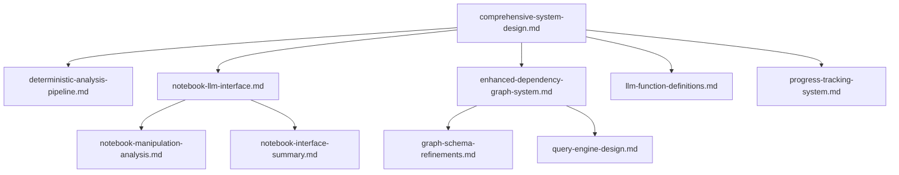

# System Design Documentation

This directory contains the comprehensive design documentation for the Spreadsheet Analyzer system. The documents are organized to provide both high-level architectural views and detailed component specifications.

## 📚 Core Design Documents

### System Architecture

- **[comprehensive-system-design.md](./comprehensive-system-design.md)** - The authoritative system design document covering all aspects of the architecture
- **[deterministic-analysis-pipeline.md](./deterministic-analysis-pipeline.md)** - Details of the deterministic spreadsheet analysis pipeline

### Notebook & LLM Integration

- **[notebook-llm-interface.md](./notebook-llm-interface.md)** - Comprehensive framework for Jupyter notebook-LLM communication
- **[notebook-manipulation-analysis.md](./notebook-manipulation-analysis.md)** - In-depth analysis of notebook manipulation tools and approaches
- **[notebook-interface-summary.md](./notebook-interface-summary.md)** - Quick reference guide for the notebook interface architecture

### Graph Database & Query Systems

- **[enhanced-dependency-graph-system.md](./enhanced-dependency-graph-system.md)** - Design for the enhanced dependency graph system
- **[graph-schema-refinements.md](./graph-schema-refinements.md)** - Refinements to the Neo4j graph schema
- **[query-engine-design.md](./query-engine-design.md)** - Design of the flexible query engine for spreadsheet dependencies

### Supporting Components

- **[llm-function-definitions.md](./llm-function-definitions.md)** - Function definitions for LLM interactions
- **[progress-tracking-system.md](./progress-tracking-system.md)** - System for tracking analysis progress
- **[ALGORITHM_RATIONALE_SUMMARY.md](./ALGORITHM_RATIONALE_SUMMARY.md)** - Summary of algorithm design decisions

## 📁 Historical Conversations

The [conversations/](./conversations/) directory contains historical design discussions with various AI assistants that shaped the system architecture:

- **claude_excel_analyzer_conversation.md** - Initial system design with Claude
- **gemini_conversation.md** - Refinements and alternative perspectives from Gemini
- **grok_convo.md** - Additional insights from Grok
- **openai_conversation.md** - OpenAI's contributions to the design

## 🗺️ Reading Order

For new team members or those wanting to understand the system:

1. Start with **[comprehensive-system-design.md](./comprehensive-system-design.md)** for the overall architecture
1. Read **[deterministic-analysis-pipeline.md](./deterministic-analysis-pipeline.md)** to understand the core analysis engine
1. Explore **[notebook-llm-interface.md](./notebook-llm-interface.md)** for the AI integration approach
1. Review specific components as needed

## 🔄 Document Relationships

## 📝 Document Status

All documents in this directory are actively maintained and represent the current state of the system design. When making changes:

1. Update the relevant design document
1. Ensure cross-references remain valid
1. Update this README if adding new documents
1. Consider updating the comprehensive-system-design.md if changes are significant

## 🤝 Contributing

When adding new design documents:

- Follow the existing naming convention (lowercase with hyphens)
- Add appropriate cross-references to related documents
- Update this README with a description
- Ensure the document includes an executive summary

For questions about the design, consult the comprehensive system design document first, then the specific component documentation.
