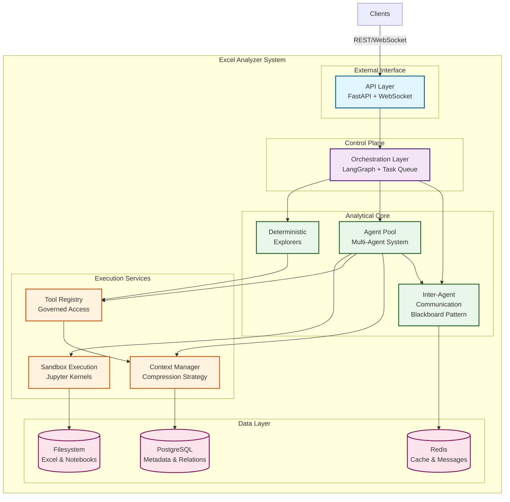
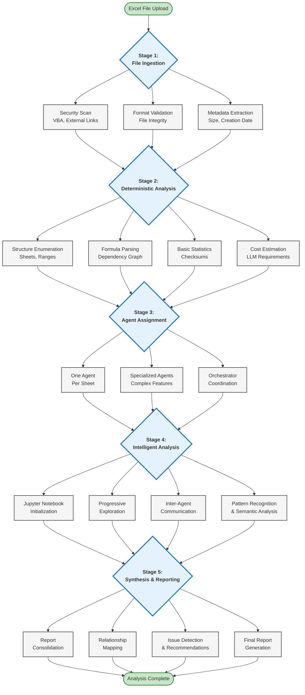
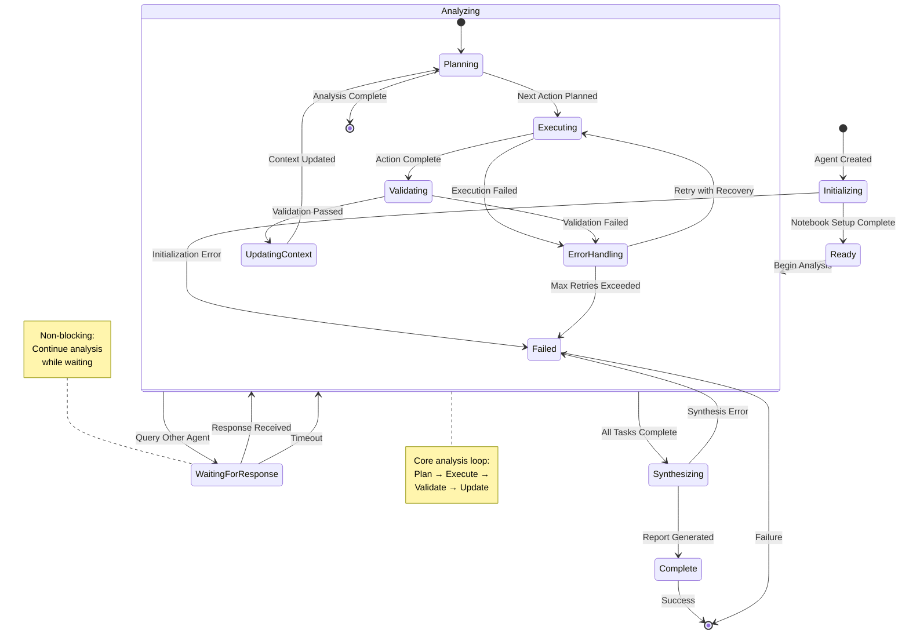
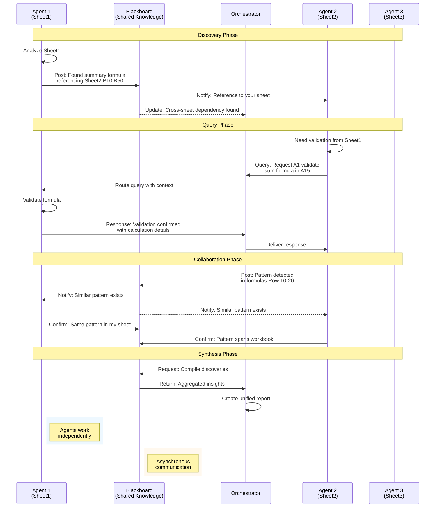
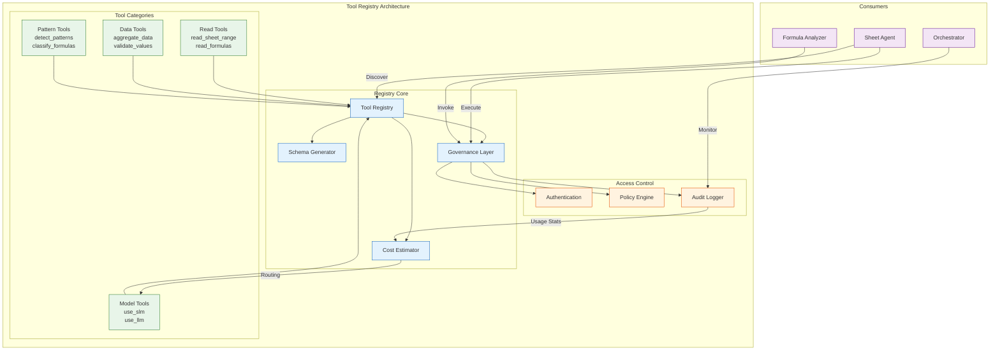
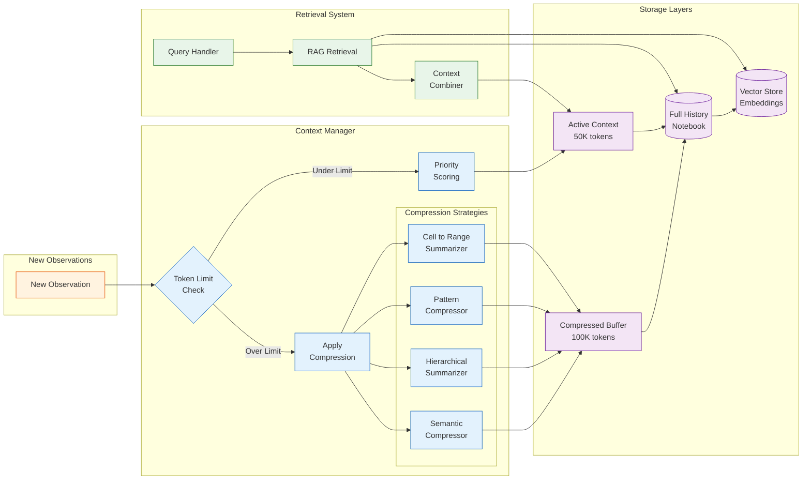
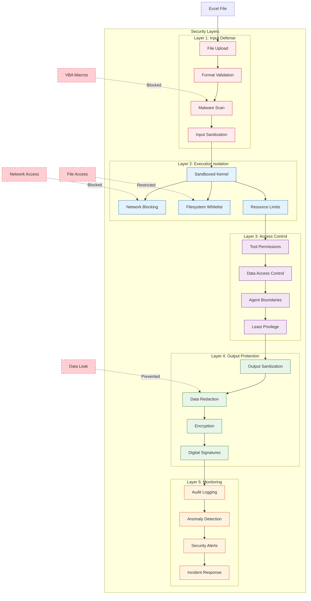
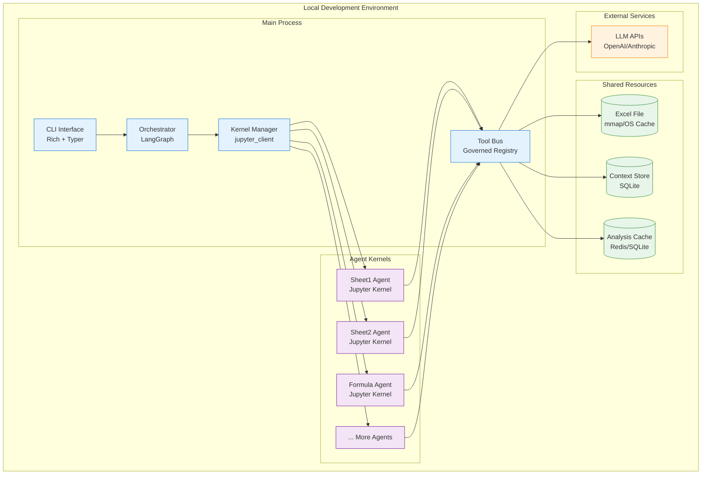
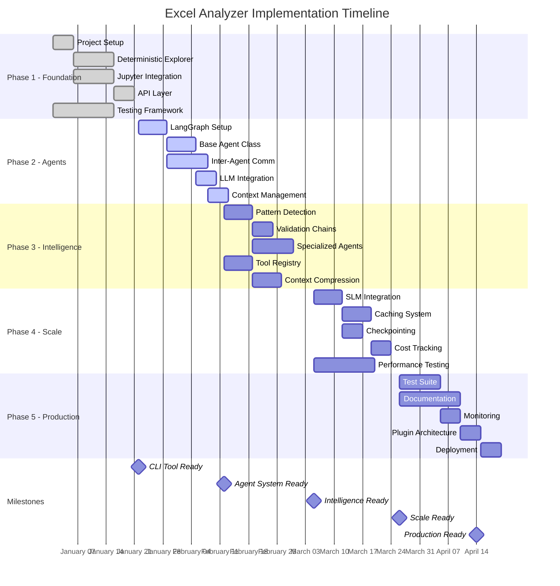

# Comprehensive Excel Analyzer System Design

## Document Purpose

This document serves as the authoritative technical specification for the Excel Analyzer system, a comprehensive solution for automated spreadsheet analysis. The design combines deterministic parsing techniques with advanced AI capabilities to deliver deep insights into complex Excel workbooks without requiring manual effort.

The architecture presented here represents a pragmatic synthesis of modern software engineering practices, AI/ML capabilities, and operational requirements. Every design decision has been carefully evaluated to balance sophistication with practicality, ensuring the system delivers genuine value while remaining maintainable and cost-effective.

## 1. Design Goals & Requirements

### Core Mission

The Excel Analyzer system aims to transform how professionals interact with complex spreadsheets by providing automated, intelligent analysis that reveals the hidden structure, relationships, and potential issues within Excel files. In today's data-driven environment, Excel files often evolve into complex, mission-critical systems that embed years of business logic, calculations, and interdependencies. Manual analysis of these files is time-consuming, error-prone, and often incomplete. Our system addresses this challenge by combining deterministic parsing techniques with advanced AI capabilities to deliver comprehensive insights without requiring manual effort.

### Consolidated Functional Requirements

#### 1.1 Content Discovery & Mapping

The foundation of effective Excel analysis lies in comprehensive content discovery. Every element within a spreadsheet—from simple data cells to complex pivot tables—must be precisely located, cataloged, and understood within its context. The system accomplishes this through multi-layered analysis that begins with structural parsing and extends to semantic understanding.

At the most basic level, the system maps the exact coordinates of all content elements, creating a spatial index that serves as the foundation for deeper analysis. However, location alone provides limited value. The true power emerges when we understand each sheet's role within the larger workbook ecosystem. Some sheets serve as raw data repositories, others perform complex calculations, while still others exist purely for visualization or reference purposes. By classifying these roles, the system can apply appropriate analysis strategies to each sheet type.

Cross-sheet dependencies represent one of the most challenging aspects of Excel analysis. Modern spreadsheets often contain intricate webs of references that span multiple sheets, creating hidden dependencies that can cascade throughout the workbook. Our system traces these connections, building a comprehensive dependency graph that reveals how data flows through the spreadsheet and identifies potential points of failure or circular references.

Formula intelligence extends beyond simple parsing to include classification, impact analysis, and optimization recommendations. The system recognizes common formula patterns, identifies inefficiencies, and suggests improvements while maintaining a complete understanding of how each formula contributes to the overall workbook logic.

Visual elements—charts, graphs, images, and shapes—require special handling as they often represent the primary way stakeholders interact with the data. The system extracts configuration details, identifies data sources, and validates that visualizations accurately represent their underlying data.

Advanced Excel features such as pivot tables, named ranges, conditional formatting, and data validation rules add layers of complexity that many analysis tools ignore. Our system provides comprehensive coverage of these features, understanding not just their presence but their purpose and impact on the overall workbook functionality.

#### 1.2 Validation & Verification

The principle of "trust but verify" guides our approach to spreadsheet analysis. Unlike traditional parsing tools that make assumptions about data structure and content, our system validates every claim through actual operations. This validation-first philosophy emerged as a unanimous consensus across all design discussions and represents a fundamental departure from conventional approaches.

When the system identifies what appears to be a summary row, it doesn't simply trust visual cues or formatting. Instead, it performs the actual aggregation calculations to verify that the claimed summary accurately reflects its constituent data. This approach extends to all aspects of analysis—null checks confirm data completeness, range validations ensure data integrity, and calculation verification catches formula errors that might otherwise go unnoticed.

Error detection capabilities encompass both structural issues (circular references, broken links, missing dependencies) and logical problems (calculation errors, data type mismatches, inconsistent formulas). The system doesn't just flag these issues; it provides detailed diagnostics that help users understand the root cause and potential impact of each problem.

Performance analysis identifies opportunities for optimization, from inefficient formula constructions to redundant calculations that could be consolidated. In large, complex spreadsheets, these optimizations can dramatically improve calculation speed and reduce the likelihood of errors.

Security scanning addresses the often-overlooked risks associated with Excel files. The system detects VBA macros, external data connections, and embedded objects that could pose security risks, providing detailed reports that help security teams assess and mitigate potential threats.

#### 1.3 Intelligence & Pattern Recognition

The integration of AI capabilities transforms our system from a sophisticated parser into an intelligent analyst. Pattern recognition algorithms identify repetitive structures within spreadsheets, even when those patterns aren't immediately obvious. For example, a financial model might use similar but not identical formulas across multiple time periods. The system recognizes these patterns, understanding the underlying logic rather than treating each formula as unique.

Semantic understanding represents perhaps the most ambitious aspect of our design. By analyzing data in context—considering column headers, sheet names, formula patterns, and data relationships—the system develops an understanding of the spreadsheet's business purpose. This semantic layer enables the system to provide insights that go beyond technical analysis to include business-relevant observations and recommendations.

Context-aware analysis allows the system to adapt its approach based on discovered information. As analysis progresses and the system develops a better understanding of the spreadsheet's structure and purpose, it can refine its analysis strategy, focusing computational resources on the most important or complex areas.

Historical comparison capabilities enable powerful change analysis when users provide previous versions of the same spreadsheet. The system can identify not just what changed, but why changes might have been made and what impact they have on the overall workbook functionality.

### Non-Functional Requirements

#### 1.4 Performance & Scalability

Real-world Excel files vary dramatically in size and complexity, from simple worksheets to massive financial models containing hundreds of sheets and millions of calculations. Our performance requirements reflect this reality, demanding a system capable of handling files ranging from kilobytes to gigabytes in size without degrading analysis quality.

The system achieves scalability through intelligent resource allocation and parallel processing. Complex workbooks with numerous sheets benefit from concurrent analysis, with individual agents assigned to each sheet while maintaining coordination through the orchestration layer. Progress tracking provides transparency for long-running analyses, allowing users to monitor completion status and receive preliminary results as they become available.

Memory management strategies prevent system overload when processing large files, using streaming techniques and intelligent caching to maintain performance even with limited resources. The architecture supports both vertical scaling (more powerful individual machines) and horizontal scaling (distributed processing across multiple machines) to meet varying performance demands.

#### Performance Targets and Benchmarks

To ensure consistent performance, the system targets these specific benchmarks:

- **File Upload**: Less than 2 seconds for files up to 10MB
- **Basic Structural Analysis**: Under 5 seconds for standard Excel files (< 10 sheets, < 10K cells)
- **Deep AI Analysis**: Within 30 seconds for complex workbooks (< 50 sheets, < 100K cells)
- **Concurrent Capacity**: Support for 10,000+ simultaneous analyses
- **Daily Throughput**: Process 100,000+ files per day

For files exceeding 50MB, the system automatically switches to a streaming-first approach, processing data in chunks to maintain responsive performance while preventing memory exhaustion. This chunk-based processing includes:

- Progressive loading with user-visible progress indicators
- Parallel chunk processing across available CPU cores
- Intelligent chunk sizing based on available memory
- Result streaming to prevent output buffer overflow

#### 1.5 Security & Safety

Security considerations permeate every aspect of the system design, reflecting the sensitive nature of many Excel files and the potential risks associated with automated analysis. The sandboxed execution environment provides the primary security boundary, ensuring that potentially malicious code cannot escape the analysis environment or access unauthorized resources.

Network isolation prevents data exfiltration attempts, while filesystem restrictions limit access to only those resources explicitly required for analysis. The system never executes embedded code such as VBA macros or scripts, instead analyzing them statically to understand their purpose without risking actual execution.

Audit trails provide comprehensive logging of all analysis operations, creating an immutable record that supports both security investigations and regulatory compliance requirements. Data handling protocols ensure that sensitive information remains protected throughout the analysis process, with options for encryption at rest and in transit.

#### 1.6 Cost Optimization

The integration of Large Language Models into our analysis pipeline introduces significant cost considerations that require careful optimization. Our multi-tiered approach minimizes expensive LLM operations while maximizing analysis value. Deterministic methods handle the bulk of structural analysis at zero marginal cost, while intelligent routing ensures that LLM capabilities are reserved for tasks that truly require advanced reasoning.

The system implements sophisticated caching mechanisms that recognize when similar analyses have been performed previously, reusing results where appropriate. For routine tasks that require some intelligence but not the full power of large models, the system leverages smaller, more economical models that provide adequate performance at a fraction of the cost.

Budget controls allow administrators to set spending limits at various granularities—per analysis, per user, or per time period—ensuring that costs remain predictable and manageable. Real-time cost tracking provides visibility into spending patterns and helps identify optimization opportunities.

#### 1.7 Flexibility & Extensibility

Enterprise environments demand systems that can adapt to changing requirements and integrate with existing workflows. Our API-first design philosophy ensures that all system capabilities are accessible through well-documented interfaces, enabling integration with existing tools and workflows.

Output format flexibility allows the system to deliver results in whatever format best suits the use case—detailed JSON for programmatic processing, formatted HTML for human review, or Markdown for documentation purposes. The architecture's modular design supports the addition of new analysis modules without disrupting existing functionality.

While Excel files represent the primary target, the system architecture accommodates future expansion to related formats such as CSV files, Google Sheets, and other tabular data sources. The plugin architecture enables third-party developers to extend system capabilities, creating specialized analyzers for industry-specific use cases or proprietary Excel extensions.

## 2. Architecture Overview

### Unified Approach: Hybrid Monolithic Agent System

The system employs a hybrid monolithic architecture with multi-agent intelligence, combining operational simplicity with analytical sophistication. Rather than managing a complex microservices ecosystem, the monolithic deployment allows focus on core analytical capabilities while maintaining easier debugging, deployment, and monitoring.

Within this monolithic architecture, multiple intelligent agents operate concurrently, recognizing that modern Excel files often contain dozens or even hundreds of sheets requiring parallel analysis. This design achieves the operational simplicity of a single deployable unit while providing the analytical power of distributed intelligence.

Jupyter notebook-based execution provides a revolutionary approach to maintaining audit trails and state persistence. Unlike traditional execution environments that lose context between operations, notebooks naturally preserve the complete history of analysis steps, enabling review, debugging, and replay of analyses. This approach directly supports the validation-first philosophy by allowing inspection of how the system arrives at its conclusions.

Tool Bus governance ensures control and safety in AI-powered operations. By mediating all tool access through a governed registry, the system enforces security policies, tracks resource usage, and prevents runaway operations that might otherwise consume excessive resources or violate security boundaries.

### High-Level Architecture

The system architecture reflects these unified principles through a layered design that separates concerns while maintaining clear communication paths between components. At the topmost level, the API layer provides both synchronous (REST) and asynchronous (WebSocket) interfaces, recognizing that Excel analysis can range from quick structural scans to hours-long deep analyses of complex financial models.

The orchestration layer, powered by LangGraph and a task queue system, coordinates the complex dance of agents, tools, and resources. This layer makes critical decisions about agent assignment, resource allocation, and execution strategy based on the initial complexity assessment of each workbook.

The core analytical components form the heart of the system. Deterministic Explorers handle the initial parsing and structural analysis, operating at machine speed to extract maximum information before any LLM tokens are consumed. The Agent Pool maintains a collection of specialized agents, each capable of analyzing specific aspects of Excel files, from formula patterns to chart configurations. Inter-Agent Communication through a Blackboard pattern enables these agents to share discoveries and coordinate their analyses without tight coupling.

Supporting these analytical components, the execution layer provides essential services. The Sandbox Execution environment, based on Jupyter kernels, ensures that all code execution occurs within strictly controlled boundaries. The Tool Registry maintains a catalog of available tools and their interfaces, enabling agents to discover and utilize capabilities dynamically. The Context Manager handles the critical challenge of managing growing analytical context within LLM token limits.

Finally, the storage and persistence layer combines multiple technologies to meet diverse needs. The filesystem stores raw Excel files and Jupyter notebooks, PostgreSQL maintains structured metadata and relationships, while Redis provides high-speed caching and inter-agent communication support.



### Processing Pipeline

The analytical pipeline represents a carefully orchestrated progression from fast, deterministic analysis to intelligent, AI-powered insights. Each stage builds upon the previous, with intelligent routing decisions ensuring that expensive resources are used only when necessary.

**For comprehensive technical details of the deterministic analysis pipeline, see [Deterministic Analysis Pipeline: Deep Dive](./deterministic-analysis-pipeline.md)**, which provides complete implementation details, code examples, and integration specifications.



**Stage 1: File Ingestion** begins immediately upon file upload, performing critical security and validation checks before any processing begins. The security scan examines the file for potentially dangerous content such as VBA macros or external data connections, quarantining suspicious files for manual review. Format detection ensures the file is a valid Excel format that the system can process, while initial metadata extraction captures basic information such as file size, creation date, and high-level structure.

**Stage 2: Deterministic Analysis** leverages traditional parsing techniques to extract maximum value without consuming LLM tokens. This stage implements a sophisticated five-phase pipeline (Integrity Probe → Security Scan → Structural Mapping → Formula Intelligence → Content Intelligence). Structure enumeration creates a complete inventory of sheets, named ranges, and other Excel objects. Formula parsing not only extracts formula text but builds a comprehensive dependency graph showing how calculations flow through the workbook. Basic statistics provide quick insights into data density, formula complexity, and potential processing requirements. Critically, this stage generates cost estimates for subsequent LLM analysis, enabling informed decisions about resource allocation.

**→ See [Deterministic Analysis Pipeline: Deep Dive](./deterministic-analysis-pipeline.md) for complete implementation details, code examples, and agent integration specifications.**

**Stage 3: Agent Assignment** represents the transition from deterministic to intelligent analysis. Based on the complexity assessment, the orchestrator assigns specialized agents to different aspects of the workbook. The default strategy assigns one agent per sheet, enabling parallel analysis of independent sheets. However, for sheets with unusual complexity or specialized features (such as pivot tables or complex charts), the system may assign specialized agents with relevant expertise. The orchestrator maintains overall coordination, ensuring agents work efficiently without duplicating effort.

**Stage 4: Intelligent Analysis** unleashes the full power of AI-driven analysis. Each agent initializes its own Jupyter notebook environment, creating an isolated workspace for experimentation and validation. Progressive exploration allows agents to adapt their analysis based on discoveries, diving deeper into areas of interest while maintaining efficiency in routine sections. When agents discover cross-sheet dependencies, the inter-agent communication system enables coordination and information sharing. Throughout this process, pattern recognition algorithms identify recurring structures and formulas, while semantic analysis develops an understanding of the spreadsheet's business purpose.

**Stage 5: Synthesis & Reporting** consolidates the distributed intelligence into actionable insights. Individual agent reports are merged and reconciled, with conflicts resolved through validation and verification. The system maps relationships across the entire workbook, revealing hidden dependencies and data flows. Issue detection algorithms identify problems ranging from broken formulas to potential security vulnerabilities. Finally, the system generates comprehensive reports tailored to the audience, whether technical teams needing detailed findings or executives requiring high-level summaries.

## 3. Component Design

### 3.1 Deterministic Explorers

The Deterministic Explorers represent the foundation of our analytical pipeline, embodying the principle that not every problem requires AI-powered solutions. These components leverage decades of established Excel parsing techniques to extract structural information at machine speed, providing a comprehensive understanding of the workbook's anatomy before any LLM tokens are consumed.

The design philosophy behind Deterministic Explorers recognizes that the vast majority of Excel structural analysis can be performed through traditional parsing methods. By front-loading this deterministic analysis, we accomplish several critical objectives. First, we minimize costs by avoiding LLM usage for tasks that don't require intelligence. Second, we provide immediate value to users through rapid structural analysis. Third, we gather essential context that makes subsequent AI analysis more effective and efficient.

**📋 Complete Implementation Guide**: The full technical specifications, including the five-stage pipeline (Integrity Probe → Security Scan → Structural Mapping → Formula Intelligence → Content Intelligence), comprehensive code examples, performance benchmarks, and agent integration patterns are documented in **[Deterministic Analysis Pipeline: Deep Dive](./deterministic-analysis-pipeline.md)**.

#### Core Implementation Stack

The implementation leverages a combination of specialized libraries for comprehensive file analysis:

**Primary Excel Parsing**: The battle-tested openpyxl library serves as our primary parser, chosen for its comprehensive coverage of Excel features and reliable parsing capabilities. The explorer operates in read-only mode to ensure data integrity while maintaining the ability to access formulas rather than just calculated values.

**File Type Detection**: Apache Tika integration provides robust MIME type detection for over 1,400 file formats, using both magic byte analysis and content inspection to prevent file type spoofing attacks. This goes beyond simple extension checking to ensure files are genuinely what they claim to be.

**Legacy Format Support**: For older .xls files, we maintain xlrd as a fallback parser, while pyxlsb handles the binary .xlsb format efficiently.

**Macro Detection**: The oletools suite, particularly olevba, performs static analysis of VBA macros and Excel 4.0 (XLM) macros without execution, flagging potentially malicious code patterns while extracting source code for security review.

Security considerations drove the decision to disable VBA loading during parsing, preventing any possibility of malicious code execution. When macros are detected, the system automatically raises the file's risk tier and routes it through additional security checks.

The structural extraction process creates a complete inventory of workbook components. Sheet enumeration goes beyond simply listing sheet names to include metadata about sheet types, visibility settings, and protection status. Formula parsing creates not just a catalog of formulas but a complete dependency graph showing how calculations flow through the workbook. Named range detection helps identify important data regions that may serve as interfaces between sheets or external systems. Chart and visual element discovery captures the presentation layer of the spreadsheet, while external reference scanning identifies potential security risks and data dependencies.

Perhaps most importantly, the complexity estimation function serves as the intelligence layer's guide. By analyzing formula complexity, data volume, and interconnectedness, the explorer generates a complexity score that informs subsequent decisions about agent assignment, resource allocation, and cost estimation. This score considers factors such as the depth of formula nesting, the presence of array formulas, the use of volatile functions, and the density of inter-sheet references.

### 3.2 Agent System

The Agent System implements a hybrid architecture that combines autonomous analytical capabilities with sophisticated peer coordination. At its core, each agent is an independent analytical unit capable of deep Excel analysis while maintaining coordination with other agents through well-defined communication mechanisms.



The architectural decision to create one agent per sheet stems from the natural structure of Excel workbooks. Sheets often represent logical boundaries, with each serving a distinct purpose—data entry, calculations, reporting, or visualization. By aligning agents with these natural boundaries, we achieve efficient parallelization while minimizing the need for constant inter-agent coordination.

Each agent incorporates three critical subsystems:

1. **Jupyter Notebook Integration**: Provides each agent with a persistent workspace for experimentation and validation. Unlike traditional execution environments that lose context between operations, the notebook maintains a complete history of all analytical steps, enabling debugging, auditing, and even replay of analyses.

1. **Tool Bus**: Mediates all agent interactions with external resources through a governance layer that ensures agents operate within defined boundaries, preventing runaway operations while maintaining detailed logs of all tool usage. The Tool Bus also enables dynamic capability discovery, allowing agents to adapt their strategies based on available tools.

1. **Context Manager**: Addresses the fundamental challenge of managing growing context within LLM token limits. Each agent's context manager implements sophisticated strategies for maintaining relevant information while discarding or compressing less critical details.

The agent's analytical process follows a progressive exploration pattern. After initialization with deterministic context from the explorer phase, the agent enters an iterative analysis loop. Each iteration involves planning the next action based on current knowledge, executing that action with validation, and updating the analytical context with new discoveries. This approach allows agents to adapt their strategies as they uncover new information, diving deeper into complex areas while maintaining efficiency in routine sections.

The asynchronous message queue enables non-blocking communication between agents. When an agent discovers a cross-sheet reference or needs information from another sheet's analysis, it can post a query and continue its own work while awaiting a response. This design prevents analysis bottlenecks while maintaining the ability to coordinate when necessary.

### 3.3 Sandbox Execution Environment

The Sandbox Execution Environment addresses the fundamental challenge of allowing AI agents to execute code while maintaining security and safety. This component creates an environment that balances analytical power with rigorous security requirements.

The security architecture implements defense in depth through multiple layers of protection. At the kernel level, resource constraints prevent any single execution from consuming excessive CPU, memory, or time. The 30-second timeout prevents infinite loops, while the 512MB memory limit ensures system stability even when analyzing large datasets. Network access is completely disabled, preventing any possibility of data exfiltration or external communication.

Filesystem access follows a whitelist approach, with agents only able to access files within their designated sandbox directory. This prevents both accidental and malicious access to system files or other sensitive data. The module whitelist restricts imports to a predefined set of safe libraries, preventing agents from loading potentially dangerous code.

The execution recovery mechanism represents one of our key innovations. When code execution fails, the system doesn't simply report an error and stop. Instead, it analyzes the failure, generates recovery code that addresses the specific issue, and documents both the failure and the recovery approach within the notebook. This creates a valuable record of edge cases and error conditions while enabling the analysis to continue.

For example, if an agent encounters a division by zero error while calculating averages, the recovery mechanism might generate code that filters out zero values or implements safe division with default values. The recovered code includes comments explaining the issue and the chosen solution, creating a self-documenting analysis trail.

The execution history maintains a complete record of all code executions, whether successful or failed. This history serves multiple purposes: it provides an audit trail for security and compliance, enables debugging of complex analyses, and allows for replay of analyses with different parameters or assumptions. The history is structured to support both human review and automated analysis, with clear timestamps, execution contexts, and results.

### 3.4 Inter-Agent Communication

The Inter-Agent Communication system implements a hybrid approach combining the Blackboard pattern for shared knowledge with an asynchronous query system for direct agent-to-agent communication. This design enables agents to collaborate effectively without creating tight coupling or synchronization bottlenecks.



The Blackboard pattern provides a shared knowledge space where agents can post discoveries and read information from other agents. The blackboard serves as a central repository for facts discovered during analysis—cross-sheet references, data validation rules that span sheets, or calculation patterns that repeat across the workbook. When an agent posts a fact to the blackboard, the system notifies potentially interested agents based on subscription patterns, enabling reactive collaboration without requiring agents to constantly poll for updates.

The asynchronous query system addresses scenarios where agents need specific information from their peers. For example, when analyzing a summary sheet, an agent might discover references to data on multiple source sheets. Rather than attempting to analyze those sheets directly, the agent posts queries to the responsible agents and continues its own analysis while awaiting responses. This non-blocking approach prevents analysis paralysis while maintaining the ability to incorporate cross-sheet insights.

The communication protocol implements several important design principles. First, all communication is asynchronous and non-blocking, preventing any single slow agent from bottlenecking the entire analysis. Second, queries include minimal context to help the receiving agent understand the request without overwhelming it with unnecessary information. Third, the system maintains query state to handle timeouts gracefully—if an agent doesn't respond within a reasonable timeframe, the querying agent can proceed with partial information rather than waiting indefinitely.

The agent state tracking mechanism provides system-wide visibility into analysis progress. Each agent regularly updates its state—initializing, analyzing, waiting for responses, or complete—enabling the orchestrator to make informed decisions about resource allocation and problem detection. If an agent becomes stuck or fails, the orchestrator can reassign its work or attempt recovery procedures.

### 3.5 Tool Registry

The Tool Registry implements a centralized, governed system for tool management. The design combines range-based utilities, pattern detection tools, and cost-aware tool selection into a cohesive system that serves all agent needs.



The registry serves multiple critical functions within the system architecture. First, it provides a discoverable catalog of capabilities, enabling agents to dynamically adapt their strategies based on available tools. Second, it enforces governance policies, ensuring that tool usage remains within defined security and resource boundaries. Third, it provides a consistent interface for tool invocation, abstracting away implementation details and enabling tool evolution without breaking agent code.

The tool collection reflects the diverse needs of Excel analysis:

**Range-based utilities** provide efficient access to spreadsheet data without requiring agents to understand the intricacies of Excel file formats. These tools handle common operations like reading cell ranges, extracting formulas, and accessing metadata, returning data in standardized formats that agents can easily process.

**Data operation tools** address the validation-first philosophy. Rather than trusting apparent patterns or structures, agents use these tools to perform actual calculations—aggregating data to verify summaries, validating formulas against their inputs, and checking for data consistency across ranges. These tools implement optimized algorithms for common operations, ensuring efficient execution even on large datasets.

**Pattern detection tools** enable agents to identify recurring structures within spreadsheets. These tools go beyond simple pattern matching to understand semantic patterns—recognizing that a series of similar formulas might represent time-series calculations, or that a particular arrangement of cells might indicate a data entry form.

**Cost-aware tool selection** enables intelligent routing of operations to appropriate models. Simple pattern matching might use a small, fast language model, while complex semantic analysis requires more powerful models. The registry maintains cost estimates for each tool, enabling agents to make informed decisions about resource usage.

The schema generation capability ensures compatibility with modern LLM function-calling interfaces. By providing OpenAI and Anthropic-compatible schemas, the registry enables seamless integration with various LLM providers while maintaining the flexibility to adapt to future interface standards.

### 3.6 Context Management

Context Management represents one of the most challenging aspects of LLM-based analysis. The system implements a sophisticated approach that balances completeness with efficiency. The fundamental challenge stems from the tension between maintaining comprehensive analytical context and staying within LLM token limits—a challenge that only grows more acute as analyses become more complex.



The hierarchical compression approach addresses this challenge through multiple complementary strategies. At the finest granularity, cell-level observations are aggregated into range-level summaries when patterns are detected. For example, if an agent observes that cells A1 through A100 all contain similar formulas with incrementing references, the context manager can compress this into a single pattern observation rather than storing 100 individual observations.

Pattern compression takes this concept further by recognizing and consolidating recurring structures throughout the analysis. When agents identify repeated patterns—whether in formulas, data structures, or relationships—the context manager creates compact representations that preserve the essential information while dramatically reducing token usage.

The hierarchical summarization strategy maintains multiple levels of detail simultaneously. Detailed observations remain available in the full history, while progressively summarized versions exist for inclusion in the active context. This approach ensures that agents always have access to the most relevant information at the appropriate level of detail.

Semantic compression, the most sophisticated strategy, uses embedding-based similarity to identify and consolidate related observations. This approach recognizes that many observations might express similar insights in different ways, enabling intelligent consolidation without losing semantic meaning.

The full history persistence, stored in the notebook environment, serves as the ultimate fallback. When an agent needs information that has been compressed out of the active context, the RAG-style retrieval system can search the full history and return relevant observations. This ensures that no information is ever truly lost, merely archived until needed.

The context manager's decision logic continuously balances multiple factors. When adding new observations, it considers not just the token count but also the relevance, uniqueness, and potential future utility of each piece of information. The system maintains a priority queue of observations, ensuring that the most critical information remains in the active context even as compression becomes necessary.

## 4. Technical Decisions

The technical decisions underlying the Excel Analyzer reflect careful consideration of both technical capabilities and practical realities of deployment, maintenance, and user needs. Each decision balances sophistication with pragmatism, ensuring the system delivers value while remaining maintainable and cost-effective.

### 4.1 Programming Language: Python

Python was selected as the implementation language due to its unique position at the intersection of data analysis, AI/ML frameworks, and enterprise software development.

Python's ecosystem for data analysis is unmatched in both breadth and maturity. Libraries like pandas provide DataFrame abstractions that map naturally to Excel's tabular structure, while numpy enables efficient numerical operations on large datasets. The openpyxl library offers comprehensive Excel file manipulation capabilities, reading and writing Excel files with full fidelity while preserving formulas, styles, and other metadata that simpler libraries might discard.

The native integration with Jupyter notebooks proved particularly compelling given our architectural decision to use notebooks as the execution environment for agents. Python's IPython kernel provides robust session management, variable persistence, and execution control that would be difficult to replicate in other languages. This integration extends beyond mere compatibility—the Python data science ecosystem has evolved alongside Jupyter, creating a symbiotic relationship that our design leverages extensively.

The explosion of LLM frameworks in Python sealed the decision. LangChain and LangGraph provide sophisticated abstractions for building LLM-powered applications, while the broader ecosystem includes everything from vector databases to prompt management tools. Attempting to build our system in another language would mean either sacrificing these powerful tools or building complex bridges to Python-based services.

### 4.2 Orchestration: LangGraph

The choice of LangGraph for orchestration emerged through careful evaluation of available frameworks and their alignment with our architectural vision. While LangChain provides excellent abstractions for single-agent LLM applications, LangGraph extends these concepts to support the multi-agent, stateful workflows that our design demands.

LangGraph's native multi-agent support aligns perfectly with our per-sheet agent architecture. The framework provides built-in primitives for agent creation, lifecycle management, and coordination—capabilities that would require significant custom development with simpler frameworks. The state management system enables agents to maintain context across multiple analytical steps while providing checkpointing capabilities for long-running analyses.

The framework's approach to tool calling proved particularly well-suited to our needs. Rather than treating tools as simple function calls, LangGraph enables sophisticated tool orchestration with features like conditional execution, result validation, and automatic retry logic. This aligns perfectly with our Tool Bus governance model, enabling us to implement security policies and resource controls at the framework level.

Streaming support enables real-time progress updates during long analyses, addressing a key user experience requirement. The async-first design allows efficient resource utilization when managing multiple concurrent agents, while the active development community ensures ongoing improvements and bug fixes.

### 4.3 Deployment: Monolithic with Agent Parallelism

The monolithic deployment model was chosen after careful analysis of specific requirements and constraints. Despite current microservices trends, the monolithic approach provides significant operational advantages for this use case.

In a microservices architecture, our system would require separate services for API handling, agent orchestration, execution sandboxing, and various utility functions. This would introduce complexity in service discovery, network communication, distributed state management, and deployment coordination. For many organizations, this complexity translates directly into operational overhead and increased failure modes.

The monolithic approach dramatically simplifies deployment—a single container or process encompasses the entire system. This simplification extends to debugging, where engineers can trace execution through the entire stack without navigating distributed logs and network boundaries. State management becomes straightforward when all components share the same process space, eliminating the need for distributed state stores or complex synchronization protocols.

However, monolithic doesn't mean monolithic thinking. Within our single deployment unit, we maintain clear architectural boundaries and implement agent parallelism through process-based or thread-based concurrency. This provides the analytical parallelism benefits of a distributed system while maintaining operational simplicity.

The trade-offs are real and acknowledged. Agent isolation is less complete than in a true microservices architecture, potentially allowing one misbehaving agent to impact others. Resource contention requires careful management to prevent agents from starving each other of CPU or memory. The single point of failure risk is mitigated through comprehensive checkpointing and the ability to resume analyses from saved state.

### 4.4 Execution Environment: Jupyter Notebooks

Jupyter notebooks provide a transformative execution environment for the system. Unlike traditional execution environments that lose context between operations and provide limited visibility into execution history, Jupyter notebooks maintain complete state and history by default.

The audit trail capability emerged as perhaps the most compelling benefit. Every operation performed by an agent is recorded in the notebook, creating a self-documenting analysis that can be reviewed, debugged, or even modified by human analysts. This transparency is invaluable for building trust in AI-driven analysis, allowing users to understand not just what the system concluded but how it reached those conclusions.

State persistence between operations enables sophisticated analytical workflows. Agents can build upon previous calculations, refer back to earlier results, and maintain complex data structures throughout their analysis. This persistence also enables checkpointing—if an analysis is interrupted, it can resume from the last saved notebook state rather than starting over.

The debugging capabilities of Jupyter notebooks proved particularly valuable during development and troubleshooting. Engineers can inspect variable states, re-run specific cells with modifications, and interactively explore edge cases. This interactive debugging extends to production, where support engineers can load saved notebooks to understand and resolve issues.

The familiarity factor shouldn't be underestimated. Data analysts and scientists already use Jupyter notebooks extensively, making the system's outputs immediately accessible to key stakeholders. Rather than producing opaque binary outputs, the system generates notebooks that analysts can open, understand, and even extend with their own analysis.

#### Sandboxing Implementation Details

To ensure secure execution, our Jupyter kernels run within strictly controlled environments using gVisor as the runtime:

```yaml
apiVersion: v1
kind: Pod
spec:
  runtimeClassName: gvisor  # Sandboxed runtime
  containers:
  - name: excel-analyzer-kernel
    securityContext:
      runAsNonRoot: true
      runAsUser: 1000
      readOnlyRootFilesystem: true
      allowPrivilegeEscalation: false
    resources:
      limits:
        memory: "512Mi"
        cpu: "1000m"
        ephemeral-storage: "1Gi"
      requests:
        memory: "256Mi"
        cpu: "250m"
```

This configuration ensures complete isolation while maintaining the flexibility needed for complex analysis tasks.

### 4.5 Context Strategy: Hybrid Compression

The context management strategy addresses one of the fundamental challenges of LLM-based analysis. As analyses progress and agents accumulate observations, the context can quickly exceed LLM token limits, requiring intelligent compression strategies that preserve essential information while discarding redundancy.

The hybrid context management approach implements multiple complementary strategies:

**Full History Persistence**: The complete notebook history serves as the authoritative record, providing an audit trail, debugging resource, and retrieval corpus when compressed context proves insufficient. This ensures that no information is truly lost, merely archived until needed.

**Hierarchical Summarization**: As agents accumulate detailed observations about individual cells or ranges, the context manager progressively summarizes these into higher-level insights. This approach mirrors how human analysts work—starting with detailed observations and building toward general conclusions.

**Vector Storage for Retrieval**: By embedding observations and storing them in a vector database, the system can quickly retrieve relevant historical context when needed. This RAG-style approach ensures that compressed-out details remain accessible without requiring the full context in every LLM call.

**Pattern Compression**: The system identifies and consolidates repetitive structures. When agents observe similar patterns across multiple cells or sheets, the context manager creates compact representations that capture the pattern without storing every instance.

**Reference-Based Storage**: Rather than storing complete datasets in context, the system maintains references that allow agents to retrieve specific details when needed. This approach keeps the active context focused on insights and patterns while preserving the ability to dive into details.

### 4.6 Cost Optimization: Multi-Tier Model Usage

The cost optimization strategy recognizes that not all analytical tasks require the full power of large language models. By implementing a multi-tier approach to model usage, the system dramatically reduces costs while maintaining analytical quality.

#### 4.6.1 Deterministic-First Processing

The foundation of cost optimization is maximizing deterministic analysis. Traditional parsing and calculation methods handle the bulk of structural analysis at zero marginal cost. Only when these deterministic methods reach their limits do we escalate to AI-powered analysis. This principle extends throughout the system—always prefer the simplest, cheapest method that can reliably accomplish the task.

#### 4.6.2 Model Tier Strategy

Small Language Models serve as the workhorses for routine analytical tasks. Pattern matching, simple classification, and basic text analysis can often be accomplished by models with billions rather than hundreds of billions of parameters. These smaller models run faster and cheaper while providing adequate performance for many tasks. The key is intelligent routing—understanding which tasks truly require large model capabilities.

Large Language Models are reserved for complex reasoning tasks that require deep understanding, sophisticated pattern recognition, or creative problem-solving. By concentrating LLM usage on high-value tasks, we ensure that the increased cost delivers commensurate value. The system tracks which types of analyses benefit most from large models, continuously refining its routing decisions.

#### 4.6.3 Caching and Reuse Strategies

Caching and result reuse provide another layer of cost optimization. When agents encounter similar analytical challenges, the system can often reuse or adapt previous results rather than performing redundant analysis. This caching operates at multiple levels—from individual tool results to complete analytical conclusions.

#### 4.6.4 Budget Management

Budget limits provide hard stops to prevent runaway costs. Administrators can set budgets at various granularities—per analysis, per user, per time period—ensuring that costs remain predictable and controlled. The system provides real-time cost tracking and projections, allowing users to make informed decisions about resource usage.

#### 4.6.5 Performance Acceleration with GPU Computing

For computationally intensive operations, the system can leverage GPU acceleration through RAPIDS cuDF, achieving up to 150x speedup for:

- Large-scale data aggregation and statistical analysis
- Parallel formula evaluation across thousands of cells
- Pattern detection and anomaly identification
- Machine learning model inference for classification tasks

This GPU acceleration is particularly valuable when analyzing massive financial models or scientific datasets where traditional CPU-based processing would be prohibitively slow.

#### 4.6.6 Real-Time Cost Tracking Dashboard

The system implements comprehensive cost monitoring with metrics including:

- Per-agent token consumption and wall time
- Cost breakdown by analysis phase (deterministic vs. AI)
- Budget utilization alerts and projections
- Historical cost trends for capacity planning

This visibility enables administrators to optimize resource allocation and identify opportunities for further cost reduction.

### 4.7 Security Model: Defense in Depth

The security model implements a comprehensive defense-in-depth approach. Recognizing that Excel files can contain sensitive data and potentially malicious content, the security architecture provides multiple layers of protection, each designed to catch threats that might slip through other defenses.



#### 4.7.1 Input Validation and Sanitization

Input validation and sanitization form the first line of defense. Before any processing begins, the system validates file formats, scans for known malicious patterns, and sanitizes inputs to prevent injection attacks. This validation extends beyond simple file format checks to include analysis of embedded content, external references, and potentially dangerous formulas.

#### 4.7.2 Sandboxed Execution Environment

The sandboxed execution environment provides the primary security boundary for agent operations. By executing all agent code within strictly controlled Jupyter kernels, we prevent malicious or misbehaving code from accessing system resources or sensitive data. The sandbox enforces strict limits on CPU, memory, and execution time while completely blocking network access and restricting filesystem operations to designated directories.

#### 4.7.3 Least Privilege Access Control

The principle of least privilege extends throughout the system. Agents only receive access to the specific tools and data required for their analysis. The Tool Bus enforces these restrictions, logging all access attempts and blocking unauthorized operations. This granular access control prevents lateral movement if any component is compromised.

#### 4.7.4 Output Protection and Sanitization

Output sanitization ensures that analysis results don't inadvertently expose sensitive information or enable attacks on downstream systems. The system scrubs outputs for potential data leaks, validates that all external references are properly documented, and ensures that generated reports don't include executable content.

#### 4.7.5 Comprehensive Audit and Monitoring

Comprehensive audit logging provides both security monitoring and compliance support. Every significant operation—from file upload to tool execution to result generation—is logged with sufficient detail to support security investigations and regulatory audits. These logs are tamper-resistant and retained according to configurable policies.

## 5. Development Environment Setup

The development environment design balances developer productivity with architectural integrity. Core principles include isolated agent execution, efficient resource utilization, and seamless local-to-production transitions. The implementation carefully manages trade-offs to create an environment that supports rapid development while maintaining production-ready patterns.

### 5.1 Development Philosophy

The local development environment embodies a "production-faithful but developer-friendly" philosophy. While production deployments may utilize microservices, message queues, and distributed storage, the local environment consolidates these into a monolithic application that preserves architectural boundaries without operational complexity. This approach emerged from recognizing that developers need rapid iteration cycles and comprehensive debugging capabilities during the experimental phase of spreadsheet analyzer development.

A key design principle is that architectural patterns matter more than deployment topology. A well-structured monolithic application can evolve into microservices when needed, but a poorly structured system remains problematic regardless of deployment model. Therefore, the local setup maintains clean interfaces between components, uses the same configuration patterns as production, and implements identical security boundaries—just within a single process rather than across network boundaries.

### 5.2 Local Architecture Overview

The local development architecture centers on a Python application managed by `uv`, leveraging its superior performance on Apple Silicon and modern dependency resolution capabilities. The application runs as a single process but spawns multiple Jupyter kernels for agent isolation, achieving concurrent analysis without the complexity of distributed systems.



### 5.3 Core Technology Stack

The technology stack leverages modern Python tooling optimized for Apple Silicon while maintaining compatibility with production Linux environments:

```yaml
# Development Environment Stack
language: Python 3.12+
package_manager: uv
project_layout: src/

# Core Dependencies
framework:
  orchestration: langraph>=0.1.0
  api_layer: fastapi>=0.109.0
  cli: typer[all]>=0.9.0
  async: asyncio, uvloop  # uvloop for 2x performance on macOS

# Excel Processing
excel:
  primary: openpyxl>=3.1.0  # Comprehensive parsing
  legacy: xlrd>=2.0.1      # For .xls files
  pandas_integration: pandas>=2.2.0

# Jupyter Integration
jupyter:
  kernel_management: jupyter_client>=8.6.0
  notebook_format: nbformat>=5.9.0
  kernel: ipykernel>=6.29.0

# LLM Integration
llm:
  openai: openai>=1.12.0
  anthropic: anthropic>=0.18.0
  langchain: langchain>=0.1.0
  langchain_community: langchain-community>=0.0.20

# Storage & Caching
storage:
  embedded_db: sqlite3  # Built-in
  cache: diskcache>=5.6.0  # Pure Python, no Redis needed for dev
  vector_store: chromadb>=0.4.0  # Optional, for RAG

# Development Tools
dev:
  testing: pytest>=8.0.0, pytest-asyncio>=0.23.0
  linting: ruff>=0.3.0  # Replacing black, isort, flake8
  type_checking: mypy>=1.9.0
  pre_commit: pre-commit>=3.6.0
  documentation: mkdocs>=1.5.0, mkdocs-material>=9.5.0
```

### 5.4 Jupyter Kernel Management

The kernel management strategy balances isolation with efficiency. Each agent requires its own execution environment while avoiding resource duplication. The implementation uses `jupyter_client` for programmatic kernel management, providing fine-grained control over kernel lifecycle and communication.

```python
# Kernel Manager Implementation
from jupyter_client import AsyncMultiKernelManager
from contextlib import asynccontextmanager
import asyncio
from typing import Dict, Optional

class AgentKernelManager:
    """Manages Jupyter kernels for agent isolation with resource pooling."""

    def __init__(self, max_kernels: int = 10):
        self.mkm = AsyncMultiKernelManager()
        self.max_kernels = max_kernels
        self.kernel_pool: asyncio.Queue = asyncio.Queue(maxsize=max_kernels)
        self.kernel_assignments: Dict[str, str] = {}

    async def initialize(self):
        """Pre-warm kernel pool for better performance."""
        await self.mkm.start()
        for _ in range(min(3, self.max_kernels)):  # Pre-warm 3 kernels
            kernel_id = await self.mkm.start_kernel(
                kernel_name='python3',
                extra_arguments=['--MatplotlibBackend=Agg'],  # Headless mode
                env={
                    'PYDEVD_DISABLE_FILE_VALIDATION': '1',  # Faster startup
                    'PYTHONUNBUFFERED': '1'
                }
            )
            await self.kernel_pool.put(kernel_id)

    @asynccontextmanager
    async def get_kernel_for_agent(self, agent_id: str):
        """Get or create a kernel for an agent with automatic cleanup."""
        # Reuse existing kernel if agent already has one
        if agent_id in self.kernel_assignments:
            kernel_id = self.kernel_assignments[agent_id]
        else:
            # Get from pool or create new
            try:
                kernel_id = await asyncio.wait_for(
                    self.kernel_pool.get(), timeout=0.1
                )
            except asyncio.TimeoutError:
                kernel_id = await self.mkm.start_kernel(kernel_name='python3')

            self.kernel_assignments[agent_id] = kernel_id

        km = self.mkm.get_kernel(kernel_id)
        kc = km.client()
        kc.start_channels()

        try:
            yield kc
        finally:
            kc.stop_channels()
            # Return to pool for reuse
            if self.kernel_pool.full():
                await self.mkm.shutdown_kernel(kernel_id)
                del self.kernel_assignments[agent_id]
            else:
                await self.kernel_pool.put(kernel_id)
```

### 5.5 File Handling and Caching Strategy

The file handling approach recognizes that Excel files are read-heavy workloads where OS-level caching provides excellent performance without complex shared memory implementations. Each agent kernel can independently open the Excel file, relying on the operating system's memory architecture and page cache for efficiency.

```python
# Idempotent Agent Bootstrap Cell Template
AGENT_BOOTSTRAP_TEMPLATE = '''
# --- Agent Bootstrap Cell (Idempotent) ---
from pathlib import Path
import openpyxl
import pandas as pd
import numpy as np
import json
from functools import lru_cache

# Constants injected by orchestrator
EXCEL_FILE = Path("{excel_path}")
SHEET_NAME = "{sheet_name}"
AGENT_ID = "{agent_id}"
DETERMINISTIC_CONTEXT = json.loads('{context_json}')

# Cached file access - OS page cache handles deduplication
@lru_cache(maxsize=1)
def load_workbook():
    """Load workbook with openpyxl - cached in agent memory."""
    return openpyxl.load_workbook(
        EXCEL_FILE,
        read_only=True,    # Streaming mode
        data_only=True,    # Values, not formulas
        keep_links=False   # Security: don't follow external links
    )

def load_sheet_range(range_spec: str = None, **pandas_kwargs):
    """Load specific range with pandas - agent decides what to load."""
    return pd.read_excel(
        EXCEL_FILE,
        sheet_name=SHEET_NAME,
        usecols=range_spec,
        engine='openpyxl',
        **pandas_kwargs
    )

def get_cell_value(cell_ref: str):
    """Get individual cell value - for surgical operations."""
    wb = load_workbook()
    return wb[SHEET_NAME][cell_ref].value

def get_formula(cell_ref: str):
    """Get cell formula if present."""
    wb = openpyxl.load_workbook(EXCEL_FILE, read_only=True, data_only=False)
    cell = wb[SHEET_NAME][cell_ref]
    return getattr(cell, 'formula', None)

# Agent ready
print(f"Agent {AGENT_ID} initialized for {SHEET_NAME}")
print(f"Sheet dimensions: {DETERMINISTIC_CONTEXT['sheets'][SHEET_NAME]['dimensions']}")
'''
```

### 5.6 Project Structure

The project structure follows modern Python practices with clear separation between library code and application code:

```
spreadsheet-analyzer/
├── .python-version          # Python 3.12
├── pyproject.toml          # uv-managed dependencies
├── README.md               # Project overview
├── CLAUDE.md               # AI assistant instructions
│
├── src/
│   └── spreadsheet_analyzer/
│       ├── __init__.py
│       ├── __main__.py     # CLI entry point
│       ├── agents/         # Agent implementations
│       │   ├── __init__.py
│       │   ├── base.py     # Base agent class
│       │   ├── sheet.py    # Per-sheet analyzer
│       │   └── formula.py  # Formula specialist
│       ├── core/           # Core analysis logic
│       │   ├── __init__.py
│       │   ├── deterministic.py  # Non-AI analysis
│       │   ├── patterns.py       # Pattern detection
│       │   └── validation.py     # Verification chains
│       ├── orchestration/  # Control plane
│       │   ├── __init__.py
│       │   ├── manager.py  # Agent orchestration
│       │   ├── context.py  # Context management
│       │   └── tools.py    # Tool registry
│       ├── kernels/        # Jupyter integration
│       │   ├── __init__.py
│       │   ├── manager.py  # Kernel lifecycle
│       │   └── templates.py # Notebook templates
│       └── utils/          # Shared utilities
│
├── tests/                  # Comprehensive test suite
│   ├── conftest.py        # Pytest configuration
│   ├── unit/              # Unit tests
│   ├── integration/       # Integration tests
│   └── fixtures/          # Test Excel files
│
├── notebooks/             # Development notebooks
│   ├── experiments/       # Experimental analysis
│   └── examples/          # Usage examples
│
├── docs/                  # All documentation
│   ├── design/           # This document and others
│   ├── api/              # API documentation
│   └── guides/           # User guides
│
└── runtime/              # Runtime artifacts (gitignored)
    ├── agent_notebooks/  # Agent execution notebooks
    ├── cache/           # Analysis cache
    └── logs/            # Execution logs
```

### 5.7 Local Development Workflow

The development workflow emphasizes rapid iteration and comprehensive testing:

```bash
# Initial setup (one time)
curl -LsSf https://astral.sh/uv/install.sh | sh  # Install uv
uv venv                                           # Create virtual environment
source .venv/bin/activate                         # Activate it
uv sync                                          # Install all dependencies

# Development cycle
uv run python -m spreadsheet_analyzer analyze path/to/excel.xlsx  # Run analysis
uv run pytest tests/unit -v                                       # Run tests
uv run ruff check src/ --fix                                      # Lint and fix

# Advanced debugging
SPREADSHEET_ANALYZER_DEBUG=1 uv run python -m spreadsheet_analyzer analyze \
  --keep-notebooks \
  --verbose \
  path/to/excel.xlsx

# Jupyter notebook inspection
jupyter lab runtime/agent_notebooks/  # Inspect agent execution
```

### 5.8 Configuration Management

Configuration follows the 12-factor app principles with environment-based overrides:

```python
# src/spreadsheet_analyzer/config.py
from pydantic_settings import BaseSettings
from typing import Optional, Dict
from pathlib import Path

class Settings(BaseSettings):
    """Application settings with environment variable support."""

    # Execution settings
    max_agents: int = 10
    agent_timeout: int = 300  # seconds
    max_kernel_memory: str = "512M"

    # File handling
    max_file_size: int = 100 * 1024 * 1024  # 100MB
    allowed_extensions: set = {".xlsx", ".xls", ".xlsm"}
    temp_dir: Path = Path("runtime/temp")

    # LLM settings
    openai_api_key: Optional[str] = None
    anthropic_api_key: Optional[str] = None
    default_llm_provider: str = "openai"
    llm_temperature: float = 0.1
    max_tokens: int = 4096

    # Caching
    enable_cache: bool = True
    cache_ttl: int = 3600  # 1 hour
    cache_dir: Path = Path("runtime/cache")

    # Development settings
    debug: bool = False
    keep_notebooks: bool = False
    log_level: str = "INFO"
    profile_performance: bool = False

    class Config:
        env_file = ".env"
        env_prefix = "SPREADSHEET_ANALYZER_"
        case_sensitive = False

# Usage
settings = Settings()
```

### 5.9 Performance Optimization for Apple Silicon

The M2 Max chip with 32GB unified memory enables specific optimizations:

```python
# Platform-specific optimizations
import platform
import multiprocessing

def get_optimal_settings():
    """Get platform-optimized settings."""
    settings = {}

    if platform.processor() == 'arm' and platform.system() == 'Darwin':
        # Apple Silicon optimizations
        settings['use_accelerate'] = True  # Use Apple's Accelerate framework
        settings['worker_count'] = min(8, multiprocessing.cpu_count() - 2)
        settings['memory_mapped_files'] = True  # Leverage unified memory

        # Use native arm64 libraries
        import os
        os.environ['ARCHFLAGS'] = '-arch arm64'

        # Enable Metal for any GPU operations (future)
        os.environ['PYTORCH_ENABLE_MPS_FALLBACK'] = '1'

    return settings
```

### 5.10 Transition to Production

The local development environment is designed to transition smoothly to production deployments:

```yaml
# docker-compose.yml for local production-like testing
version: '3.8'

services:
  analyzer:
    build: .
    environment:
      - SPREADSHEET_ANALYZER_CACHE_TYPE=redis
      - SPREADSHEET_ANALYZER_DB_TYPE=postgres
    depends_on:
      - redis
      - postgres
    volumes:
      - ./runtime:/app/runtime

  redis:
    image: redis:alpine
    command: redis-server --appendonly yes

  postgres:
    image: postgres:15-alpine
    environment:
      POSTGRES_DB: spreadsheet_analyzer
      POSTGRES_PASSWORD: development
    volumes:
      - postgres_data:/var/lib/postgresql/data

volumes:
  postgres_data:
```

This development environment setup provides the foundation for rapid experimentation while maintaining architectural integrity. The monolithic local deployment preserves the boundaries and patterns necessary for future microservices deployment, while the comprehensive tooling ensures developer productivity throughout the implementation phases.

## 6. Implementation Plan

The implementation strategy follows a carefully orchestrated five-phase approach, designed to deliver incremental value while building toward the complete system. Each phase builds upon the previous, allowing for early validation of architectural decisions and continuous refinement based on real-world testing. The 15-week timeline balances ambition with pragmatism, providing sufficient time for quality implementation while maintaining momentum toward production deployment.



### Phase 1: Foundation (Weeks 1-3)

The foundation phase establishes the core infrastructure and deterministic analysis capabilities that will support all subsequent development. This phase deliberately focuses on non-AI components, ensuring we have a robust base before introducing the complexity of LLM integration.

Project setup begins with establishing a modern Python development environment using Poetry or uv for dependency management. This choice ensures reproducible builds and clean dependency resolution throughout the project lifecycle. The development environment will include comprehensive tooling for code quality—linting with ruff, type checking with mypy, and formatting with black—establishing quality standards from day one.

The deterministic explorer implementation leverages openpyxl to create a comprehensive Excel parsing layer. This component will extract workbook structure, enumerate sheets and ranges, parse formulas, identify named ranges, and detect external references. By implementing this layer first, we can immediately provide value through structural analysis while laying the groundwork for intelligent analysis in later phases.

Basic Jupyter notebook integration introduces the execution environment that will eventually host our agents. In this phase, we focus on kernel management, session persistence, and basic code execution capabilities. This early integration allows us to validate the notebook-based approach and identify any technical challenges before building the full agent system on top.

The API layer, built with FastAPI, provides the external interface for the system. Starting with simple endpoints for file upload and structural analysis, the API establishes patterns for authentication, request validation, and response formatting that will extend throughout the project. FastAPI's automatic OpenAPI documentation generation provides immediate value for early adopters and integration partners.

Testing infrastructure deserves special attention in this foundation phase. We establish patterns for unit testing, integration testing, and end-to-end testing that will scale with the project. The creation of a comprehensive test Excel file suite—including simple spreadsheets, complex financial models, and edge cases—provides the basis for validation throughout development.

The deliverable for this phase is a functional CLI tool capable of parsing Excel files and producing structural analysis reports. While limited in scope, this tool provides immediate value and serves as a proof of concept for the core parsing capabilities.

### Phase 2: Agent Framework (Weeks 4-6)

The second phase introduces the multi-agent architecture that represents the heart of our intelligent analysis system. Building on the foundation established in Phase 1, we now add LLM-powered intelligence while maintaining the robustness and reliability of our deterministic base.

LangGraph orchestrator implementation establishes the control plane for our multi-agent system. This includes agent lifecycle management, state persistence, checkpoint handling, and coordination protocols. The orchestrator must handle various failure modes gracefully—agent timeouts, resource exhaustion, and LLM API failures—while maintaining overall system stability.

The base Agent class encapsulates common functionality shared across all agents: notebook initialization and management, tool discovery and invocation, context management, and communication protocols. This abstraction allows us to implement sophisticated agent behaviors once and reuse them across specialized agent types.

Inter-agent communication system implementation brings the Blackboard pattern and asynchronous query system to life. This phase must carefully balance functionality with performance, ensuring that communication enhances rather than hinders analysis. The implementation includes message routing, timeout handling, and conflict resolution mechanisms.

The first LLM integration represents a critical milestone, validating our architectural decisions with real AI capabilities. Whether choosing GPT-4 or Claude, this integration must handle API authentication, rate limiting, error handling, and response parsing. The implementation should abstract LLM-specific details to enable easy switching or multi-model support in the future.

Basic context management in this phase focuses on maintaining conversation history and managing token counts. While full compression strategies come later, this phase establishes the fundamental patterns for context tracking and overflow handling that will be essential as analyses grow more complex.

Progress tracking and logging infrastructure provides visibility into the multi-agent system's operations. This includes real-time progress updates via WebSocket connections, structured logging for debugging and monitoring, and performance metrics collection. These capabilities prove essential for understanding system behavior and diagnosing issues in production.

The deliverable for Phase 2 is a system capable of analyzing simple Excel files using AI-powered agents. While limited to basic analyses, this version validates the multi-agent architecture and provides a platform for more sophisticated capabilities.

### Phase 3: Intelligence Layer (Weeks 7-9)

Phase 3 elevates the system from basic AI-powered analysis to sophisticated pattern recognition and semantic understanding. This phase represents the core value proposition of our system—moving beyond what traditional parsers can achieve to deliver genuine insights.

Pattern detection algorithms implement sophisticated recognition of formula patterns, data structures, and relationships within spreadsheets. These algorithms must balance precision with performance, identifying meaningful patterns without getting lost in noise. The implementation includes pattern clustering, similarity scoring, and pattern abstraction capabilities.

Validation chains bring the validation-first philosophy to life through systematic verification of all discoveries. Rather than trusting apparent patterns, the system actively validates assumptions through calculation, cross-referencing, and consistency checking. This phase implements the verification workflows that ensure our analyses are trustworthy and accurate.

Specialized agents extend the base agent framework for specific analytical tasks. The formula analyzer agent understands complex formula relationships and can identify inefficiencies or errors. The chart reader agent extracts and validates visualization configurations. Additional agents handle pivot tables, data validation rules, and other specialized Excel features.

The tool registry implementation provides the full catalog of analytical tools, from simple data readers to complex analysis functions. This phase includes tool discovery mechanisms, capability negotiation, and usage governance. The registry must support dynamic tool addition while maintaining security and performance standards.

Context compression strategies address the growing complexity of analyses by implementing the hierarchical compression approach. This includes pattern-based compression, semantic summarization, and priority-based retention. The implementation must balance compression effectiveness with information preservation, ensuring critical insights aren't lost.

Semantic understanding capabilities represent the culmination of the intelligence layer, enabling agents to understand not just the structure but the meaning of spreadsheet contents. This includes business logic interpretation, domain recognition, and insight generation. The implementation leverages both pattern recognition and LLM reasoning to develop deep understanding.

The Phase 3 deliverable is an intelligent analysis system capable of discovering complex patterns and generating meaningful insights from Excel files. This version demonstrates the full potential of AI-powered spreadsheet analysis.

### Phase 4: Optimization & Scale (Weeks 10-12)

Phase 4 transforms the intelligent system into a production-ready platform capable of handling real-world workloads efficiently and cost-effectively. This phase focuses on the operational characteristics that determine whether the system succeeds in production environments.

Small Language Model integration implements the multi-tier model strategy, routing appropriate tasks to smaller, faster, cheaper models. This requires careful task classification, performance benchmarking, and routing logic development. The implementation must maintain quality while dramatically reducing operational costs.

Comprehensive caching addresses both performance and cost by storing and reusing analysis results. This includes tool result caching, pattern match caching, and complete analysis caching. The cache implementation must handle invalidation, versioning, and storage management while providing significant performance benefits.

Checkpointing and recovery mechanisms ensure long-running analyses can survive interruptions and failures. This includes automatic checkpoint creation, state serialization, and recovery procedures. The implementation must balance checkpoint frequency with performance impact while ensuring reliable recovery.

Cost tracking and optimization provides real-time visibility into resource consumption and enables intelligent resource allocation. This includes token counting, API cost tracking, and budget enforcement. The system must provide accurate cost projections and enable users to make informed trade-offs between analysis depth and cost.

Auto-generated extractors leverage the pattern recognition capabilities to create reusable extraction code for common patterns. This includes template recognition, code generation, and validation. The implementation significantly reduces analysis time for repetitive structures.

Performance testing and optimization ensures the system meets scalability requirements. This includes load testing with large files, concurrency testing with multiple analyses, and resource usage optimization. The optimization process focuses on bottleneck identification and systematic improvement.

The Phase 4 deliverable is a scalable, cost-optimized system ready for production deployment. Performance characteristics meet enterprise requirements while costs remain predictable and manageable.

### Phase 5: Polish & Extensions (Weeks 13-15)

The final phase prepares the system for production deployment and future growth. This phase addresses the operational requirements, documentation needs, and extensibility features that determine long-term success.

Comprehensive test suite development goes beyond functional testing to include performance benchmarks, security tests, and chaos engineering. The test suite must provide confidence in system reliability while enabling rapid detection of regressions.

User documentation spans multiple audiences—developers needing API documentation, analysts requiring usage guides, and administrators needing operational procedures. The documentation must be comprehensive yet accessible, with examples and best practices throughout.

Monitoring and observability implementation provides deep visibility into production operations. This includes metrics collection, distributed tracing, and alerting. The observability stack must support both operational monitoring and business analytics.

Additional format support extends the system beyond Excel to related formats like CSV and Google Sheets. This requires abstraction of format-specific logic and extension of the parser layer. The implementation maintains consistency while accommodating format differences.

Plugin architecture creation enables third-party extensions and custom analyzers. This includes plugin interfaces, security sandboxing, and marketplace infrastructure. The architecture must balance extensibility with security and performance.

Production deployment represents the culmination of the implementation effort. This includes containerization, deployment automation, and operational runbooks. The deployment must support various environments from single-server installations to cloud-native deployments.

The final deliverable is a production-ready Excel Analyzer system with comprehensive documentation, monitoring, and extensibility features. The system is prepared for real-world deployment and ongoing evolution based on user needs.

## 7. Open Issues

Several important architectural questions remain open for future refinement. These represent areas where additional research, experimentation, or real-world experience will be necessary to determine optimal approaches. Rather than weaknesses in the design, these are opportunities for continued innovation and refinement as the system evolves.

### 7.1 Unresolved Design Questions

#### 7.1.1 LLM Selection and Routing Strategy

The selection of Large Language Models represents one of the most impactful decisions for system performance and cost. Each available model exhibits unique strengths—Claude excels at complex reasoning and maintains strong context coherence, GPT-4 demonstrates superior general knowledge and code generation, while Gemini offers impressive context windows and multimodal capabilities. The challenge lies not just in selecting a primary model but in developing criteria for routing different types of analytical tasks to the most appropriate model. This decision impacts analytical quality, operational costs, and system latency. Comprehensive benchmarking across representative Excel analysis tasks will be necessary to develop evidence-based routing strategies.

#### 7.1.2 Inter-Agent Communication Protocols

Inter-agent communication interrupts present a fascinating architectural challenge that touches on fundamental questions of agent autonomy versus coordination. When an agent discovers information relevant to another agent's analysis, should it interrupt the recipient immediately, queue the information for later delivery, or use some priority-based system? The interrupt model ensures timely information sharing but risks disrupting focused analysis. The queuing model preserves agent focus but might delay critical insights. A priority system offers a middle ground but requires sophisticated classification of information importance. Furthermore, timeout handling adds another layer of complexity—when an agent doesn't respond to a query, the system must decide whether to retry, escalate, or proceed with partial information. These decisions significantly impact both analysis quality and system performance.

#### 7.1.3 Context Window Optimization

Context window management emerges as a critical challenge that grows more complex as analyses deepen. While our hybrid compression strategy provides a solid foundation, determining optimal compression ratios remains an empirical question. Too aggressive compression risks losing critical details, while insufficient compression limits analysis depth. The decision of when to use full versus compressed context depends on factors we don't yet fully understand—task complexity, data patterns, and the specific capabilities of different LLMs. Graceful handling of context overflow represents another challenge. When even compressed context exceeds limits, the system must intelligently partition the analysis, but the optimal partitioning strategy remains unclear.

#### 7.1.4 Error Recovery Boundaries

Error recovery boundaries require careful calibration between persistence and efficiency. When an agent encounters an error, how many retry attempts are appropriate before escalating? The answer likely varies based on error type, task criticality, and resource availability. Similarly, determining when to involve human operators requires balancing automation goals with practical limitations. Some errors might indicate fundamental issues requiring human insight, while others represent transient failures best handled automatically. The handling of partial success—when some aspects of analysis succeed while others fail—demands sophisticated strategies for result aggregation and quality assessment.

### 7.2 Technical Challenges

#### 7.2.1 Performance at Scale

Performance at scale represents perhaps the most significant technical hurdle for production deployment. While our architecture theoretically supports workbooks with thousands of sheets, practical limitations emerge from memory constraints, concurrent execution limits, and coordination overhead. Real-world Excel files can reach gigabytes in size with complex interdependencies that strain even well-designed systems. Memory management strategies must balance the need to maintain analytical context with finite system resources. The optimal number of concurrent agents depends on factors including available CPU cores, memory capacity, and LLM rate limits. Finding the sweet spot that maximizes throughput without overwhelming system resources requires extensive performance testing and optimization.

#### 7.2.2 Semantic Understanding Accuracy

Semantic understanding accuracy touches on fundamental limitations of current AI technology. While LLMs demonstrate impressive capabilities in understanding text and code, interpreting business logic embedded in Excel formulas requires domain-specific knowledge that general models may lack. A formula calculating return on investment might be obvious to a financial analyst but opaque to an AI without appropriate context. Integrating domain-specific knowledge without sacrificing generality represents an ongoing challenge. Handling ambiguous data—where multiple interpretations are plausible—requires sophisticated strategies for uncertainty quantification and user interaction.

#### 7.2.3 Cost Predictability

Cost predictability remains elusive in LLM-based systems where token usage can vary dramatically based on file complexity and analysis depth. Providing accurate cost estimates before analysis requires predictive models that don't yet exist. When analyses exceed budget limits, the system must gracefully degrade functionality while still providing value. Demonstrating return on investment requires not just cost tracking but value quantification—how do we measure the value of insights discovered or errors prevented? These economic considerations will largely determine enterprise adoption.

### 7.3 Operational Considerations

#### 7.3.1 Deployment Complexity

Deployment complexity emerges from the intersection of sophisticated architecture with production requirements. Managing Jupyter kernels in production environments presents unique challenges around resource allocation, process isolation, and failure recovery. Unlike traditional web services, Jupyter kernels maintain state and consume resources even when idle. Dynamic resource allocation for agents must balance responsiveness with efficiency, scaling up for complex analyses while avoiding resource waste. Monitoring and alerting setup must provide visibility into not just system health but analytical progress and quality.

#### 7.3.2 Security Hardening

Security hardening in production environments requires constant vigilance against evolving threats. While our sandboxing approach provides strong isolation, determined attackers continuously develop new escape techniques. Preventing data exfiltration requires monitoring not just network access but also side channels like timing attacks or resource consumption patterns. Audit log tamper-proofing must protect against both external attackers and malicious insiders while maintaining queryability for legitimate investigations.

#### 7.3.3 User Experience Design

User experience considerations extend beyond basic functionality to support how analysts actually work. Progress visualization for long-running analyses must provide meaningful updates without overwhelming users with technical details. The availability of partial results enables users to make decisions even before analysis completes, but determining which results are meaningful in isolation requires careful design. Interactive refinement of analysis—allowing users to guide and adjust analytical approaches based on intermediate results—demands sophisticated state management and user interface design.

### 7.4 Future Research Areas

#### 7.4.1 Advanced Analytical Techniques

Advanced analytical techniques represent natural extensions of the current architecture. Multi-modal analysis of charts and images embedded in Excel files requires integration of computer vision capabilities with our text-based analysis. Time-series pattern detection could identify trends and anomalies in financial models that traditional analysis might miss. Automated insight generation—moving beyond pattern detection to actual narrative generation—could make results more accessible to non-technical users.

#### 7.4.2 Integration Possibilities

Integration possibilities extend the system's value through connection with existing enterprise tools. Business Intelligence tools could leverage our deep Excel understanding to improve data import and transformation. Version control integration would enable tracking changes in Excel files over time with semantic understanding of what changed and why. Collaborative analysis features could allow multiple analysts to work together, sharing insights and building on each other's discoveries.

#### 7.4.3 Machine Learning Enhancements

Machine learning enhancements offer perhaps the most exciting long-term possibilities. Custom model fine-tuning on organization-specific Excel patterns could dramatically improve analysis accuracy and relevance. Learning from user corrections would allow the system to improve continuously, adapting to local conventions and requirements. Domain-specific model adaptation could create specialized variants for financial analysis, scientific data processing, or other vertical applications.

## Conclusion

This design document embodies a vision for the future of spreadsheet analysis. By combining pragmatic deployment strategies, innovative execution environments, and robust governance systems, the architecture balances sophistication with practicality.

The design addresses real-world needs while pushing the boundaries of what's possible with current technology. The Excel Analyzer provides powerful analysis capabilities that go far beyond traditional parsing tools, revealing insights and relationships that manual analysis might never discover. Yet it remains grounded in practical considerations of deployment, operation, and cost.

Core architectural principles include:

- Validation-first analysis ensuring trustworthy results
- Multi-agent systems for parallel, intelligent analysis
- Cost optimization through tiered model usage
- Security-by-design with multiple protection layers
- Audit trails and transparency in all operations

The phased implementation plan provides a clear path from concept to production, with each phase delivering tangible value while building toward the complete vision. The identified open issues and research areas ensure that the system will continue evolving, adapting to new technologies and user needs as they emerge.

This design document serves as the authoritative reference for the Excel Analyzer system. It provides the blueprint for transforming spreadsheet analysis from a manual, error-prone process into an intelligent, automated capability that empowers analysts to focus on insights rather than mechanics. The future of spreadsheet analysis begins with this design.
