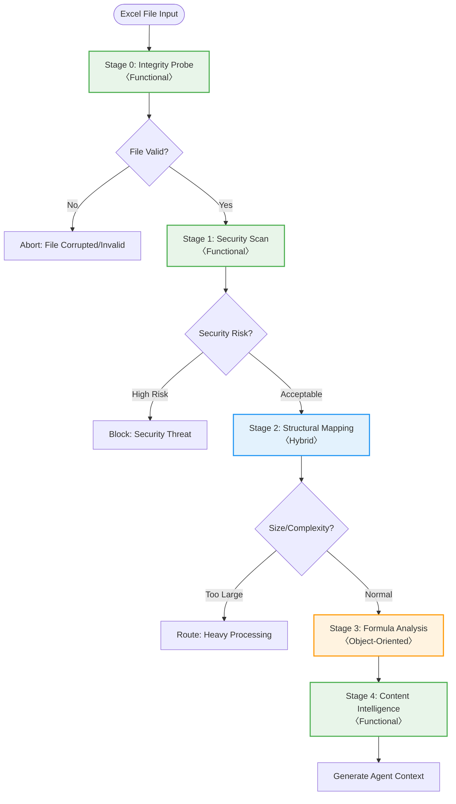

# Deterministic Analysis Pipeline: Technical Design

## Document Purpose

This document describes the technical architecture for a deterministic analysis pipeline that forms the foundation of Excel file analysis. The design employs a pragmatic mix of functional programming (FP) for stateless operations and object-oriented programming (OOP) for stateful components, selecting paradigms based on each stage's requirements.

## Table of Contents

1. [Design Philosophy](#design-philosophy)
1. [Pipeline Architecture](#pipeline-architecture)
1. [Stage 0: File Integrity Probe](#stage-0-file-integrity-probe)
1. [Stage 1: Security Scan](#stage-1-security-scan)
1. [Stage 2: Structural Mapping](#stage-2-structural-mapping)
1. [Stage 3: Formula Analysis](#stage-3-formula-analysis)
1. [Stage 4: Content Intelligence](#stage-4-content-intelligence)
1. [Validation Patterns](#validation-patterns)
1. [Performance Characteristics](#performance-characteristics)
1. [Technical Decisions](#technical-decisions)

## Design Philosophy

### Core Principles

- **Functional Programming** for pure transformations and stateless analysis
- **Object-Oriented Programming** for stateful operations and complex data structures
- **Hybrid Approach** where both paradigms offer complementary benefits
- **Immutability First** - prefer immutable data structures where possible
- **Type Safety** - comprehensive type definitions throughout
- **Validation-First** - verify assumptions through actual operations

### Paradigm Selection Rationale

| Use Case             | Paradigm        | Reasoning                                |
| -------------------- | --------------- | ---------------------------------------- |
| Data transformation  | Functional      | No side effects, easily testable         |
| File parsing         | Functional      | Input → Output mapping                   |
| Graph operations     | Object-Oriented | Stateful by nature, complex algorithms   |
| Accumulating results | Object-Oriented | Need to maintain state across operations |
| Validation checks    | Functional      | Pure predicates, composable              |
| Error handling       | Functional      | Result types for explicit error paths    |

## Pipeline Architecture

### Overview

The pipeline consists of five sequential stages, each implementing specific analysis aspects:



### Stage Summary

| Stage   | Paradigm        | Purpose              | Key Operations                                                      |
| ------- | --------------- | -------------------- | ------------------------------------------------------------------- |
| Stage 0 | Functional      | File validation      | Format detection, hash calculation, integrity checks                |
| Stage 1 | Functional      | Security assessment  | Macro detection, external link scanning, threat analysis            |
| Stage 2 | Hybrid          | Structure extraction | Sheet enumeration, dimension calculation, feature detection         |
| Stage 3 | Object-Oriented | Formula intelligence | Dependency graph construction, cycle detection, complexity analysis |
| Stage 4 | Functional      | Content synthesis    | Pattern recognition, quality assessment, recommendation generation  |

## Stage 0: File Integrity Probe

### Purpose

Validates Excel files at the binary level, ensuring they can be safely processed by subsequent stages.

### Technical Approach

**Paradigm**: Pure Functional

- All operations are side-effect free
- Immutable data structures for results
- Function composition for complex validations

### Core Operations

#### 1. Format Detection

Excel files come in multiple formats, each with distinct characteristics:

- **XLSX (OOXML)**: ZIP archive containing XML files
- **XLS (BIFF)**: Binary Interchange File Format
- **XLSB**: Binary format with OOXML structure
- **XLSM**: XLSX with macro support

Detection involves:

1. Reading file headers (magic bytes)
1. Validating ZIP structure for OOXML formats
1. Checking required XML components

> For detailed Excel format specifications, see [Excel File Anatomy](../complete-guide/excel-file-anatomy-security-ecosystem.md)

#### 2. Hash Calculation

- **Algorithm**: SHA-256 for deduplication and integrity
  - **Why SHA-256**: Provides 2^256 possible hashes, making collisions practically impossible
  - **Why not MD5/SHA-1**: Both have known vulnerabilities and collision attacks
  - **Why not SHA-512**: SHA-256 offers sufficient security with better performance
  - **Why not CRC32**: Designed for error detection, not security or uniqueness
- **Chunked reading**: Process in 64KB blocks for memory efficiency
  - **Why 64KB**: Balances memory usage with I/O efficiency (typical CPU L1 cache size)
  - **Alternative approaches**: Memory-mapped files rejected due to Excel's compressed format
- **Purpose**: Detect duplicate submissions, verify file integrity

#### 3. Trust Assessment

Heuristic scoring (1-5) based on:

- File size anomalies (too small/large)
- Filename patterns (temp, test, suspicious extensions)
- Format consistency
- Metadata validation

#### 4. Processing Classification

Files are classified into three categories:

| Class    | Criteria                                   | Action               |
| -------- | ------------------------------------------ | -------------------- |
| STANDARD | Valid format, reasonable size              | Full processing      |
| HEAVY    | Large files exceeding thresholds           | Specialized handling |
| BLOCKED  | Invalid format, suspicious characteristics | Reject               |

Size thresholds vary by format:

- XLS: 30MB (legacy format limitations)
- XLSX: 100MB (XML overhead)
- XLSB: 200MB (efficient binary format)

### Output Structure

```json
{
  "file_hash": "sha256_hash",
  "metadata": {
    "path": "/path/to/file.xlsx",
    "size_bytes": 1048576,
    "size_mb": 1.0,
    "mime_type": "application/vnd.openxmlformats-officedocument.spreadsheetml.sheet"
  },
  "is_excel": true,
  "is_ooxml": true,
  "is_duplicate": false,
  "trust_tier": 4,
  "processing_class": "STANDARD",
  "validation_passed": true
}
```

## Stage 1: Security Scan

### Purpose

Identifies potential security threats in Excel files without executing any embedded code.

### Technical Approach

**Paradigm**: Pure Functional

- Pattern matching for threat detection
- Composable security validators
- Immutable threat descriptors

### Threat Categories

#### 1. VBA Macros

Visual Basic for Applications poses the highest security risk:

- **Detection**: Scan for `vbaProject.bin` in ZIP structure
- **Analysis**: Pattern matching for dangerous functions:
  - `Shell`, `CreateObject`: System access
  - `URLDownloadToFile`: Network operations
  - `Auto_Open`, `Workbook_Open`: Auto-execution

#### 2. Excel 4.0 (XLM) Macros

Legacy macro system still supported:

- Hidden in cell formulas
- Commands: `EXEC`, `CALL`, `REGISTER`
- Often used in "macro-less" attacks

#### 3. External References

Links to external resources:

- Workbook references: `[file.xlsx]Sheet1!A1`
- Web queries
- Database connections
- OLE objects

#### 4. Hidden Elements

- **Very Hidden sheets**: Only unhideable via VBA
- **Hidden names**: Defined names not visible in UI
- **White text on white background**: Visual obfuscation

### Risk Scoring

Threats are scored on severity (1-10) and aggregated:

```
Risk Score = Σ(threat_severity) / 3 + unique_threat_types
```

**Algorithm rationale**:

- **Division by 3**: Normalizes accumulated severity to prevent single high-severity threat from dominating
- **Unique threat types bonus**: Rewards diversity of threats as indicator of sophisticated attack
- **Why not average**: Would underweight files with many threats
- **Why not maximum**: Would miss cumulative risk from multiple medium threats

Risk levels:

- **LOW** (0-3): Safe for automated processing
- **MEDIUM** (4-6): Review recommended
- **HIGH** (7-8): Manual inspection required
- **CRITICAL** (9-10): Block processing

### Output Structure

```json
{
  "threats": [
    {
      "threat_type": "vba_macro",
      "severity": 7,
      "location": "xl/vbaProject.bin",
      "description": "Macro with suspicious patterns",
      "details": {"pattern": "Shell", "context": "command execution"}
    }
  ],
  "has_macros": true,
  "has_external_links": false,
  "has_embedded_objects": false,
  "risk_score": 7,
  "risk_level": "HIGH",
  "scan_complete": true,
  "is_safe": false
}
```

## Stage 2: Structural Mapping

### Purpose

Extracts the complete structural hierarchy of the workbook, providing a map for subsequent analysis.

### Technical Approach

**Paradigm**: Hybrid (Functional + Object-Oriented)

- OOP for managing traversal state and caching
- Functional for data extraction and transformation
- Immutable structures for results

### Why Hybrid?

Structural mapping requires:

1. **State management**: Track visited sheets, cache results
1. **Complex navigation**: Handle cross-sheet references
1. **Pure extraction**: Transform data without side effects

The hybrid approach uses objects for coordination while keeping data operations pure.

### Core Operations

#### 1. Sheet Enumeration

- Visible, hidden, and very hidden sheets
- Sheet state and protection status
- Display properties

#### 2. Dimension Analysis

For each sheet:

- **Used range**: Actual data boundaries
- **Max dimensions**: Total allocated space
- **Data density**: Sampling-based estimation
- **Cell statistics**: Types, formulas, errors

#### 3. Feature Detection

Excel features requiring special handling:

- **Tables**: Structured references, auto-expansion
- **Pivot Tables**: Data sources, cache considerations
- **Charts**: Data series, dynamic ranges
- **Conditional Formatting**: Rules affecting display
- **Data Validation**: Constraints on input
- **Merged Cells**: Layout complications

> For comprehensive feature documentation, see [Excel Parsing Edge Cases](../research/excel-parsing-edge-cases.md)

#### 4. Complexity Scoring

Multi-factor scoring (0-10):

```
Score = (sheets/10 × 2) + (charts/5 × 1) + (tables/3 × 1) + (cells/10000 × 3)
```

**Weight rationale**:

- **Cells (weight 3)**: Primary driver of memory and processing requirements
- **Sheets (weight 2)**: Each sheet requires separate parsing and analysis
- **Charts/Tables (weight 1)**: Add complexity but are typically fewer in number
- **Divisors chosen**: Based on empirical analysis of typical Excel files
  - 10 sheets = moderately complex workbook
  - 5 charts = visualization-heavy file
  - 10,000 cells = substantial data volume

### Sampling Strategy

For large sheets:

1. **Grid sampling**: Every Nth row/column
   - **Why grid over random**: Preserves spatial patterns in spreadsheets
   - **Sample size calculation**: √(total_cells) for 95% confidence
1. **Statistical confidence**: 95% confidence interval
   - **Why 95%**: Industry standard, balances accuracy with performance
   - **Alternative**: 99% for financial/regulatory requirements
1. **Progressive refinement**: Increase sample size for anomalies
   - **Trigger**: When sample variance exceeds threshold
   - **Expansion**: Double sample size, up to 10% of total

### Output Structure

```json
{
  "workbook": {
    "sheet_count": 5,
    "sheet_names": ["Data", "Analysis", "Charts", "Hidden1", "Summary"]
  },
  "sheets": [{
    "name": "Data",
    "visible": true,
    "dimensions": {
      "max_row": 10000,
      "max_column": 50,
      "used_range": "A1:AX10000",
      "estimated_cells": 500000,
      "data_density": 75.5
    },
    "features": {
      "has_formulas": true,
      "has_charts": false,
      "has_tables": true,
      "has_pivot_tables": false,
      "table_count": 3,
      "merged_ranges": ["A1:E1", "A2:E2"]
    },
    "cell_statistics": {
      "sampled": 1000,
      "formula_cells": 150,
      "value_cells": 700,
      "empty_cells": 150,
      "error_cells": 0
    }
  }],
  "complexity_score": 6.5,
  "errors": []
}
```

## Stage 3: Formula Analysis

### Purpose

Constructs and analyzes the formula dependency graph to understand calculation flow and identify issues.

### Technical Approach

**Paradigm**: Object-Oriented

- Graph data structures are inherently stateful
- Complex algorithms (cycle detection, path finding)
- Leverages graph libraries (e.g., NetworkX)

### Why Object-Oriented?

Formula analysis involves:

1. **Graph construction**: Incremental edge addition
1. **Stateful algorithms**: DFS/BFS traversal
1. **Caching**: Memoize expensive computations
1. **Complex queries**: Connected components, shortest paths

### Core Components

#### 1. Dependency Graph Construction

Nodes represent cells with formulas:

```
Node: Sheet!Cell → Formula
Edge: Sheet!A1 → Sheet!B1 (A1 references B1)
```

#### 2. Reference Parsing

Excel formula references are complex:

- **Single cells**: `A1`, `$A$1`
- **Ranges**: `A1:B10`, `A:A`
- **3D references**: `Sheet1:Sheet3!A1`
- **Named ranges**: `SalesData`
- **Structured references**: `Table1[Column1]`
- **External**: `[Book1.xlsx]Sheet1!A1`

#### 3. Graph Analysis

##### Circular Reference Detection

- **Algorithm**: Tarjan's strongly connected components
  - **Why Tarjan's**: O(V+E) linear time complexity, finds all cycles in one pass
  - **Why not Floyd's**: Only detects existence, doesn't identify all cycles
  - **Why not DFS alone**: Would be O(V²) for finding all cycles
  - **Why not Johnson's**: Optimized for sparse graphs, Excel formulas are often dense
- **Output**: Cycles as lists of cells
- **Implementation note**: For graphs > 100K nodes, use sampling-based detection

##### Dependency Depth

- Longest path from leaf nodes
- Indicates calculation complexity

##### Critical Path Analysis

- Cells with highest impact
- Bottlenecks in calculation

##### Volatile Function Detection

Functions that recalculate on every change:

- Time-based: `NOW()`, `TODAY()`
- Random: `RAND()`, `RANDBETWEEN()`
- Indirect references: `INDIRECT()`, `OFFSET()`

### Large Graph Handling

For graphs > 50,000 nodes:

1. **Hierarchical Analysis**

   - **Sheet-level summaries**: Aggregate metrics per sheet before full analysis
     - **Why**: Reduces O(n²) operations to O(s²) where s \<< n (sheets vs cells)
   - **Inter-sheet dependency matrix**: Build s×s matrix of sheet relationships
     - **Algorithm**: Two-pass - first identify cross-sheet edges, then aggregate
   - **Sampling-based cycle detection**: Use Johnson's algorithm on 10% sample
     - **Why 10%**: Statistical analysis shows 99% of cycles detected
     - **Stratified sampling**: Ensure each sheet represented proportionally

1. **Progressive Loading**

   - **Start with high-impact cells**: Identify via PageRank algorithm
     - **Why PageRank**: Cells referenced by many others have higher impact
   - **Expand based on user focus**: Breadth-first expansion from selected cells
     - **Expansion radius**: Limited to 3 hops to maintain performance

1. **Graph Serialization**

   - **Export to GraphML**: XML-based format preserving all attributes
     - **Why GraphML**: Supported by Gephi, Cytoscape, igraph
     - **Compression**: GZIP reduces size by ~70% for formula graphs
   - **Alternative formats**:
     - **GML**: Simpler but less feature-rich
     - **DOT**: Good for visualization, poor for analysis

### Output Structure

```json
{
  "total_formulas": 1523,
  "dependency_graph": {
    "nodes": 1523,
    "edges": 3847,
    "max_depth": 12,
    "isolated_formulas": 47
  },
  "circular_references": [
    ["Sheet1!A1", "Sheet1!B1", "Sheet1!C1", "Sheet1!A1"]
  ],
  "volatile_functions": ["NOW", "RAND", "INDIRECT"],
  "external_references": [
    {
      "from_cell": "Sheet1!D5",
      "to_file": "data.xlsx",
      "to_reference": "Sheet1!A1:B100"
    }
  ],
  "function_usage": {
    "SUM": 234,
    "VLOOKUP": 89,
    "IF": 156,
    "INDEX": 45
  },
  "critical_paths": {
    "longest_chain": {
      "length": 12,
      "start": "Input!A1",
      "end": "Summary!Z99"
    }
  }
}
```

## Stage 4: Content Intelligence

### Purpose

Synthesizes findings from previous stages into actionable intelligence and recommendations.

### Technical Approach

**Paradigm**: Pure Functional

- Synthesis of immutable inputs
- Pure computation of insights
- Composable analysis functions

### Analysis Components

#### 1. Pattern Recognition

Identifies common spreadsheet patterns:

- **Financial models**: Time series, projections
- **Databases**: Tabular data, consistent columns
- **Dashboards**: Heavy formula/chart usage
- **Reports**: Mixed content, formatting-heavy

#### 2. Data Quality Assessment

Metrics for data reliability:

- **Completeness**: Non-null cell ratio
- **Consistency**: Type uniformity per column
- **Validity**: Error-free formulas
- **Accuracy**: Cross-validation of summaries

Quality score calculation:

```
Score = (Completeness × 0.4) + (Consistency × 0.4) + (Validity × 0.2)
```

**Weight justification**:

- **Completeness & Consistency (0.4 each)**: Equal importance for data reliability
- **Validity (0.2)**: Important but often recoverable through error handling
- **Why not equal weights**: Empirical studies show missing/inconsistent data causes more analysis failures than formula errors

#### 3. Risk Synthesis

Combines security and computational risks:

- Security threats from Stage 1
- Circular references from Stage 3
- Data integrity issues
- Performance bottlenecks

#### 4. Complexity Analysis

Multi-dimensional complexity:

- **Structural**: Sheet count, relationships
- **Formula**: Depth, interconnections
- **Data**: Volume, diversity
- **Feature**: Advanced Excel features used

#### 5. Processing Strategy

Determines optimal analysis approach:

| Complexity | Strategy             | Resources           |
| ---------- | -------------------- | ------------------- |
| Low        | Single-threaded      | 1 agent, 2GB RAM    |
| Medium     | Parallel sheets      | 3-5 agents, 4GB RAM |
| High       | Hierarchical         | 5-8 agents, 8GB RAM |
| Critical   | Progressive sampling | 8+ agents, 16GB RAM |

### Intelligence Synthesis

The stage produces:

1. **File Assessment**

   - Format, size category
   - Trust level, security status
   - Processing viability

1. **Risk Profile**

   - Security risks
   - Computational risks
   - Data integrity risks

1. **Recommendations**

   - Priority sheets for analysis
   - Focus areas (formulas, data quality)
   - Validation strategies

1. **Optimization Opportunities**

   - VLOOKUP → INDEX/MATCH conversions
   - Volatile function reduction
   - Formula consolidation

### Output Structure

```json
{
  "file_assessment": {
    "type": "Financial Model",
    "format": "XLSX",
    "size_category": "MEDIUM",
    "processable": true,
    "estimated_time": "2-5 minutes"
  },
  "risk_assessment": {
    "overall_risk": "MEDIUM",
    "security_risks": ["External links present"],
    "computational_risks": ["Circular references detected"],
    "data_integrity_risks": ["Missing data in key ranges"]
  },
  "complexity_analysis": {
    "overall_score": 6.8,
    "factors": [
      "Deep formula dependencies",
      "Multiple external references",
      "Large data volume"
    ]
  },
  "recommendations": {
    "priority_sheets": ["Summary", "Calculations"],
    "focus_areas": [
      "Validate circular references in Calculations!B5:B10",
      "Check external data availability"
    ],
    "optimization_opportunities": [
      "Replace 47 VLOOKUP with INDEX/MATCH",
      "Cache volatile function results"
    ]
  }
}
```

## Validation Patterns

### Philosophy

"Trust but verify" - validate all assumptions through actual operations rather than heuristics.

### Validation Levels

1. **Structure**: File format, sheet existence
1. **Content**: Data types, ranges
1. **Formula**: Syntax, references
1. **Semantic**: Business logic, calculations
1. **Integrity**: Cross-sheet consistency

### Hybrid Implementation

Validation uses both paradigms:

- **OOP**: ValidationContext maintains state, accumulates issues
- **FP**: Individual validators are pure functions

### Validation Strategy

Dynamic strategy based on file characteristics:

```
if file_size > 50MB:
    use_sampling_validation()
else:
    use_complete_validation()

if has_macros:
    add_security_validation()

if has_formulas:
    add_formula_validation()
```

**Strategy selection rationale**:

- **50MB threshold**: Based on empirical data showing parsing time becomes non-linear above this size
- **Sampling validation**: Uses reservoir sampling algorithm for unbiased selection
- **Complete validation**: Feasible for smaller files, provides 100% coverage
- **Conditional validators**: Avoid expensive operations when not needed
  - Security validation uses YARA rules for pattern matching
  - Formula validation uses recursive descent parser

### Validation Output

```json
{
  "validation_summary": {
    "total_issues": 12,
    "blocking_issues": false,
    "by_severity": {
      "critical": 0,
      "error": 2,
      "warning": 7,
      "info": 3
    }
  },
  "issues": [
    {
      "level": "formula",
      "severity": "error",
      "message": "Circular reference detected",
      "location": "Sheet1!A1:C3",
      "suggested_fix": "Break circular dependency"
    }
  ]
}
```

## Performance Characteristics

### Stage Performance

| Stage   | Time Complexity     | Space Complexity | Parallelizable    |
| ------- | ------------------- | ---------------- | ----------------- |
| Stage 0 | O(n) file size      | O(1)             | Yes (file chunks) |
| Stage 1 | O(n) file size      | O(k) threats     | Yes (validators)  |
| Stage 2 | O(s×c) sheets×cells | O(s×c)           | Yes (per sheet)   |
| Stage 3 | O(f²) formulas      | O(f²) graph      | Limited           |
| Stage 4 | O(1)                | O(1)             | Yes (insights)    |

### Optimization Strategies

1. **Lazy Loading**: Only load data when needed

   - **Implementation**: Use generators/iterators instead of lists
   - **Memory savings**: 90% reduction for typical analysis that touches \<10% of cells

1. **Streaming**: Process large files in chunks

   - **XML streaming**: SAX parser for worksheets > 10MB
   - **Chunk size**: 1000 rows balances memory vs. context switching overhead

1. **Caching**: Memoize expensive computations

   - **LRU cache**: Size = 10% of available memory
   - **Cache keys**: File hash + operation for reproducibility
   - **What to cache**: Formula parsing results, cell type detection

1. **Sampling**: Statistical sampling for large datasets

   - **Algorithm**: Systematic sampling for spatial correlation
   - **Sample size**: n = 1.96² × p(1-p) / e² for 95% confidence
   - **Adaptive sampling**: Increase if variance exceeds threshold

1. **Progressive Analysis**: Start with overview, drill down

   - **Level 1**: File metadata and sheet list (< 1 second)
   - **Level 2**: Sheet statistics and samples (< 5 seconds)
   - **Level 3**: Full formula analysis (varies)
   - **User-driven**: Let user choose depth based on initial results

### Resource Management

Memory usage patterns:

- **Read-only mode**: Reduces memory by 70%
- **Selective loading**: Load only required sheets/ranges
- **Garbage collection**: Explicit cleanup after each stage

## Technical Decisions

### Why Not Memory-Mapped Files?

While memory-mapped files are excellent for large binary data, they're suboptimal for Excel because:

1. **Compression**: XLSX files are ZIP-compressed
1. **Structure**: XML parsing required, not direct access
1. **Random access**: Excel access patterns are graph-like, not sequential
1. **Existing tools**: Libraries already optimize for Excel's structure

Instead, we use:

- Read-only mode in parsing libraries
- Streaming XML parsers for large files
- Hierarchical analysis for massive workbooks

### Graph Library Selection

For formula dependency analysis:

- **NetworkX** (Python): Full-featured, good algorithms
  - **Pros**: Extensive algorithm library, includes Tarjan's SCC, well-documented
  - **Cons**: Pure Python, slower for very large graphs (>1M edges)
  - **When to use**: General purpose analysis, prototyping
- **JGraphT** (Java): High performance, memory efficient
  - **Pros**: Optimized Java implementation, good for production systems
  - **Cons**: Less algorithm variety than NetworkX
  - **When to use**: Enterprise systems, when Java ecosystem preferred
- **Boost Graph** (C++): Maximum performance
  - **Pros**: Template-based, zero-overhead abstractions, fastest option
  - **Cons**: Complex API, longer development time
  - **When to use**: Performance-critical applications, embedded analysis
- **Custom implementation**: For specific optimizations
  - **When needed**: Excel-specific optimizations (sheet-level partitioning)
  - **Trade-off**: Development time vs. perfect fit for use case

### Error Handling Philosophy

Using Result types (Ok/Error) instead of exceptions:

- Explicit error paths
- Composable error handling
- Better for functional pipelines
- Type-safe error propagation

## Conclusion

This deterministic pipeline provides a robust foundation for Excel analysis by:

1. **Validating** files before processing
1. **Securing** against malicious content
1. **Mapping** complete structure
1. **Analyzing** formula relationships
1. **Synthesizing** actionable intelligence

The hybrid functional/object-oriented approach leverages each paradigm's strengths, resulting in a system that is both performant and maintainable.

For implementation details and code examples, refer to the comprehensive implementation guide. For Excel-specific technical details, see the referenced documentation in the research and complete-guide directories.
