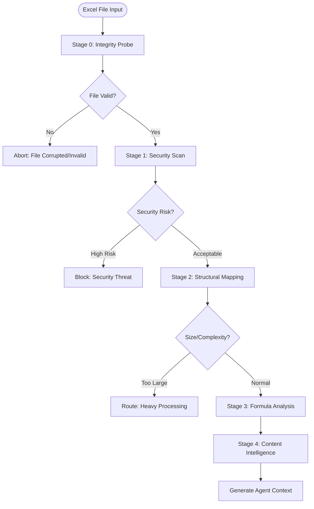

# Deterministic Analysis Pipeline: Technical Design

## Document Purpose

This document describes the technical architecture for a deterministic analysis pipeline that forms the foundation of Excel file analysis. The design focuses on behavioral contracts, quality attributes, and measurable requirements that ensure reliable and performant analysis.

## Table of Contents

1. [Design Philosophy](#design-philosophy)
1. [Pipeline Architecture](#pipeline-architecture)
1. [Stage 0: File Integrity Probe](#stage-0-file-integrity-probe)
1. [Stage 1: Security Scan](#stage-1-security-scan)
1. [Stage 2: Structural Mapping](#stage-2-structural-mapping)
1. [Stage 3: Formula Analysis](#stage-3-formula-analysis)
1. [Stage 4: Content Intelligence](#stage-4-content-intelligence)
1. [Validation Patterns](#validation-patterns)
1. [Performance Characteristics](#performance-characteristics)
1. [Technical Decisions](#technical-decisions)

## Design Philosophy

### Core Principles

- **Deterministic Behavior** - Same input always produces same output
- **Immutable Results** - Output data structures cannot be modified after creation
- **Fail-Fast Validation** - Verify assumptions through actual operations, not heuristics
- **Resource Efficiency** - Memory and CPU usage scales predictably with input size
- **Type Safety** - Comprehensive type definitions for all data structures
- **Error Transparency** - Explicit error paths with detailed failure information

### Quality Attributes

| Attribute       | Requirement                                 | Measurement           |
| --------------- | ------------------------------------------- | --------------------- |
| Performance     | < 5s for standard files (< 10MB)            | Execution time        |
| Scalability     | Linear time complexity where possible       | Big-O analysis        |
| Reliability     | No crashes on malformed input               | Error rate            |
| Security        | No code execution from file content         | Threat detection rate |
| Maintainability | New validators addable without core changes | Change impact         |
| Testability     | Each stage independently testable           | Test isolation        |

## Pipeline Architecture

### Overview

The pipeline consists of five sequential stages, each with specific responsibilities and contracts:



### Stage Contracts

| Stage   | Input                  | Output            | Guarantees                                |
| ------- | ---------------------- | ----------------- | ----------------------------------------- |
| Stage 0 | File path              | IntegrityResult   | File unmodified, format validated         |
| Stage 1 | File path              | SecurityReport    | No code execution, threats identified     |
| Stage 2 | File path, context     | WorkbookStructure | Structure mapped, no content modification |
| Stage 3 | File path, structure   | FormulaAnalysis   | Dependencies graphed, cycles detected     |
| Stage 4 | File path, all results | ContentAnalysis   | Insights generated, patterns identified   |

## Stage 0: File Integrity Probe

### Purpose

Validates Excel files at the binary level, ensuring they can be safely processed by subsequent stages.

### Contract

```yaml
Input:
  - file_path: Path to potential Excel file
  - known_hashes: Optional set of previously seen file hashes

Output:
  - Success: IntegrityResult with validation details
  - Failure: Error with specific reason

Guarantees:
  - Input file remains unmodified
  - Completes within 5 seconds for files up to 1GB
  - Deterministic hash calculation
  - No external dependencies
```

### Technical Requirements

- **File Validation**: Must detect actual file format, not rely on extension
- **Hash Calculation**: SHA-256 with consistent chunking strategy
- **Format Support**: XLSX, XLS, XLSB, XLSM with proper MIME type detection
- **Trust Assessment**: Heuristic scoring based on measurable file characteristics
- **Processing Classification**: Categorize as STANDARD, HEAVY, or BLOCKED

### Implementation Guidance

1. **Format Detection**

   - Read file headers for magic bytes
   - Validate ZIP structure for OOXML formats
   - Check required XML components for XLSX

1. **Hash Calculation**

   - Use SHA-256 for deduplication and integrity
   - Process in 64KB chunks for memory efficiency
   - Must be reproducible across runs

1. **Trust Scoring**

   - Score 1-5 based on file characteristics
   - Consider size anomalies, naming patterns, format consistency
   - Document scoring rationale

### Output Structure

```json
{
  "file_hash": "sha256_hash",
  "metadata": {
    "path": "/path/to/file.xlsx",
    "size_bytes": 1048576,
    "size_mb": 1.0,
    "mime_type": "application/vnd.openxmlformats-officedocument.spreadsheetml.sheet"
  },
  "is_excel": true,
  "is_ooxml": true,
  "is_duplicate": false,
  "trust_tier": 4,
  "processing_class": "STANDARD",
  "validation_passed": true
}
```

## Stage 1: Security Scan

### Purpose

Identifies potential security threats in Excel files without executing any embedded code.

### Contract

```yaml
Input:
  - file_path: Validated Excel file path
  - scan_options: Configuration for security checks

Output:
  - Success: SecurityReport with threat assessment
  - Failure: Error with scan failure reason

Guarantees:
  - No macro execution
  - No network connections
  - Completes within 30 seconds
  - All threats categorized by severity
```

### Technical Requirements

- **Threat Detection**: Pattern-based identification without code execution
- **Risk Assessment**: Quantified scoring with clear thresholds
- **Completeness**: Check all common threat vectors
- **Performance**: Stream large files rather than full loading

### Threat Categories

1. **VBA Macros**

   - Detection: Scan for `vbaProject.bin` in ZIP structure
   - Analysis: Pattern matching for dangerous functions
   - Risk: Auto-execution capabilities

1. **Excel 4.0 (XLM) Macros**

   - Detection: Hidden in cell formulas
   - Commands: `EXEC`, `CALL`, `REGISTER`
   - Risk: Often used in "macro-less" attacks

1. **External References**

   - Workbook links: `[file.xlsx]Sheet1!A1`
   - Web queries and database connections
   - OLE objects and embedded files

1. **Hidden Elements**

   - Very Hidden sheets (only unhideable via VBA)
   - Hidden names and ranges
   - Visual obfuscation techniques

### Risk Scoring Algorithm

```
Risk Score = Σ(threat_severity) / 3 + unique_threat_types
```

Risk levels:

- **LOW** (0-3): Safe for automated processing
- **MEDIUM** (4-6): Review recommended
- **HIGH** (7-8): Manual inspection required
- **CRITICAL** (9-10): Block processing

### Output Structure

```json
{
  "threats": [...],
  "has_macros": true,
  "has_external_links": false,
  "has_embedded_objects": false,
  "risk_score": 7,
  "risk_level": "HIGH",
  "scan_complete": true,
  "is_safe": false
}
```

## Stage 2: Structural Mapping

### Purpose

Extracts the complete structural hierarchy of the workbook, providing a map for subsequent analysis.

### Contract

```yaml
Input:
  - file_path: Security-validated Excel file
  - has_vba: VBA presence from security scan
  - has_external_links: External link presence

Output:
  - Success: WorkbookStructure with complete mapping
  - Failure: Error with parsing failure details

Guarantees:
  - Read-only file access
  - Memory usage proportional to structure, not content
  - Handles files with 1000+ sheets
  - Accurate dimension reporting
```

### Technical Requirements

- **Efficient Traversal**: Must handle large workbooks without loading all content
- **Feature Detection**: Identify all Excel features that affect analysis
- **Sampling Strategy**: Statistical sampling for large sheets
- **State Management**: Track visited elements to prevent redundant processing

### Core Operations

1. **Sheet Enumeration**

   - All sheets including hidden states
   - Protection and display properties
   - Sheet type classification

1. **Dimension Analysis**

   - Used range vs allocated space
   - Data density estimation
   - Cell type statistics

1. **Feature Detection**

   - Tables, Pivot Tables, Charts
   - Conditional Formatting rules
   - Data Validation constraints
   - Merged cell regions

1. **Complexity Scoring**

   ```
   Score = (sheets/10 × 2) + (charts/5 × 1) + (tables/3 × 1) + (cells/10000 × 3)
   ```

### Sampling Requirements

For sheets exceeding 10,000 cells:

- Use grid sampling (every Nth row/column)
- Maintain 95% statistical confidence
- Progressive refinement for anomalies

### Output Structure

```json
{
  "workbook": {
    "sheet_count": 5,
    "sheet_names": ["Data", "Analysis", "Charts", "Hidden1", "Summary"]
  },
  "sheets": [...],
  "complexity_score": 6.5,
  "errors": []
}
```

## Stage 3: Formula Analysis

### Purpose

Constructs and analyzes the formula dependency graph to understand calculation flow and identify issues.

### Contract

```yaml
Input:
  - file_path: Structurally mapped Excel file
  - structure: Workbook structure from Stage 2

Output:
  - Success: FormulaAnalysis with dependency graph
  - Failure: Error with analysis failure details

Guarantees:
  - All formula dependencies tracked
  - Circular references detected
  - Graph remains consistent during analysis
  - Memory usage O(n) for n formulas
```

### Technical Requirements

- **Graph Construction**: Build complete dependency graph
- **Reference Parsing**: Handle all Excel reference types
- **Cycle Detection**: Identify all circular reference chains
- **Performance**: Efficient algorithms for large graphs

### Core Components

1. **Dependency Graph**

   - Nodes: Cells containing formulas
   - Edges: Dependencies between cells
   - Bidirectional tracking for impact analysis

1. **Reference Types**

   - Single cells: `A1`, `$A$1`
   - Ranges: `A1:B10`, `A:A`
   - 3D references: `Sheet1:Sheet3!A1`
   - Named ranges: `SalesData`
   - Structured references: `Table1[Column1]`
   - External: `[Book1.xlsx]Sheet1!A1`

1. **Analysis Algorithms**

   - Circular reference detection: O(V+E) complexity
   - Dependency depth calculation
   - Critical path identification
   - Volatile function detection

### Large Graph Handling

For graphs exceeding 50,000 nodes:

- Hierarchical analysis by sheet
- Progressive loading based on focus area
- Graph serialization for external tools

### Output Structure

```json
{
  "total_formulas": 1523,
  "dependency_graph": {
    "nodes": 1523,
    "edges": 3847,
    "max_depth": 12,
    "isolated_formulas": 47
  },
  "circular_references": [...],
  "volatile_functions": ["NOW", "RAND", "INDIRECT"],
  "external_references": [...],
  "function_usage": {...},
  "critical_paths": {...}
}
```

## Stage 4: Content Intelligence

### Purpose

Synthesizes findings from previous stages into actionable intelligence and recommendations.

### Contract

```yaml
Input:
  - file_path: Fully analyzed Excel file
  - all_results: Results from stages 0-3
  - sample_size: Content sampling configuration

Output:
  - Success: ContentAnalysis with insights
  - Failure: Error with synthesis failure

Guarantees:
  - Deterministic pattern detection
  - Consistent quality scoring
  - No modification of analysis results
  - Completes within 10 seconds
```

### Technical Requirements

- **Pattern Recognition**: Identify common spreadsheet patterns
- **Quality Assessment**: Quantify data reliability
- **Insight Generation**: Transform findings into recommendations
- **Summary Creation**: Human-readable analysis summary

### Analysis Components

1. **Pattern Detection**

   - Financial models: Time series, projections
   - Databases: Tabular data, consistent columns
   - Dashboards: Heavy formula/chart usage
   - Reports: Mixed content, formatting-heavy

1. **Data Quality Metrics**

   - Completeness: Non-null cell ratio
   - Consistency: Type uniformity per column
   - Validity: Error-free formulas
   - Accuracy: Cross-validation of summaries

1. **Quality Score Calculation**

   ```
   Score = (Completeness × 0.4) + (Consistency × 0.4) + (Validity × 0.2)
   ```

1. **Processing Strategy Determination**

   | Complexity | Strategy             | Resources           |
   | ---------- | -------------------- | ------------------- |
   | Low        | Single-threaded      | 1 agent, 2GB RAM    |
   | Medium     | Parallel sheets      | 3-5 agents, 4GB RAM |
   | High       | Hierarchical         | 5-8 agents, 8GB RAM |
   | Critical   | Progressive sampling | 8+ agents, 16GB RAM |

### Output Structure

```json
{
  "data_patterns": [...],
  "insights": [...],
  "data_quality_score": 85,
  "summary": "Financial model with quarterly projections...",
  "key_metrics": {...}
}
```

## Validation Patterns

### Philosophy

"Trust but verify" - validate all assumptions through actual operations rather than heuristics.

### Validation Requirements

1. **Structure**: File format and sheet existence verification
1. **Content**: Data type and range validation
1. **Formula**: Syntax and reference validation
1. **Semantic**: Business logic verification
1. **Integrity**: Cross-sheet consistency checks

### Dynamic Strategy

```python
if file_size > 50MB:
    use_sampling_validation()
elif has_macros:
    add_security_validation()
elif has_formulas:
    add_formula_validation()
```

### Validation Output

```json
{
  "validation_summary": {
    "total_issues": 12,
    "blocking_issues": false,
    "by_severity": {
      "critical": 0,
      "error": 2,
      "warning": 7,
      "info": 3
    }
  },
  "issues": [...]
}
```

## Performance Characteristics

### Stage Performance

| Stage   | Time Complexity     | Space Complexity | Parallelizable    |
| ------- | ------------------- | ---------------- | ----------------- |
| Stage 0 | O(n) file size      | O(1)             | Yes (file chunks) |
| Stage 1 | O(n) file size      | O(k) threats     | Yes (validators)  |
| Stage 2 | O(s×c) sheets×cells | O(s×c)           | Yes (per sheet)   |
| Stage 3 | O(f²) formulas      | O(f²) graph      | Limited           |
| Stage 4 | O(1)                | O(1)             | Yes (insights)    |

### Optimization Strategies

1. **Lazy Loading**: Load data only when needed
1. **Streaming**: Process large files in chunks
1. **Caching**: Memoize expensive computations
1. **Sampling**: Statistical sampling for large datasets
1. **Progressive Analysis**: Start with overview, drill down as needed

### Resource Management

- Read-only mode reduces memory by 70%
- Selective loading of required sheets/ranges
- Explicit cleanup after each stage

## Technical Decisions

### Why Not Memory-Mapped Files?

Excel files are ZIP-compressed and require XML parsing, making memory-mapped files ineffective. Instead:

- Use read-only mode in parsing libraries
- Stream XML parsing for large files
- Hierarchical analysis for massive workbooks

### Graph Algorithm Selection

For formula dependency analysis, consider:

- **Small graphs (\<10K nodes)**: Any implementation
- **Medium graphs (\<100K nodes)**: Specialized graph library
- **Large graphs (>100K nodes)**: Custom optimized implementation
- **Key algorithms**: Tarjan's SCC for cycles, BFS for depth

### Error Handling Strategy

Use explicit Result types (Ok/Error) for:

- Clear error propagation
- Composable error handling
- Type-safe failure paths
- Detailed error context

## Conclusion

This deterministic pipeline provides a robust foundation for Excel analysis through:

1. **Clear Contracts** - Each stage has defined inputs, outputs, and guarantees
1. **Quality Attributes** - Measurable performance and reliability requirements
1. **Technical Requirements** - Specific behaviors without implementation constraints
1. **Validation First** - Verify assumptions through operations
1. **Resource Efficiency** - Predictable scaling with input size

The design enables implementers to choose appropriate technologies and patterns while meeting the specified contracts and quality requirements.
