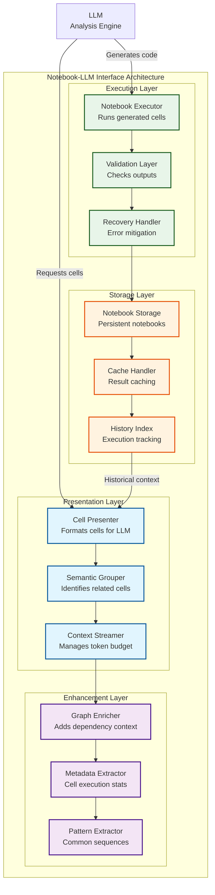

# Jupyter Notebook-LLM Interface Framework

## Executive Summary

This document provides a comprehensive specification for the Jupyter notebook interfacing framework that enables Large Language Models (LLMs) to analyze Excel spreadsheets effectively. The framework leverages notebooks as the primary execution and communication medium, providing a natural interface that aligns with how LLMs process text and code while maintaining complete audit trails and enabling sophisticated analysis patterns.

The design philosophy centers on presenting notebook content to LLMs in a way that maximizes their analytical capabilities while managing context limitations and ensuring reproducible results. By treating notebooks as first-class citizens in the analysis pipeline, we create a system that is both powerful and transparent.

## Table of Contents

1. [Design Philosophy](#design-philosophy)
1. [Architecture Overview](#architecture-overview)
1. [Cell Presentation Framework](#cell-presentation-framework)
1. [Context Management Strategies](#context-management-strategies)
1. [Integration with Deterministic Pipeline](#integration-with-deterministic-pipeline)
1. [Graph Database Integration](#graph-database-integration)
1. [Implementation Patterns](#implementation-patterns)
1. [Security Considerations](#security-considerations)
1. [Performance Optimization](#performance-optimization)
1. [Future Extensions](#future-extensions)

## Design Philosophy

### Why Notebooks as the Primary Interface?

The decision to use Jupyter notebooks as the primary interface between the analysis system and LLMs stems from several key insights:

1. **Natural Text-Code Duality**: LLMs have been extensively trained on both prose and code, making notebook cells (which combine both) an ideal format for consumption.

1. **Execution History Preservation**: Unlike traditional REPLs or execution environments, notebooks maintain a complete, reviewable history of all operations, supporting our validation-first philosophy.

1. **Progressive Exploration**: The cell-by-cell structure naturally supports the iterative exploration pattern that characterizes effective spreadsheet analysis.

1. **Self-Documenting Analysis**: Notebooks inherently create documentation as analysis proceeds, with markdown cells explaining reasoning and code cells showing implementation.

1. **Error Recovery Visibility**: Failed attempts and recovery strategies are preserved, creating valuable learning data for future analyses.

### Core Principles

1. **Cell Autonomy**: Each cell should be independently meaningful while contributing to the overall narrative.

1. **Context Efficiency**: Present only the most relevant information within LLM token limits.

1. **Semantic Grouping**: Related cells should be presented together to maintain analytical coherence.

1. **Progressive Disclosure**: Start with high-level insights and dive deeper based on LLM requests.

1. **Bidirectional Communication**: LLMs can both consume notebook content and generate new cells for execution.

## Architecture Overview

The notebook-LLM interface consists of several cooperating components:



## Cell Presentation Framework

### Cell Structure for LLM Consumption

Each notebook cell is transformed into an LLM-optimized format that preserves essential information while maximizing readability:

```python
@dataclass
class LLMCell:
    """Optimized cell representation for LLM consumption."""
    
    id: str  # Unique cell identifier
    type: Literal["code", "markdown", "output"]
    content: str  # The actual cell content
    metadata: CellMetadata
    context: CellContext
    relationships: CellRelationships
    
@dataclass
class CellMetadata:
    """Execution and timing metadata."""
    
    execution_count: int | None
    execution_time_ms: float | None
    memory_delta_mb: float | None
    error_occurred: bool
    tags: list[str]  # e.g., ["data_load", "validation", "recovery"]
    
@dataclass
class CellContext:
    """Enriched context for understanding."""
    
    sheet_references: list[str]  # Excel sheets referenced
    cell_references: list[str]  # Excel cells accessed
    dataframe_shapes: dict[str, tuple[int, int]]  # Variable -> (rows, cols)
    formula_count: int
    
@dataclass
class CellRelationships:
    """How this cell relates to others."""
    
    depends_on: list[str]  # Previous cell IDs
    required_by: list[str]  # Subsequent cell IDs
    error_recovery_for: str | None  # If this recovers from an error
    semantic_group: str  # e.g., "initial_exploration", "formula_analysis"
```

### Presentation Strategies

#### Strategy 1: Narrative Flow

Present cells as a coherent story of exploration and discovery:

````markdown
## Analysis Narrative: Understanding Sales Calculations

### Discovery Phase

**Cell 1** [Exploration - 125ms]
```python
# Initial data sample to understand structure
df_sample = pd.read_excel(EXCEL_FILE, sheet_name="Sales", nrows=5)
print(f"Columns: {df_sample.columns.tolist()}")
print(f"Shape: {df_sample.shape}")
````

*Output:*

```
Columns: ['Date', 'Product', 'Units', 'Price', 'Total']
Shape: (5, 5)
```

*Context: First contact with data, identifying structure*

**Cell 2** [Formula Detection - 89ms]

```python
# Check if Total column contains formulas
wb = load_workbook(EXCEL_FILE, data_only=False)
ws = wb["Sales"]
formulas_found = sum(1 for cell in ws['E'] if cell.data_type == 'f')
print(f"Formulas in Total column: {formulas_found}")
```

*Output:*

```
Formulas in Total column: 1248
```

*Graph Context: Column E formulas reference columns C and D extensively*
*Next: Analyzing formula patterns...*

````

#### Strategy 2: Problem-Solution Pairs
Group cells that show problems and their resolutions:

```markdown
### Challenge: Mixed Data Types in Revenue Column

**Problem Detection** (Cell 8)
```python
# Attempting aggregation
revenue_sum = df['Revenue'].sum()
````

*Error: TypeError - unsupported operand type(s)*

**Root Cause Analysis** (Cell 9)

```python
# Investigate data types
print(df['Revenue'].dtype)
print(df['Revenue'].apply(type).value_counts())
```

*Output:*

```
object
<class 'str'>      45
<class 'float'>    1203
```

**Solution Implementation** (Cell 10)

```python
# Clean and convert
df['Revenue'] = pd.to_numeric(df['Revenue'], errors='coerce')
revenue_sum = df['Revenue'].sum()
print(f"Total Revenue: ${revenue_sum:,.2f}")
```

*Output:*

```
Total Revenue: $1,234,567.89
```

*Learning: 45 cells contained text values, now converted to NaN*

````

#### Strategy 3: Hierarchical Exploration
Present analysis as a tree of investigations:

```yaml
Analysis Tree:
├── Sheet Structure Overview (Cells 1-3)
│   ├── Dimension Analysis
│   └── Content Type Distribution
├── Formula Investigation (Cells 4-12)
│   ├── Dependency Mapping (Cells 4-7)
│   │   ├── Direct References
│   │   └── Range Dependencies
│   └── Complexity Assessment (Cells 8-12)
│       ├── Nesting Depth
│       └── Volatile Functions
└── Data Quality Checks (Cells 13-20)
    ├── Type Consistency
    ├── Missing Values
    └── Outlier Detection
````

## Context Management Strategies

### Token Budget Allocation

The system must carefully manage LLM context windows, typically ranging from 4K to 128K tokens:

```python
class TokenBudgetManager:
    """Manages token allocation across different context types."""
    
    def __init__(self, max_tokens: int = 100_000):
        self.max_tokens = max_tokens
        self.allocation = {
            'system_prompt': 0.05,      # 5% for instructions
            'bootstrap_context': 0.15,  # 15% for file metadata
            'notebook_cells': 0.60,     # 60% for actual analysis
            'graph_context': 0.10,      # 10% for dependencies
            'history_context': 0.10     # 10% for relevant past analyses
        }
        
    def allocate_for_cells(self, cells: list[LLMCell]) -> list[LLMCell]:
        """Select cells that fit within budget."""
        budget = int(self.max_tokens * self.allocation['notebook_cells'])
        
        # Score cells by relevance
        scored_cells = [
            (self._score_cell(cell), cell) 
            for cell in cells
        ]
        scored_cells.sort(reverse=True, key=lambda x: x[0])
        
        # Select highest scoring cells within budget
        selected = []
        used_tokens = 0
        
        for score, cell in scored_cells:
            cell_tokens = self._estimate_tokens(cell)
            if used_tokens + cell_tokens <= budget:
                selected.append(cell)
                used_tokens += cell_tokens
                
        return selected
    
    def _score_cell(self, cell: LLMCell) -> float:
        """Score cell importance for inclusion."""
        score = 1.0
        
        # Boost cells with errors (learning opportunity)
        if cell.metadata.error_occurred:
            score *= 1.5
            
        # Boost cells that discovered patterns
        if 'pattern_found' in cell.metadata.tags:
            score *= 1.4
            
        # Boost cells with high formula density
        if cell.context.formula_count > 10:
            score *= 1.3
            
        # Reduce score for repetitive operations
        if 'repetitive' in cell.metadata.tags:
            score *= 0.5
            
        return score
```

### Progressive Context Expansion

Start with minimal context and expand based on LLM needs:

```python
class ProgressiveContextProvider:
    """Provides context in expanding waves."""
    
    def __init__(self, notebook: Notebook, budget_manager: TokenBudgetManager):
        self.notebook = notebook
        self.budget_manager = budget_manager
        self.provided_cells = set()
        
    def get_initial_context(self) -> AnalysisContext:
        """Provide high-level overview."""
        return AnalysisContext(
            summary=self._generate_notebook_summary(),
            key_findings=self._extract_key_findings(),
            cell_groups=self._identify_major_sections(),
            available_deep_dives=self._list_expansion_options()
        )
        
    def expand_context(self, focus_area: str) -> AnalysisContext:
        """Expand context for specific area."""
        relevant_cells = self._find_relevant_cells(focus_area)
        new_cells = [
            cell for cell in relevant_cells 
            if cell.id not in self.provided_cells
        ]
        
        # Add to provided set
        for cell in new_cells:
            self.provided_cells.add(cell.id)
            
        return AnalysisContext(
            cells=self.budget_manager.allocate_for_cells(new_cells),
            graph_context=self._get_graph_context(focus_area),
            related_analyses=self._find_similar_patterns()
        )
```

### Context Compression Techniques

When approaching token limits, compress less critical information:

```python
class ContextCompressor:
    """Compresses context to fit token limits."""
    
    def compress_cells(self, cells: list[LLMCell], target_reduction: float) -> list[LLMCell]:
        """Reduce token usage by target percentage."""
        compressed = []
        
        for cell in cells:
            if self._can_summarize(cell):
                compressed.append(self._create_summary_cell(cell))
            elif self._can_truncate_output(cell):
                compressed.append(self._truncate_output(cell))
            elif self._is_repetitive(cell):
                # Skip repetitive cells, add count annotation
                continue
            else:
                compressed.append(cell)
                
        return compressed
    
    def _create_summary_cell(self, cell: LLMCell) -> LLMCell:
        """Create compressed version of cell."""
        if len(cell.content) > 1000:
            # Summarize long cells
            summary = f"# Summary of {cell.id}\n"
            summary += f"# Original: {len(cell.content)} chars\n"
            summary += self._extract_key_lines(cell.content)
            
            return LLMCell(
                id=f"{cell.id}_summary",
                type="markdown",
                content=summary,
                metadata=cell.metadata,
                context=cell.context,
                relationships=cell.relationships
            )
        return cell
```

## Integration with Deterministic Pipeline

The notebook interface seamlessly integrates with the deterministic analysis pipeline:

````python
class DeterministicContextProvider:
    """Provides deterministic analysis results to notebook agents."""
    
    def __init__(self, pipeline_result: PipelineResult):
        self.pipeline_result = pipeline_result
        
    def generate_bootstrap_cell(self, sheet_name: str) -> str:
        """Generate initial cell with deterministic context."""
        
        # Extract relevant results for this sheet
        sheet_context = self._extract_sheet_context(sheet_name)
        
        return f'''# Bootstrap Context for {sheet_name}
        
## File Overview
- **Path**: {self.pipeline_result.file_path}
- **Total Sheets**: {len(self.pipeline_result.structure.sheets)}
- **Analysis Time**: {self.pipeline_result.execution_time:.2f}s

## Sheet Statistics
- **Dimensions**: {sheet_context.dimensions}
- **Formula Count**: {sheet_context.formula_count}
- **Named Ranges**: {sheet_context.named_ranges}
- **External References**: {sheet_context.external_refs}

## Key Findings
{self._format_key_findings(sheet_context)}

## Available Data
```python
# Pre-computed analysis results
FORMULA_GRAPH = {sheet_context.formula_graph!r}
CELL_TYPES = {sheet_context.cell_types!r}
CIRCULAR_REFS = {sheet_context.circular_refs!r}

# Helper functions
from spreadsheet_analyzer.notebook_helpers import *
````

'''

````

## Graph Database Integration

The notebook interface enriches cell presentations with graph database insights:

```python
class GraphContextEnricher:
    """Enriches notebook cells with graph database context."""
    
    def __init__(self, query_engine: SpreadsheetQueryEngine):
        self.query_engine = query_engine
        
    def enrich_cell(self, cell: LLMCell) -> LLMCell:
        """Add graph insights to cell presentation."""
        
        # Extract references from cell
        references = self._extract_references(cell)
        
        if not references:
            return cell
            
        # Build enriched content
        enriched_content = cell.content
        enriched_content += "\n\n### Graph Insights\n"
        
        for ref in references:
            sheet, cell_ref = self._parse_reference(ref)
            
            # Query graph for insights
            stats = self.query_engine.query("stats", sheet=sheet, cell=cell_ref)
            deps = self.query_engine.query("dependencies", sheet=sheet, cell=cell_ref)
            
            enriched_content += f"\n**{ref}**:\n"
            enriched_content += f"- Dependencies: {stats.data['total_dependencies']}\n"
            enriched_content += f"- Dependents: {stats.data['total_dependents']}\n"
            
            if deps.cells:
                enriched_content += "- Formula: `{}`\n".format(
                    deps.cells[0].formula or "No formula"
                )
                
        return LLMCell(
            id=cell.id,
            type=cell.type,
            content=enriched_content,
            metadata=cell.metadata,
            context=cell.context,
            relationships=cell.relationships
        )
````

### Query Integration Patterns

Enable LLMs to query the graph database through notebook cells:

```python
# Example: LLM-generated cell for graph query
def analyze_dependencies(cell_ref: str):
    """Analyze dependencies for a specific cell."""
    
    # Use injected query engine
    result = QUERY_ENGINE.query(
        "impact",
        sheet=CURRENT_SHEET,
        cell=cell_ref,
        depth=3
    )
    
    print(f"Impact Analysis for {CURRENT_SHEET}!{cell_ref}")
    print(f"Total cells affected: {result.data['impacted_cells']}")
    
    # Visualize impact
    if result.relationships:
        print("\nImpact Chain:")
        for rel in result.relationships[:10]:  # First 10
            print(f"  → {rel.cell.sheet}!{rel.cell.ref}")
            
    return result
```

## Implementation Patterns

### Pattern 1: Exploratory Analysis Loop

```python
class ExploratoryAnalysisPattern:
    """Common pattern for exploratory analysis."""
    
    def generate_exploration_cells(self, focus: str) -> list[str]:
        """Generate notebook cells for exploration."""
        
        cells = []
        
        # Cell 1: Load and inspect
        cells.append(f'''
# Initial exploration of {focus}
df = pd.read_excel(EXCEL_FILE, sheet_name=SHEET_NAME)
print(f"Shape: {{df.shape}}")
print(f"\\nColumns: {{df.columns.tolist()}}")
print(f"\\nFirst few rows:")
df.head()
''')
        
        # Cell 2: Check for formulas
        cells.append('''
# Check for formulas in the data
wb = load_workbook(EXCEL_FILE, data_only=False)
ws = wb[SHEET_NAME]

formula_cells = []
for row in ws.iter_rows():
    for cell in row:
        if cell.data_type == 'f':
            formula_cells.append(f"{cell.coordinate}: {cell.value}")
            
print(f"Found {len(formula_cells)} formulas")
if formula_cells:
    print("\\nFirst 5 formulas:")
    for fc in formula_cells[:5]:
        print(f"  {fc}")
''')
        
        # Cell 3: Pattern detection
        cells.append('''
# Look for patterns in the data
patterns = detect_patterns(df)
for pattern_type, instances in patterns.items():
    print(f"\\n{pattern_type}: {len(instances)} instances")
    if instances:
        print(f"  Example: {instances[0]}")
''')
        
        return cells
```

### Pattern 2: Error Recovery Flow

```python
class ErrorRecoveryPattern:
    """Pattern for handling and recovering from errors."""
    
    def generate_recovery_sequence(self, error_info: dict) -> list[str]:
        """Generate cells that handle specific error."""
        
        cells = []
        
        # Diagnosis cell
        cells.append(f'''
# Diagnose the error: {error_info['error_type']}
# Original operation: {error_info['operation']}

# Let's understand what went wrong
try:
    # Reproduce the error
    {error_info['original_code']}
except Exception as e:
    print(f"Error reproduced: {{type(e).__name__}}")
    print(f"Message: {{str(e)}}")
    
    # Analyze the data that caused it
    {self._generate_diagnostic_code(error_info)}
''')
        
        # Recovery cell
        recovery_strategies = self._get_recovery_strategies(error_info['error_type'])
        
        for i, strategy in enumerate(recovery_strategies):
            cells.append(f'''
# Recovery Strategy {i+1}: {strategy['name']}
try:
    {strategy['code']}
    print("✓ Recovery successful!")
except Exception as e:
    print(f"✗ Recovery failed: {{e}}")
''')
        
        return cells
```

### Pattern 3: Validation Sequences

```python
class ValidationPattern:
    """Pattern for validating analysis results."""
    
    def generate_validation_cells(self, 
                                 claim: str, 
                                 evidence: dict) -> list[str]:
        """Generate cells that validate analytical claims."""
        
        cells = []
        
        # State the claim
        cells.append(f'''
# Validation: {claim}
# Evidence provided: {list(evidence.keys())}

validation_results = {{}}
''')
        
        # Generate validation tests
        for evidence_type, evidence_data in evidence.items():
            validation_code = self._generate_validation_code(
                evidence_type, 
                evidence_data
            )
            
            cells.append(f'''
# Validate: {evidence_type}
try:
    result = {validation_code}
    validation_results['{evidence_type}'] = {{
        'valid': result['valid'],
        'confidence': result['confidence'],
        'details': result.get('details', {{}})
    }}
    print(f"✓ {evidence_type}: Valid ({{result['confidence']:.1%}} confidence)")
except Exception as e:
    validation_results['{evidence_type}'] = {{
        'valid': False,
        'error': str(e)
    }}
    print(f"✗ {evidence_type}: Validation failed - {{e}}")
''')
        
        # Summary cell
        cells.append('''
# Validation Summary
valid_count = sum(1 for v in validation_results.values() if v.get('valid', False))
total_count = len(validation_results)

print(f"\\nValidation Results: {valid_count}/{total_count} passed")
print(f"Overall Confidence: {np.mean([v.get('confidence', 0) for v in validation_results.values()]):.1%}")

if valid_count < total_count:
    print("\\nFailed validations:")
    for test, result in validation_results.items():
        if not result.get('valid', False):
            print(f"  - {test}: {result.get('error', 'Unknown error')}")
''')
        
        return cells
```

## Security Considerations

### Sandboxed Execution

All notebook cells execute within a secure sandbox:

```python
class SecureNotebookExecutor:
    """Executes notebook cells with security constraints."""
    
    def __init__(self):
        self.sandbox_config = {
            'max_execution_time': 30,  # seconds
            'max_memory': 512 * 1024 * 1024,  # 512MB
            'allowed_modules': {
                'pandas', 'numpy', 'openpyxl', 
                'json', 're', 'datetime', 'math'
            },
            'blocked_builtins': {
                'eval', 'exec', '__import__', 
                'compile', 'open', 'input'
            },
            'filesystem_access': 'readonly',
            'network_access': False
        }
        
    def execute_cell(self, code: str, context: dict) -> CellResult:
        """Execute cell code in sandbox."""
        
        # Validate code before execution
        validation = self._validate_code(code)
        if not validation.safe:
            return CellResult(
                success=False,
                error=f"Security violation: {validation.reason}"
            )
            
        # Create restricted globals
        restricted_globals = self._create_restricted_globals(context)
        
        # Execute with timeout
        try:
            with self._timeout(self.sandbox_config['max_execution_time']):
                with self._memory_limit(self.sandbox_config['max_memory']):
                    exec(code, restricted_globals)
                    
            return CellResult(
                success=True,
                outputs=self._capture_outputs(restricted_globals),
                execution_time=self._get_execution_time()
            )
            
        except TimeoutError:
            return CellResult(
                success=False,
                error="Execution timeout exceeded"
            )
        except MemoryError:
            return CellResult(
                success=False,
                error="Memory limit exceeded"
            )
        except Exception as e:
            return CellResult(
                success=False,
                error=str(e),
                traceback=self._safe_traceback()
            )
```

### Input Sanitization

Ensure all LLM-generated code is safe:

```python
class CodeSanitizer:
    """Sanitizes LLM-generated code before execution."""
    
    def sanitize(self, code: str) -> tuple[str, list[str]]:
        """Sanitize code and return sanitized version with warnings."""
        
        warnings = []
        
        # Check for dangerous patterns
        dangerous_patterns = [
            (r'__[a-zA-Z]+__', 'Access to dunder attributes'),
            (r'exec\s*\(', 'Dynamic code execution'),
            (r'eval\s*\(', 'Dynamic expression evaluation'),
            (r'compile\s*\(', 'Code compilation'),
            (r'globals\s*\(', 'Access to global namespace'),
            (r'locals\s*\(', 'Access to local namespace'),
        ]
        
        for pattern, description in dangerous_patterns:
            if re.search(pattern, code):
                warnings.append(f"Removed: {description}")
                code = re.sub(pattern, '# BLOCKED: ' + pattern, code)
                
        # Ensure imports are from allowed list
        code = self._sanitize_imports(code, warnings)
        
        # Limit string sizes to prevent memory attacks
        code = self._limit_string_sizes(code, warnings)
        
        return code, warnings
```

## Performance Optimization

### Caching Strategies

Implement intelligent caching to avoid recomputation:

```python
class NotebookCacheManager:
    """Manages caching of notebook execution results."""
    
    def __init__(self, cache_dir: Path):
        self.cache_dir = cache_dir
        self.cache_index = self._load_cache_index()
        
    def get_cached_result(self, 
                         cell_code: str, 
                         context_hash: str) -> CellResult | None:
        """Retrieve cached result if available."""
        
        cache_key = self._compute_cache_key(cell_code, context_hash)
        
        if cache_key in self.cache_index:
            cache_entry = self.cache_index[cache_key]
            
            # Check if cache is still valid
            if self._is_cache_valid(cache_entry):
                return self._load_cached_result(cache_entry)
                
        return None
        
    def cache_result(self, 
                    cell_code: str, 
                    context_hash: str, 
                    result: CellResult):
        """Cache execution result."""
        
        cache_key = self._compute_cache_key(cell_code, context_hash)
        cache_path = self.cache_dir / f"{cache_key}.pkl"
        
        # Store result
        with open(cache_path, 'wb') as f:
            pickle.dump(result, f)
            
        # Update index
        self.cache_index[cache_key] = {
            'path': cache_path,
            'timestamp': datetime.now(),
            'context_hash': context_hash,
            'result_summary': self._summarize_result(result)
        }
        
    def _is_cache_valid(self, cache_entry: dict) -> bool:
        """Check if cache entry is still valid."""
        
        # Cache expires after 24 hours
        age = datetime.now() - cache_entry['timestamp']
        if age.total_seconds() > 86400:
            return False
            
        # Check if file still exists
        return cache_entry['path'].exists()
```

### Parallel Execution

Enable parallel execution of independent cells:

```python
class ParallelNotebookExecutor:
    """Executes independent notebook cells in parallel."""
    
    def __init__(self, max_workers: int = 4):
        self.max_workers = max_workers
        self.executor = ThreadPoolExecutor(max_workers=max_workers)
        
    def execute_cells(self, cells: list[NotebookCell]) -> list[CellResult]:
        """Execute cells in parallel where possible."""
        
        # Build dependency graph
        dep_graph = self._build_dependency_graph(cells)
        
        # Identify execution waves
        waves = self._identify_execution_waves(dep_graph)
        
        results = {}
        
        for wave in waves:
            # Execute cells in current wave in parallel
            futures = []
            
            for cell_id in wave:
                cell = self._get_cell(cells, cell_id)
                context = self._build_context(cell, results)
                
                future = self.executor.submit(
                    self._execute_single_cell, 
                    cell, 
                    context
                )
                futures.append((cell_id, future))
                
            # Wait for wave to complete
            for cell_id, future in futures:
                results[cell_id] = future.result()
                
        return [results[cell.id] for cell in cells]
        
    def _identify_execution_waves(self, dep_graph: dict) -> list[list[str]]:
        """Identify groups of cells that can execute in parallel."""
        
        waves = []
        executed = set()
        
        while len(executed) < len(dep_graph):
            # Find cells with no unexecuted dependencies
            wave = []
            
            for cell_id, deps in dep_graph.items():
                if cell_id not in executed:
                    if all(dep in executed for dep in deps):
                        wave.append(cell_id)
                        
            if not wave:
                raise ValueError("Circular dependency detected")
                
            waves.append(wave)
            executed.update(wave)
            
        return waves
```

## Future Extensions

### 1. Multi-Modal Analysis

Extend the framework to handle Excel files with embedded images and charts:

```python
class MultiModalCellPresenter:
    """Presents cells with visual content to multi-modal LLMs."""
    
    def present_chart_cell(self, chart_info: ChartInfo) -> str:
        """Format chart information for LLM consumption."""
        
        return f'''
### Chart Analysis: {chart_info.title}

**Type**: {chart_info.chart_type}
**Data Range**: {chart_info.data_range}
**Series Count**: {len(chart_info.series)}


**Key Observations**:
- X-Axis: {chart_info.x_axis_title} ({chart_info.x_axis_range})
- Y-Axis: {chart_info.y_axis_title} ({chart_info.y_axis_range})
- Trend: {chart_info.detected_trend}
'''
```

### 2. Collaborative Analysis

Enable multiple LLM agents to collaborate through shared notebooks:

```python
class CollaborativeNotebookManager:
    """Manages notebooks shared between multiple agents."""
    
    def coordinate_analysis(self, 
                          agents: list[Agent], 
                          workbook: Workbook) -> NotebookCollection:
        """Coordinate multi-agent analysis."""
        
        notebooks = {}
        
        # Create notebook for each agent
        for agent in agents:
            notebooks[agent.id] = self.create_agent_notebook(
                agent, 
                workbook
            )
            
        # Enable cross-notebook references
        for agent in agents:
            agent.set_peer_notebooks(notebooks)
            
        # Run analysis rounds
        for round in range(self.max_rounds):
            # Each agent analyzes in parallel
            futures = []
            
            for agent in agents:
                future = agent.analyze_async(
                    notebook=notebooks[agent.id],
                    round=round
                )
                futures.append(future)
                
            # Wait for round completion
            for future in futures:
                future.result()
                
            # Share insights between agents
            self.share_insights(agents, notebooks)
            
        return NotebookCollection(notebooks)
```

### 3. Learning Integration

Incorporate learning from successful analyses:

```python
class LearningNotebookSystem:
    """System that learns from successful analysis patterns."""
    
    def __init__(self):
        self.pattern_database = PatternDatabase()
        self.success_metrics = SuccessMetrics()
        
    def learn_from_notebook(self, 
                          notebook: Notebook, 
                          analysis_result: AnalysisResult):
        """Extract patterns from successful analysis."""
        
        if analysis_result.success_score > 0.8:
            # Extract successful patterns
            patterns = self.extract_patterns(notebook)
            
            for pattern in patterns:
                self.pattern_database.add(
                    pattern,
                    context=notebook.context,
                    score=analysis_result.success_score
                )
                
    def suggest_next_cell(self, 
                         current_notebook: Notebook, 
                         goal: str) -> str:
        """Suggest next cell based on learned patterns."""
        
        # Find similar contexts
        similar_patterns = self.pattern_database.find_similar(
            context=current_notebook.context,
            goal=goal
        )
        
        if similar_patterns:
            # Adapt best pattern to current context
            best_pattern = similar_patterns[0]
            return self.adapt_pattern(best_pattern, current_notebook)
            
        return None
```

## Conclusion

The Jupyter notebook-LLM interface framework provides a powerful, flexible foundation for AI-driven spreadsheet analysis. By leveraging the natural alignment between notebook structure and LLM capabilities, we create a system that is both sophisticated in its analysis capabilities and transparent in its operations.

The framework's emphasis on progressive exploration, error recovery, and validation aligns perfectly with the overall system's philosophy of trustworthy, auditable analysis. As LLM capabilities continue to evolve, this framework provides a stable interface that can adapt to leverage new capabilities while maintaining backward compatibility.

For implementation details and code examples, refer to the [Implementation Guide](./notebook-interface-implementation.md). For integration with the broader system architecture, see the [Comprehensive System Design](./comprehensive-system-design.md#agent-system). For a detailed analysis of notebook manipulation tools and technologies, including nbformat, MCP servers, and alternative approaches, see the [Notebook Manipulation Analysis](./notebook-manipulation-analysis.md).
