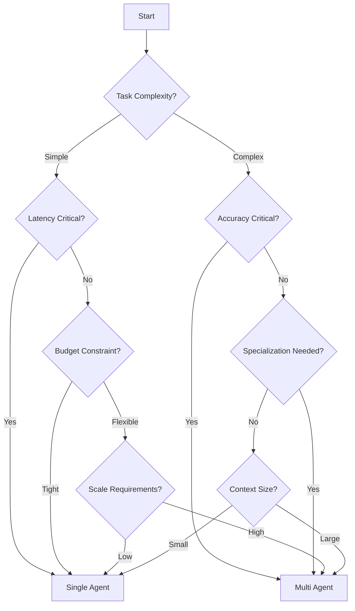

# Single vs Multi-Agent LLM Systems: Comprehensive Analysis

## Executive Summary

The evolution of Large Language Model (LLM) systems in 2024 has highlighted a critical architectural decision: whether to use single-agent or multi-agent approaches. This document provides a comprehensive analysis of both approaches, their trade-offs, and decision criteria, with specific focus on Excel spreadsheet analysis applications.

**Key Finding**: Multi-agent systems generally outperform single-agent systems for complex tasks, showing up to 95% accuracy compared to 67% for single agents in coding tasks, and 88% vs 50% accuracy in simulating human reasoning. However, they introduce coordination complexity and higher computational overhead.

## Table of Contents

1. [Overview](#overview)
1. [Single-Agent LLM Systems](#single-agent-llm-systems)
1. [Multi-Agent LLM Systems](#multi-agent-llm-systems)
1. [Decision Criteria](#decision-criteria)
1. [Architectural Trade-offs](#architectural-trade-offs)
1. [Performance Benchmarks](#performance-benchmarks)
1. [Communication and Coordination](#communication-and-coordination)
1. [Excel-Specific Use Cases](#excel-specific-use-cases)
1. [Implementation Patterns](#implementation-patterns)
1. [Latest Research (2023-2024)](#latest-research-2023-2024)
1. [Recommendations](#recommendations)

## Overview

### Single-Agent Systems

- One LLM handles all tasks
- Simpler architecture and deployment
- Lower computational overhead
- Limited by context window and specialization

### Multi-Agent Systems

- Multiple specialized LLMs collaborate
- Each agent focuses on specific expertise
- Higher accuracy through cross-validation
- Increased coordination complexity

## Single-Agent LLM Systems

### Characteristics

- **Processing Model**: Single-threaded execution
- **Context Management**: Limited context window (typically 4K-128K tokens)
- **Specialization**: General-purpose, jack-of-all-trades approach
- **Coordination**: No coordination overhead
- **Infrastructure**: Simpler deployment and maintenance

### Strengths

1. **Simplicity**: Straightforward implementation and debugging
1. **Low Latency**: No inter-agent communication delays
1. **Cost-Effective**: Single model inference costs
1. **Predictable**: Deterministic behavior easier to achieve
1. **Resource Efficient**: Lower memory and compute requirements

### Limitations

1. **Context Loss**: Struggles with long documents or conversations
1. **Multitasking**: Degraded performance under high load
1. **Specialization**: Cannot excel in multiple domains simultaneously
1. **Hallucinations**: Higher risk without cross-validation
1. **Scalability**: Vertical scaling limitations

### Best Use Cases

- Simple, well-defined tasks
- Low-latency requirements
- Budget-constrained projects
- Proof-of-concept implementations
- Single-domain applications

## Multi-Agent LLM Systems

### Characteristics

- **Processing Model**: Parallel and distributed execution
- **Context Management**: Distributed across agents
- **Specialization**: Each agent optimized for specific tasks
- **Coordination**: Complex inter-agent communication
- **Infrastructure**: Sophisticated orchestration required

### Strengths

1. **Accuracy**: 95% vs 67% improvement in coding tasks
1. **Specialization**: Domain-specific expertise
1. **Scalability**: Horizontal scaling capabilities
1. **Reliability**: Cross-validation reduces hallucinations
1. **Modularity**: Easy to add/remove capabilities

### Limitations

1. **Complexity**: Harder to design and debug
1. **Overhead**: Communication and coordination costs
1. **Latency**: Inter-agent communication delays
1. **Cost**: Multiple model inference expenses
1. **Consistency**: Potential for conflicting outputs

### Best Use Cases

- Complex, multi-step workflows
- High-accuracy requirements
- Long-term context management
- Multi-domain problems
- Production systems at scale

## Decision Criteria

### 1. Task Complexity

**Single Agent**

- Simple, focused tasks
- Clear, linear workflows
- Limited decision branches

**Multi Agent**

- Complex, multi-faceted problems
- Non-linear workflows
- Multiple decision paths

### 2. Performance Requirements

**Single Agent**

- Acceptable accuracy: 50-70%
- Low latency critical (\<100ms)
- Consistent response times

**Multi Agent**

- High accuracy needed: >85%
- Latency tolerance (>500ms)
- Quality over speed

### 3. Scale and Load

**Single Agent**

- Low to medium throughput
- Predictable load patterns
- Single user/session

**Multi Agent**

- High throughput requirements
- Variable load patterns
- Multiple concurrent users

### 4. Domain Expertise

**Single Agent**

- General-purpose tasks
- Single domain focus
- Broad but shallow knowledge

**Multi Agent**

- Specialized expertise needed
- Multi-domain integration
- Deep domain knowledge

### 5. Context Requirements

**Single Agent**

- Short context windows sufficient
- Stateless or simple state
- Limited memory needs

**Multi Agent**

- Long context management
- Complex state tracking
- Extensive memory requirements

## Architectural Trade-offs

### Centralized vs Decentralized

**Centralized (Supervisor Pattern)**

```
Advantages:
- Clear control flow
- Easier debugging
- Consistent decision-making

Disadvantages:
- Single point of failure
- Potential bottlenecks
- Limited scalability
```

**Decentralized (Peer-to-Peer)**

```
Advantages:
- Greater resilience
- Better scalability
- No bottlenecks

Disadvantages:
- Coordination complexity
- Potential inconsistencies
- Harder to debug
```

### Communication Patterns

1. **Sequential Chain**

   - Simple, linear flow
   - Easy to understand
   - Limited parallelism

1. **Hierarchical**

   - Multi-level supervision
   - Balanced control
   - Complex management

1. **Network/Mesh**

   - Maximum flexibility
   - High communication overhead
   - Complex coordination

1. **Hybrid**

   - Combines patterns
   - Optimized for specific needs
   - Higher design complexity

## Performance Benchmarks

### Accuracy Comparisons (2024)

| Metric           | Single Agent | Multi Agent | Improvement |
| ---------------- | ------------ | ----------- | ----------- |
| Coding Tasks     | 67%          | 95%         | +42%        |
| Human Reasoning  | 50%          | 88%         | +76%        |
| Complex Analysis | 60%          | 85%         | +42%        |
| Error Rate       | 15-20%       | 5-8%        | -60%        |

### Latency Analysis

| Operation        | Single Agent | Multi Agent | Overhead |
| ---------------- | ------------ | ----------- | -------- |
| Simple Query     | 50-100ms     | 200-500ms   | 4-5x     |
| Complex Task     | 500ms-2s     | 1-5s        | 2-2.5x   |
| Batch Processing | Linear       | Parallel    | Variable |

### Resource Utilization

| Resource | Single Agent | Multi Agent    | Factor  |
| -------- | ------------ | -------------- | ------- |
| Memory   | 4-8GB        | 16-64GB        | 4-8x    |
| CPU      | 2-4 cores    | 8-32 cores     | 4-8x    |
| Network  | Minimal      | Significant    | 10-100x |
| Storage  | Model size   | N × Model size | N×      |

## Communication and Coordination

### Communication Overhead Management

**1. Message Batching**

- Aggregate multiple messages
- 40% reduction in overhead reported
- 20% improvement in latency

**2. Adaptive Scheduling**

- Context-aware communication
- Prevents redundant exchanges
- Dynamic channel selection

**3. Efficient Protocols**

- Binary formats over JSON
- Compression techniques
- Caching strategies

### Coordination Patterns

**1. Event-Driven**

```python
# Example: Event-driven coordination
class EventDrivenCoordinator:
    def __init__(self):
        self.event_bus = EventBus()
        self.agents = {}

    def register_agent(self, agent_id, agent):
        self.agents[agent_id] = agent
        agent.subscribe_to_events(self.event_bus)

    def publish_event(self, event):
        self.event_bus.publish(event)
        # Agents react asynchronously
```

**2. Shared Memory**

```python
# Example: Shared memory coordination
class SharedMemoryCoordinator:
    def __init__(self):
        self.shared_state = {}
        self.locks = {}

    def read_state(self, key):
        with self.locks.get(key, threading.Lock()):
            return self.shared_state.get(key)

    def update_state(self, key, value):
        with self.locks.get(key, threading.Lock()):
            self.shared_state[key] = value
```

## Excel-Specific Use Cases

### Single-Agent Approaches

**1. Simple Formula Generation**

```python
# Single agent for basic Excel operations
class ExcelFormulaAgent:
    def generate_formula(self, description):
        # Direct LLM call for formula generation
        return llm.generate(f"Create Excel formula: {description}")
```

**2. Basic Data Analysis**

- Summary statistics
- Simple pivot tables
- Basic charting
- Cell formatting

### Multi-Agent Approaches

**1. Complex Financial Modeling**

```python
# Multi-agent system for financial analysis
class FinancialAnalysisSystem:
    def __init__(self):
        self.data_agent = DataValidationAgent()
        self.formula_agent = FormulaGenerationAgent()
        self.analysis_agent = StatisticalAnalysisAgent()
        self.visualization_agent = ChartingAgent()

    def analyze_spreadsheet(self, file_path):
        # Coordinated analysis across agents
        data = self.data_agent.validate(file_path)
        formulas = self.formula_agent.generate(data)
        analysis = self.analysis_agent.compute(data, formulas)
        charts = self.visualization_agent.create(analysis)
        return self.compile_report(analysis, charts)
```

**2. Advanced Use Cases**

- Multi-sheet dependency analysis
- Complex macro generation
- Data quality validation
- Automated reporting pipelines
- Cross-workbook integration

### Implementation Strategy for Excel

**Cell-Level Context Windows**

- Each cell as independent context
- Parallel processing capability
- No large context confusion
- Efficient memory usage

**Specialized Agent Roles**

1. **Data Validation Agent**: Check data integrity
1. **Formula Agent**: Generate and validate formulas
1. **Analysis Agent**: Statistical computations
1. **Visualization Agent**: Chart generation
1. **Report Agent**: Compile final outputs

## Implementation Patterns

### Framework Comparison (2024)

| Framework | Type  | Strengths                         | Best For          |
| --------- | ----- | --------------------------------- | ----------------- |
| AutoGen   | Multi | Microsoft backing, conversational | Enterprise apps   |
| LangGraph | Multi | Event-driven, cycles              | Complex workflows |
| CrewAI    | Multi | Production-ready, clean API       | Practical apps    |
| Langroid  | Multi | Lightweight, principled           | Research/Academic |

### Code Examples

**1. Single-Agent Pattern**

```python
class SingleLLMAgent:
    def __init__(self, model_name):
        self.llm = LLM(model_name)
        self.context = []

    def process(self, task):
        # All processing in one agent
        self.context.append(task)
        response = self.llm.generate(
            prompt=self.build_prompt(task),
            context=self.context
        )
        return response

    def build_prompt(self, task):
        return f"""
        Context: {self.context[-5:]}  # Limited context
        Task: {task}
        Please provide a response.
        """
```

**2. Multi-Agent Pattern**

```python
class MultiAgentSystem:
    def __init__(self):
        self.planner = PlannerAgent()
        self.executor = ExecutorAgent()
        self.validator = ValidatorAgent()
        self.coordinator = Coordinator()

    async def process(self, task):
        # Distributed processing
        plan = await self.planner.create_plan(task)

        # Parallel execution
        results = await asyncio.gather(*[
            self.executor.execute(step)
            for step in plan.steps
        ])

        # Validation
        validated = await self.validator.check(results)

        # Coordination
        return self.coordinator.compile(validated)
```

**3. Hybrid Pattern**

```python
class HybridSystem:
    def __init__(self):
        self.primary = PrimaryAgent()
        self.specialists = {
            'data': DataSpecialist(),
            'analysis': AnalysisSpecialist(),
            'viz': VisualizationSpecialist()
        }

    def process(self, task):
        # Primary agent decides routing
        task_type = self.primary.classify(task)

        if task_type in self.specialists:
            # Route to specialist
            return self.specialists[task_type].handle(task)
        else:
            # Handle directly
            return self.primary.handle(task)
```

## Latest Research (2023-2024)

### Key Trends

1. **Specialization Over Generalization**

   - Move towards specialized agents
   - Domain-specific fine-tuning
   - Task-oriented architectures

1. **Improved Coordination Mechanisms**

   - Event-driven architectures
   - Adaptive communication
   - Dynamic team formation

1. **Production Optimizations**

   - Message batching (40% overhead reduction)
   - Caching strategies
   - Model quantization

1. **New Evaluation Frameworks**

   - AgentBench for simulations
   - CAMEL for collaboration
   - SWE-agent for development

### Industry Implementations

**1. Microsoft AutoGen**

- Focus on conversational agents
- Enterprise integration
- Human-in-the-loop support

**2. LangChain/LangGraph**

- Event-driven orchestration
- Cycle support for complex flows
- Extensive tool ecosystem

**3. CrewAI**

- Production-focused design
- Clean API design
- Workflow-driven execution

### Research Papers (2024)

1. **"Multi-Agent Collaboration Mechanisms"**

   - 40% communication overhead reduction
   - Adaptive scheduling benefits
   - Dynamic channel selection

1. **"LLM-Coordination Benchmark"**

   - Pure coordination settings
   - Environmental variable reliance
   - Partner belief challenges

1. **"Survey on LLM-based Multi-Agent Systems"**

   - Workflow patterns
   - Infrastructure challenges
   - Scalability solutions

## Recommendations

### Decision Framework



### Best Practices

**1. Start Simple**

- Begin with single agent
- Identify bottlenecks
- Evolve to multi-agent as needed

**2. Measure Everything**

- Latency per operation
- Accuracy metrics
- Resource utilization
- Communication overhead

**3. Design for Scale**

- Modular architecture
- Loose coupling
- Clear interfaces
- Error resilience

**4. Optimize Communication**

- Batch messages
- Async patterns
- Efficient serialization
- Caching strategies

### Excel-Specific Recommendations

**For Single Agent:**

- Basic formula generation
- Simple data validation
- Quick calculations
- Ad-hoc analysis

**For Multi Agent:**

- Complex financial models
- Multi-sheet workflows
- Data pipeline automation
- Enterprise reporting
- Real-time collaboration

## Conclusion

The choice between single and multi-agent LLM systems depends on specific use case requirements. While multi-agent systems offer superior accuracy and capabilities for complex tasks, they come with increased complexity and overhead. For Excel spreadsheet analysis, multi-agent systems show particular promise for complex financial modeling and enterprise-scale automation, while single agents remain suitable for simpler, latency-sensitive operations.

The trend in 2024 clearly favors multi-agent architectures for production systems requiring high accuracy and complex reasoning, with frameworks like AutoGen, LangGraph, and CrewAI making implementation more accessible. However, the principle of "start simple and evolve" remains sound advice for most projects.

______________________________________________________________________

*Last Updated: January 2025*
*Based on research from 2023-2024 academic papers, industry implementations, and production deployments*
